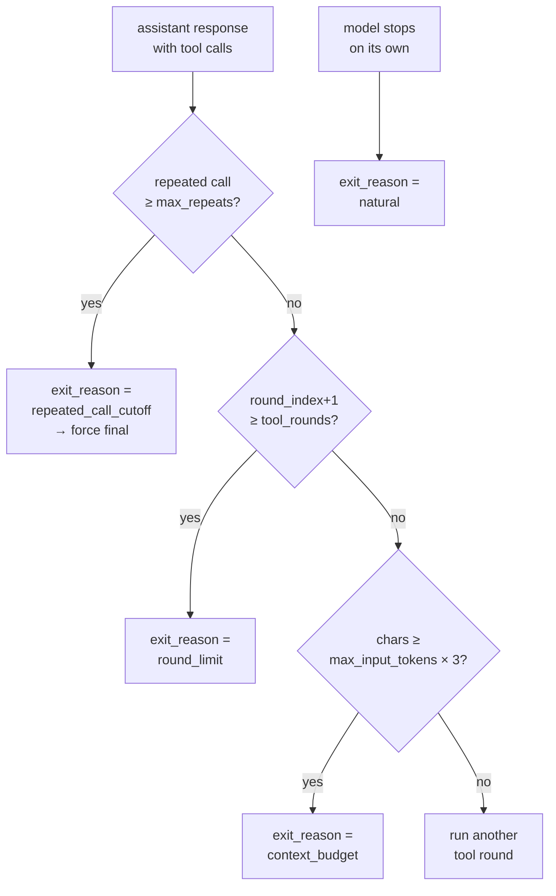

# Guardrails — bounded autonomy

The agent core lets a model call tools across many rounds, but never indefinitely. Three guards in `runtime/loop_guards.py` bound the loop on *repetition*, *rounds*, and *context size*; whichever fires first stamps an `exit_reason` on the run. A second module, `runtime/run_health.py`, then rolls that `exit_reason` (together with per-signal evidence) into a deterministic `verification_status`. The model reports evidence; the code computes every consequential label — no agent grades its own run-health.

This page documents the three guards and the `exit_reason → verification_status` mapping. For how the rounds are actually driven see [the tool loop](tool-loop.md); for the schema the model fills in see [structured output](structured-output.md).

## The three guards ✅

All three are enforced in `runtime/tool_loop.py` (in `handle_request_done` and the dispatch path) using helpers from `runtime/loop_guards.py`. Each is set by a CLI flag or a fixed constant in `config/config.py` and, when it fires, writes a string into the per-paper `exit_reasons` map.

| Guard | Trigger | Bound (default) | `exit_reason` |
|-------|---------|----------------|---------------|
| Repeated-call cutoff | Model re-issues a tool call whose `(name, args)` signature has already succeeded `max_repeats` times | `MAX_REPEATED_TOOL_CALLS` constant (`2`) | `repeated_call_cutoff` |
| Round limit | Loop reaches the last permitted tool round | `--tool-rounds` (`10`) | `round_limit` |
| Context budget | Estimated prompt chars reach the `max_input_tokens` budget before the next round | `--max-input-tokens` (`128000`) | `context_budget` |

If none fire and the model stops on its own, `exit_reason` defaults to `natural` (`exit_reasons.get(custom_id, "natural")`).

### Repeated-call cutoff → `repeated_call_cutoff`

`repeated_tool_call` in `loop_guards.py` compares each call in the assistant's response against a running `Counter` of prior calls plus the calls already seen earlier in the same response. A call's identity is its `tool_call_signature` — `(name, canonical-JSON args)`, where arguments are parsed and re-dumped `sort_keys=True` so argument ordering and whitespace don't disguise a repeat.

```python
# loop_guards.py
if counts[signature] + seen_in_response[signature] >= max_repeats:
    return f"{signature[0]}({signature[1]})"
```

When the threshold is hit, `handle_request_done` sets `exit_reasons[custom_id] = "repeated_call_cutoff"` and submits a `noop` with `force_final=True`, forcing one final tools-off pass to collect schema-constrained JSON.

!!! note "Failed calls don't count"
    `record_tool_call` skips any result whose envelope is `{"ok": false}`. Retrying an errored tool call is therefore **never** treated as a repeat — only successful, duplicated work trips this guard.

### Round limit → `round_limit`

Each completed tool round advances `round_index`. Once `round_index + 1 >= args.tool_rounds`, `handle_request_done` records `exit_reasons[custom_id] = "round_limit"`. The loop also reports `tool_rounds_used`, `max_tool_rounds` (= `args.tool_rounds`), and the derived `hit_tool_round_limit` flag in the run's `tool_loop` block.

!!! tip
    `round_limit` is recorded but does not force an immediate stop on that round — tools are simply no longer offered, and the next pass runs tools-off. `--tool-rounds` must be `>= 1` (validated in `config/cli_args.py`).

### Context budget → `context_budget`

Before re-enabling tools for the next round, the loop calls `context_budget_exceeded(conversations[custom_id], args.max_input_tokens)`. This is a *chars* estimate, deliberately conservative so the loop stops **before** vLLM would silently front-truncate the prompt at `max_input_tokens` (vLLM is configured with `truncate_prompt_tokens` in `vllm/io.py`).

```python
# loop_guards.py
BUDGET_CHARS_PER_TOKEN = 3
def context_budget_exceeded(messages, max_input_tokens):
    if not max_input_tokens:
        return False
    return conversation_chars(messages) >= max_input_tokens * BUDGET_CHARS_PER_TOKEN
```

`conversation_chars` sums message `content` lengths plus the length of every tool-call `arguments` string. When the budget is reached, `exit_reasons[custom_id] = "context_budget"`, tools are withheld, and the final message carries a `budget_note` so the model knows it must finalize now.



## From `exit_reason` to `verification_status` ✅

`verification_status` in `runtime/run_health.py` (used by the classifier/extraction path via `finalize_extracted_row`) folds the loop outcome and the model's per-signal evidence into one of three states:

| `verification_status` | `web_verification` alias | Meaning |
|-----------------------|--------------------------|---------|
| `verified` | `available` | Loop exited cleanly and every applicable signal was settled by a tool (`tool_verified` or `tool_searched_not_found`) |
| `incomplete` | `partial` | Loop was cut short, or some signal was unverifiable / no tools ran |
| `degraded` | `unavailable` | Prompt overflowed, or the structured signals are missing/malformed — score and tier are stripped |

The exit reason is one input among several. `verification_status` resolves in this order:

1. **`degraded`** if telemetry reports `input_overflow` (estimated input tokens reached `max_input_tokens`), or if `signal_verification_states(parsed)` is `None` (signals block absent or any signal missing a boolean `value` / valid `verification` state).
2. **`incomplete`** if `loop_exit_reason(...)` is in `INCOMPLETE_EXIT_REASONS = ("round_limit", "repeated_call_cutoff", "context_budget")`.
3. **`incomplete`** if any applicable signal is in `UNVERIFIED_SIGNAL_STATES = ("tool_failed", "paper_text_only")`, or if there are applicable signals but `telemetry.tool_calls == 0`.
4. **`verified`** otherwise.

### `exit_reason → status` rollup

| `exit_reason` | Effect on `verification_status` |
|---------------|---------------------------------|
| `natural` | No downgrade from the loop — status driven by signal evidence (→ `verified` if every applicable signal was settled by a tool) |
| `round_limit` | Forces `incomplete` |
| `repeated_call_cutoff` | Forces `incomplete` |
| `context_budget` | Forces `incomplete` |

!!! warning "`context_budget` vs. `input_overflow` are distinct downgrades"
    The `context_budget` **exit reason** (guard tripped *before* truncation) downgrades to `incomplete`. Separately, if telemetry shows `input_overflow` — estimated tokens actually reached `max_input_tokens` — the row is downgraded all the way to `degraded` and loses its score/tier. The budget guard exists precisely so a clean `context_budget` exit usually beats the model into `incomplete` rather than `degraded`.

!!! note "How `exit_reason` is read back"
    `loop_exit_reason(tool_loop)` returns the stored `exit_reason`, falling back to `"round_limit"` if only the legacy `hit_tool_round_limit` flag is present, else `"natural"`. The same `INCOMPLETE_EXIT_REASONS` tuple is reused by the auditor path in `audit/audit.py` (`_verification_status`), so the classifier and auditor agents downgrade on identical loop outcomes.

## Downstream effects

`finalize_extracted_row` (`runtime/run_health.py`) applies the status:

- **`degraded`** → `without_score` blanks `score` and `tier` (preserving any model-reported values under `reported_score` / `reported_tier`).
- Non-empirical papers (`paper_kind != "empirical"`) get `score = None` and the `NON_EMPIRICAL_TIER`.
- Everything else is scored via `normalize_score_and_tier`.

The row always carries `verification_status`, its `web_verification` alias, and the resolved `exit_reason`, so consumers like the [verify app](../apps/verify-app.md) can show *why* a run landed where it did. See [the auditor mode](../modes/auditor.md) for the parallel grading-side rollup and the [system architecture](../architecture.md) for where guards sit in the end-to-end flow.
