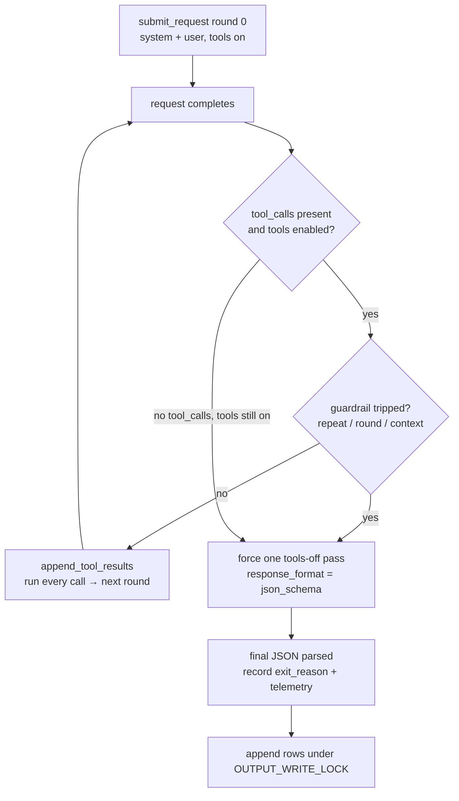

# The single agent core

ReproBench runs **one tool-calling agent core** — `run_tool_loop` in `runtime/tool_loop.py` — and the classifier and auditor are just *modes* of it. They share the same loop, guardrails, and structured-output finalization; only their **prompt, toolset, and output schema** differ, swapped in by `resolve_mode_settings` in `config/cli_args.py`. This section is the landing page for that core; the child pages drill into the loop, the guardrails, and the forced final JSON.

!!! note "One brain, three roles"
    The [architecture overview](../architecture.md) frames the whole system around *one lockfile and three LLM roles*. All three roles (classifier ✅, auditor ✅, reproduction agent 🚧) reuse this same skeleton. The reproduction agent is the same `run_tool_loop` with an execution toolset bolted on — see [the reproduction mode](../modes/reproduction.md).

## What a "mode" actually swaps

`run_arxiv_prompt_vllm.main()` parses args, then `resolve_mode_settings(args)` fills mode defaults *before* the loop ever runs. A mode is not a different code path through the loop — it is a different set of fields hanging off `args` that the loop reads. From `config/cli_args.py` (`resolve_mode_settings`):

| field on `args` | classification (default) | audit (`--mode audit`) |
|---|---|---|
| `args.system_message` | `WEB_SYSTEM_MESSAGE` | `AUDIT_SYSTEM_MESSAGE` |
| `args.tools` | `WEB_TOOLS` (defined in `config/config.py`, executed by `tools/web_tools.py`) | `AUDIT_TOOLS` (`tools/run_dir_tools.py`) |
| `args.response_format` | `None` → falls back to `FINAL_RESPONSE_FORMAT` (`schema/output.py`) | `AUDIT_RESPONSE_FORMAT` (`schema/audit.py`) |
| `args.final_no_tools_message` | `FINAL_NO_TOOLS_MESSAGE` | `AUDIT_FINAL_NO_TOOLS_MESSAGE` |
| `args.prompt_file` | `prompts/prompt.txt` | `prompts/prompt_audit.txt` (+ `rubric_audit.md`) |
| `args.use_tools` | `True` | `True` |
| input | bundle LaTeX text (`{PAPER_TEXT}`) | central claim + rubric + run-dir (`{CENTRAL_CLAIM}`) |

!!! tip "The three swap points"
    Everything that differs between roles reduces to **prompt, tools, schema**. The loop body, the request/tool thread pools, the guardrails, and the final-JSON pass are byte-for-byte identical across modes. Adding a fourth role means a new branch in `resolve_mode_settings` — not a new loop.

The classifier leaves `args.response_format = None`; `vllm/io.py` then falls back to `FINAL_RESPONSE_FORMAT` when it builds the final request, so both modes still finalize against a strict `json_schema`. See [structured output](structured-output.md) for that fallback.

## The four properties

The core holds the same four invariants in every mode:

=== "Single, not multi-agent"
    One model, one conversation per item, one fixed toolset. In `run_tool_loop` each paper gets its own entry in the `conversations` dict (`paper.arxiv_id → [messages]`). Parallelism is **across items** — up to `--request-workers` independent episodes at once — never sub-agents *within* an episode.

=== "ReAct, `tool_choice=\"auto\"`"
    `submit_request` always builds the chat request with `tool_choice="auto"`. The model decides whether and which tool to call; the loop never scripts a fixed tool sequence. It only enforces budgets and harvests results back into the conversation.

=== "Bounded autonomy"
    Every episode provably terminates. Three guardrails each force a final answer: the round cap (`--tool-rounds`), the repeat-call cap (`--max-repeated-tool-calls`), and the context budget (`--max-input-tokens`, checked by `context_budget_exceeded` in `runtime/loop_guards.py`). See [guardrails](guardrails.md).

=== "Trust-but-verify"
    The LLM proposes evidence; deterministic post-processing decides every consequential label (tier, score, verdict, run-health, anti-cheat cap). No agent grades itself. The mode's `response_format` only constrains the *shape* of what the model reports, never the final verdict.

## The loop at a glance

A single episode runs a *free tool-exploration* phase (tools on, `tool_choice=auto`) followed by exactly one *forced structured-output* phase (tools removed, `response_format=json_schema`). That two-phase split is why the final JSON parses reliably.

The transition function is `handle_request_done`; `exit_reason` is one of `natural · round_limit · repeated_call_cutoff · context_budget`, and it rolls up into the `tool_loop` telemetry block on the output row. The full state machine — including the re-issue of a tools-off pass when the model stops without a tool call — lives in [the tool loop](tool-loop.md).

## Statelessness

The vLLM server is a pure completion endpoint; **all conversation memory is the orchestrator's `conversations` dict**, never the server. That is what lets `--vllm-server-url` (attach to an existing server) and the embedded `VllmServer` share one code path in `run_arxiv_prompt_vllm.main()`, and it is the property the [reproduction agent](../modes/reproduction.md) exploits to put its *brain* on a served model while its *hands* (`srun`) live elsewhere.

## Child pages

| page | what it covers |
|---|---|
| [Tool loop](tool-loop.md) | the `run_tool_loop` / `handle_request_done` state machine, the two thread pools, the per-round event loop, and `exit_reason` telemetry |
| [Guardrails](guardrails.md) | the bounded-autonomy guards in `runtime/loop_guards.py` — repeated-call cutoff, round limit, context budget — and how each forces a final answer |
| [Structured output](structured-output.md) | the forced tools-off finalization pass and the per-mode `response_format` (`FINAL_RESPONSE_FORMAT` vs `AUDIT_RESPONSE_FORMAT`) |

!!! note "Where the modes themselves live"
    This section documents the *shared* core. The role-specific prompts, tools, and post-processing are under [Modes](../modes/classifier.md): the [classifier](../modes/classifier.md), the [auditor](../modes/auditor.md), and the designed-but-not-built [reproduction agent](../modes/reproduction.md). The toolsets each mode plugs in are documented under [web tools](../tools/web-tools.md) and [run-dir tools](../tools/run-dir-tools.md).
