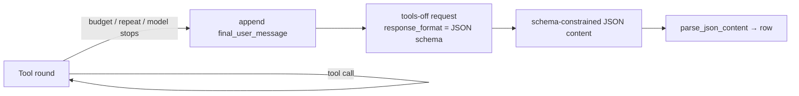

# Structured output — the forced final pass

After an agent finishes exploring with tools, the loop re-issues **one last request with the tools removed and a JSON-schema `response_format` attached**, so the final message comes back as a single schema-constrained JSON object that parses every time. This page documents that forced-final-pass mechanism and the two `response_format` objects it can send — `FINAL_RESPONSE_FORMAT` (classifier) and `AUDIT_RESPONSE_FORMAT` (auditor). For the full field-by-field breakdown of each schema, see [the schemas reference](../tools/schemas.md).

> Verified against: `runtime/tool_loop.py`, `vllm/io.py`, `schema/output.py`,
> `schema/audit.py`, `config/cli_args.py`, `config/config.py`.
> Status legend: ✅ live · 🚧 designed, not yet wired.

## Why a separate final pass ✅

During exploration the request is sent with `tools` and `tool_choice: "auto"`, and a tool-calling model is free to emit either a tool call or free-form prose. Neither is a reliable JSON document. If we asked the model to *also* produce the final structured answer in that same tool-enabled turn, we would have to parse whatever it happened to write — prose, a fenced block, a half-finished object.

The loop avoids that entirely. `build_chat_completion_request` in `vllm/io.py` sends **tools XOR `response_format`**, never both:

```python
if include_tools:
    body["tools"] = getattr(args, "tools", None) or WEB_TOOLS
    body["tool_choice"] = tool_choice
else:
    body["response_format"] = getattr(args, "response_format", None) or FINAL_RESPONSE_FORMAT
```

So the *only* request that carries a `response_format` is the tools-off final pass. With tools gone the model cannot call a tool, and with `response_format: {"type": "json_schema", ...}` the server constrains decoding to the schema. The returned `content` is therefore valid JSON matching the schema — `parse_json_content` in `vllm/io.py` can `json.loads` it directly (it keeps fenced-block and outermost-brace fallbacks only as defense in depth).

!!! note "The schema is enforced server-side"
    `response_format` with a `json_schema` is honored by the vLLM/OpenAI-compatible endpoint via constrained decoding. The guarantee is structural: the model literally cannot emit tokens that violate the schema during this pass.

## When the final pass fires

The loop in `run_tool_loop` (`runtime/tool_loop.py`) drives each paper through tool rounds, then flips `include_tools` off for exactly one more request. The next round drops tools when `force_final` is set or the round budget is spent:

```python
include_tools = not state.get("force_final") and next_round < args.tool_rounds
```

There are four triggers into the tools-off final request. The first three are set in `handle_request_done`; the context-budget check runs in `run_tool_loop` itself, just before the next round is submitted:

| Trigger | Where | `exit_reason` |
|---|---|---|
| Tool-round budget reached after a tool call | `handle_request_done`: `round_index + 1 >= args.tool_rounds` | `round_limit` |
| Model stopped (no tool call) while tools were still enabled | `handle_request_done`: `state["include_tools"]` and no `tool_calls` → `force_final` | `natural` |
| Same tool call repeated too often | `handle_request_done`: `repeated_tool_call(...)` → `force_final` | `repeated_call_cutoff` |
| Context budget hit before the next round | `run_tool_loop`: `context_budget_exceeded(...)` → `include_tools = False` | `context_budget` |

In every case the next `submit_request` runs through `conversation_for_round`, which appends a `final_user_message` (the tools-off instruction) to the transcript before the tools-off, schema-constrained request goes out:

```python
def conversation_for_round(messages, include_tools, *, budget_note=False, final_message=FINAL_NO_TOOLS_MESSAGE):
    if include_tools:
        return messages
    return [*messages, final_user_message(budget_note, final_message)]
```

The text of `final_message` (`FINAL_NO_TOOLS_MESSAGE` / `AUDIT_FINAL_NO_TOOLS_MESSAGE` in `config/config.py`) tells the model the tool phase is over and to "Return only the JSON object". When the exit was `context_budget`, `CONTEXT_BUDGET_NOTE` is prepended so partial categories get marked `tool_failed` / `paper_text_only` rather than guessed. The prompt nudges the model; the `response_format` is what actually guarantees the shape.



See [the tool loop](tool-loop.md) for the round driver and [guardrails](guardrails.md) for the repeat/round/context cutoffs that force the pass early.

## Which schema is sent — set by mode

The active `response_format` is chosen once at startup by mode in `config/cli_args.py` and stashed on `args.response_format`. `build_chat_completion_request` reads it back via `getattr(args, "response_format", None)`, falling back to `FINAL_RESPONSE_FORMAT` when unset.

| Mode | `args.response_format` | Object | Top-level schema name |
|---|---|---|---|
| Classifier (default) | `None` → fallback | `FINAL_RESPONSE_FORMAT` (`schema/output.py`) | `repro_artifact_classification` |
| Auditor (`--mode audit`) | `AUDIT_RESPONSE_FORMAT` | `AUDIT_RESPONSE_FORMAT` (`schema/audit.py`) | `audit_verdict` |

!!! note "🚧 Reproduction mode"
    Only the classifier and auditor send a `response_format`. The [reproduction agent](../modes/reproduction.md) is not yet wired into this loop.

### `FINAL_RESPONSE_FORMAT` — classifier ✅

Defined in `schema/output.py`. The object sent is:

```json
{
  "type": "json_schema",
  "json_schema": {
    "name": "repro_artifact_classification",
    "schema": { "...": "strict object, additionalProperties: false" }
  }
}
```

The schema is a strict object (`additionalProperties: false`) requiring the artifact-classification fields — `central_claim`, `claim_evidence`, `paper_kind`, `mre_config`, `match_bar`, `verified_links`, `signals`, `agent_task`, and `h100_estimate`. Each `signals.*` entry uses `signal_schema()`; `match_bar` and `h100_estimate` are built by `match_bar_schema()` and `h100_estimate_schema()`. Note that `score`/`tier` are **not** in the schema — they are computed deterministically downstream by `normalize_score_and_tier` (`schema/output.py`), not produced by the model. `FINAL_JSON_SCHEMA` exposes the inner `schema` object for reuse.

Full field semantics are in the [classifier mode](../modes/classifier.md) page and the [schemas reference](../tools/schemas.md).

### `AUDIT_RESPONSE_FORMAT` — auditor ✅

Defined in `schema/audit.py`. Same envelope, different payload:

```json
{
  "type": "json_schema",
  "json_schema": {
    "name": "audit_verdict",
    "schema": { "...": "strict object built from AUDIT_JSON_SCHEMA" }
  }
}
```

The schema (`AUDIT_JSON_SCHEMA`, assembled with the `_obj` helper) is the structured reproduction verdict: the restated target (`target_metric`, `reference_value`, `op`, `tolerance`), execution proof (`execution_verified`, `execution_evidence`), the measured value and its citation, an array of `cheat_flags` (each `kind` ∈ `FLAG_KINDS`, `severity` ∈ `low`/`med`/`high`), comparison and methodology notes, and a granular integer `score` constrained to `0–5` via `minimum`/`maximum`. As with the classifier, the final verdict is derived downstream from the model's `score` plus anti-cheat caps, not emitted whole.

Full field semantics are in the [auditor mode](../modes/auditor.md) page and the [schemas reference](../tools/schemas.md).

## What you get back

Because the final pass is schema-constrained, the response `content` is a single JSON object. `extracted_response` (`vllm/io.py`) parses it and routes by mode — `finalize_audit_row` for `audit`, `finalize_extracted_row` otherwise — attaching the `tool_loop` telemetry block written by `handle_request_done`. A row that still fails to parse falls through to `degraded_row`, but with constrained decoding in place that path is the rare exception, not the norm.

!!! tip "Debugging a bad final pass"
    If a row comes back degraded, check that the request actually went out tools-off: a `response_format` is only attached when `include_tools` is false. Confirm the mode wired the right schema onto `args.response_format` in `config/cli_args.py`, and inspect the appended `final_user_message` in the saved trace ([round JSONL](../contributing/testing.md)).
