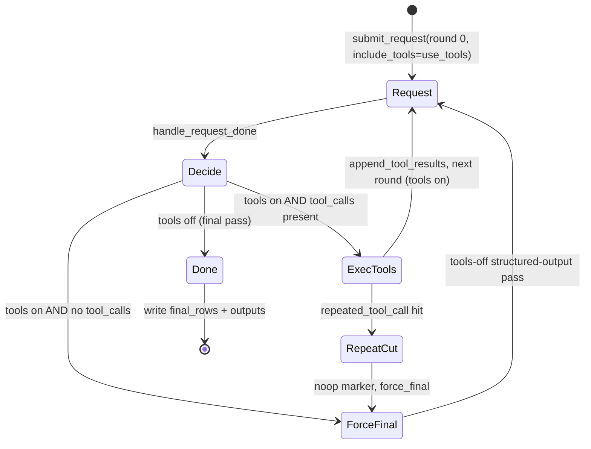

# The async tool loop

The tool loop is the heart of the agent core: it drives every episode (one paper / claim) through a free **tool-exploration** phase and then one forced **structured-output** pass against a stateless vLLM server. The live **auditor** mode runs this exact runtime; the Stage-6 **reproduction agent** forks the same skeleton into its own package. The implementation lives in `runtime/tool_loop.py`, with request plumbing in `vllm/client.py` and message construction in `vllm/io.py`.

!!! info "Where this fits"
    See the [architecture overview](../architecture.md) for how the loop relates to the dataset, lockfile, and the agent roles. The two phases below are paired with [guardrails](guardrails.md) (repeat/context limits) and the [structured-output](structured-output.md) final pass.

## The server is stateless; the client holds memory

The vLLM OpenAI-compatible endpoint (`POST /v1/chat/completions`, see `vllm/client.py::post_vllm_chat_completion`) keeps no conversation state. Every request carries the **entire** message list. The runtime owns all per-episode memory in one dict:

```python
conversations = {
    paper.arxiv_id: initial_messages(prompt, args.system_message)
    for paper, prompt in zip(papers, prompts, strict=True)
}
```

`conversations` (in `run_tool_loop`) maps each `custom_id` (an `arxiv_id`) to a growing `list[dict]` of chat messages. `initial_messages` (`vllm/io.py`) seeds it with a `system` message and the `user` prompt. As the episode progresses, the assistant turn and tool results are appended in place by `append_tool_results`, so the next request replays the full history.

| State (keyed by `custom_id`) | Purpose |
| --- | --- |
| `conversations` | Full per-episode message history replayed on every request |
| `final_rows` | Completed raw response row, written once per episode |
| `exit_reasons` | Why the loop stopped (`round_limit`, `repeated_call_cutoff`, `context_budget`, or `natural`) |
| `tool_call_counts` | `Counter` of tool-call signatures, feeds the repeat guard |
| `tool_rounds_used` | High-water mark of rounds that actually issued tool calls |

## Two thread pools

`run_tool_loop` opens **two** `ThreadPoolExecutor`s, both sized to `workers = max(1, min(args.request_workers, len(original_ids)))` (`--request-workers`, default `8`):

| Pool | Runs | Bound on |
| --- | --- | --- |
| `requests` | `post_chat_completion_row` — HTTP calls to vLLM | Server / network latency |
| `tools` | `append_tool_results` (real tool execution) and `noop` (force-final marker) | Tool I/O (web fetch, run-dir reads) |

Separating them keeps a slow tool call (e.g. a web fetch) from starving an inference slot, and vice versa. Futures are tracked in two dicts, `request_futures` and `tool_futures`, each mapping `Future → state` where `state` carries `custom_id`, `round_index`, and `include_tools`.

!!! note "Mixed batch, shared pools"
    All episodes run concurrently through the same two pools. The loop is a single-threaded scheduler that dispatches work to the pools and reacts as futures complete — it never blocks on one episode.

## The event loop

The scheduler is a `wait(..., return_when=FIRST_COMPLETED)` loop over the union of both future sets:

```python
while request_futures or tool_futures:
    done, _ = wait(set(request_futures) | set(tool_futures),
                   return_when=FIRST_COMPLETED)
    for future in done:
        if future in request_futures:
            handle_request_done(...)        # request finished
            continue
        state = tool_futures.pop(future)    # tool work finished
        future.result()
        next_round = int(state["round_index"]) + 1
        include_tools = not state.get("force_final") and next_round < args.tool_rounds
        ...
        submit_request(custom_id, next_round, include_tools)
```

Two completion types are handled:

- **A request future completed** → call `handle_request_done` (the transition function below).
- **A tool future completed** → compute the next round. Tools stay on only if this was not a `force_final` marker **and** `next_round < args.tool_rounds`. A pre-flight `context_budget_exceeded` check (`runtime/loop_guards.py`) can flip `include_tools` off and set `exit_reasons[custom_id] = "context_budget"`. Then `submit_request` issues the next request.

The loop exits when both future dicts are empty. A final guard raises `SystemExit` if any `custom_id` never produced a `final_rows` entry.

### `handle_request_done` — the transition function

This is the state machine. Given a finished request, it pops the state, builds a `row` via `response_row`, extracts the assistant `message`, and normalizes any `tool_calls`. It branches on whether tools were enabled and whether the model called one:



| Condition in `handle_request_done` | Action |
| --- | --- |
| `include_tools` and `tool_calls` and **repeat** detected | Set `exit_reason = repeated_call_cutoff`; submit a `noop` tool future marked `force_final` |
| `include_tools` and `tool_calls` (normal) | Bump `tool_rounds_used`; if `round_index + 1 >= tool_rounds` set `exit_reason = round_limit`; submit `append_tool_results` on the tools pool |
| `include_tools` and **no** `tool_calls` | Model stopped early; append the assistant turn and submit a `noop` marked `force_final` to trigger the tools-off pass |
| not `include_tools` (the final pass) | Finalize: attach `tool_loop` metadata, append the final message, record `final_rows`, write outputs |

The `noop`/`force_final` trick lets both "model stopped on its own" and "repeat cutoff" funnel through the tool pool and re-enter the scheduler as a tools-off request, so there is exactly one code path that issues the structured-output pass.

## Two phases of an episode

### Phase 1 — free tool exploration ✅

The first request is submitted with `include_tools=args.use_tools` (`resolve_mode_settings` sets it `True`). While tools are on, `build_chat_completion_request` (`vllm/io.py`) attaches `tools` (`args.tools` — `AUDIT_TOOLS` for the audit mode) and `tool_choice="auto"`. The model freely calls tools; each round appends the assistant turn plus one `tool` message per call (`tool_result_message`). Real execution is `execute_tool_call` from `tools/web_tools.py`, which routes each call to the run-dir handlers (`AUDIT_TOOL_HANDLERS`). The phase ends when one of these fires:

| Exit reason | Trigger |
| --- | --- |
| `natural` | Model emits no tool call (then routed to Phase 2) |
| `round_limit` | `round_index + 1 >= args.tool_rounds` (`--tool-rounds`, default `10`) |
| `repeated_call_cutoff` | Same tool+args signature hit the fixed `MAX_REPEATED_TOOL_CALLS` constant (`2`, `config/config.py`) |
| `context_budget` | Estimated chars `>= max_input_tokens * 3` (`BUDGET_CHARS_PER_TOKEN`) |

See [guardrails](guardrails.md) for the repeat-signature and context-budget logic.

### Phase 2 — one forced tools-off structured-output pass ✅

Exactly one tools-off request closes every episode. `conversation_for_round` appends a `final_user_message` (`FINAL_NO_TOOLS_MESSAGE`, or the audit variant; prefixed with `CONTEXT_BUDGET_NOTE` when the budget tripped). With `include_tools=False`, `build_chat_completion_request` drops `tools` and instead sets `response_format` (the per-mode `args.response_format` — `AUDIT_RESPONSE_FORMAT` for audit, else the `FINAL_RESPONSE_FORMAT` fallback). This is the schema-constrained JSON answer — covered in [structured-output](structured-output.md).

!!! warning "Always exactly one final pass"
    Even when the model stops early in Phase 1, the runtime re-issues one tools-off pass rather than trusting whatever it emitted with tools enabled. This guarantees the final turn is schema-constrained JSON.

## Per-request body fields

`build_chat_completion_request` assembles the body (`vllm/io.py`):

| Field | Source | Notes |
| --- | --- | --- |
| `model`, `messages` | `args.model`, current conversation | Full history every call |
| `temperature`, `top_p` | `--temperature`, `--top-p` | `top_k` added only if set |
| `max_tokens` | `--max-tokens` (default `8192`) | Output budget |
| `truncate_prompt_tokens` | `--max-input-tokens` (default `128000`) | vLLM front-truncates if exceeded |
| `tools` + `tool_choice` | Phase 1 only | `"auto"` |
| `response_format` | Phase 2 only | Structured output schema |

Requests post through `post_chat_completion_row` with `REQUEST_TIMEOUT = 1800.0` s. The first round of the first episode may stream to stderr when `--stream-first-response` is set (`StreamedResponseBuilder` in `vllm/client.py` reassembles SSE chunks into a normal completion).

## Output writing and `OUTPUT_WRITE_LOCK` ✅

Outputs are written incrementally, one episode at a time, as each finalizes — not in a batch at the end. `prepare_incremental_outputs` truncates the files up front, then `append_completed_outputs` appends per episode under a shared lock:

```python
with OUTPUT_WRITE_LOCK:
    append_jsonl_row(args.output, row, truncate=False)
    append_jsonl_row(args.extracted_output,
                     extracted_response(custom_id, row, args.mode), truncate=False)
    if args.save_round_jsonl:
        append_trace_row(args.trace_output, custom_id, messages, row)
```

`OUTPUT_WRITE_LOCK` is a module-level `threading.Lock` defined in `runtime/tool_loop.py`, so concurrent episodes never interleave their JSONL appends. Each episode emits one row to the raw `--output` and one parsed row to `--extracted-output` (via `extracted_response`); the full per-round trace goes to `--trace-output` only when `--save-round-jsonl` is set.

!!! tip "Crash resilience"
    Because rows are flushed as episodes complete, a mid-run crash leaves a partial but valid JSONL of everything finished so far.

## Related pages

- [Agent core overview](index.md) — how the live modes reuse this loop
- [Guardrails](guardrails.md) — repeat and context-budget cutoffs
- [Structured output](structured-output.md) — the Phase 2 schema-constrained pass
- [Run-dir tools](../tools/run-dir-tools.md) — the audit toolset Phase 1 calls
- [`run-arxiv` CLI](../cli/run-arxiv.md) — flags and entry point (`run_arxiv_prompt_vllm.py`)
