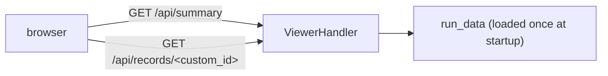

# v3 viewer — MiniMax output inspector ✅

A small, dependency-free HTTP viewer for inspecting a single classifier run's JSONL outputs (the MiniMax M2 output family). It joins the three sidecar files a run produces by `custom_id`, re-derives the deterministic score/tier from the stored signals to flag drift, surfaces per-record health issues, and renders the saved conversation trace with long paper/tool payloads trimmed for the browser. It lives at `tools/v3_viewer/` and is launched directly with `python3`, not through the `reprocli` CLI.

!!! note "Scope"
    This is a read-only debugging tool. It loads files into memory once at startup and serves them; it never writes back to the run. For the live grading/verification UI see [the verify app](verify-app.md).

## What it serves

A run is identified by a **base path** (no extension). The loader (`tools/v3_viewer/v3_loader.py`, `load_run`) reads three JSONL files derived from that base:

| File | Derived from base | Role of each row |
| --- | --- | --- |
| `<base>.jsonl` | base + `.jsonl` | `final` — the raw batch/API response (response body, `tool_loop` stats, usage) |
| `<base>_extracted.jsonl` | base + `_extracted.jsonl` | `extracted` — the parsed classifier record (`central_claim`, `signals`, `score`, `tier`, `web_verification`) |
| `<base>_trace.jsonl` | base + `_trace.jsonl` | `trace` — the saved conversation (`messages`, `tool_loop`) |

Rows are joined per record by `custom_id` (`attach_rows`); a second row with the same `custom_id` and kind is stashed as a duplicate rather than overwriting. Lines that fail to parse are collected as errors — for trace lines the loader even regex-greps `custom_id` out of the broken line (`guess_custom_id`) so a corrupt trace can still attach to its record as `trace_error`.

The default base is `outputs/v4/neurips_2025_minimax_m2_trial` (`DEFAULT_BASE` in `tools/v3_viewer/server.py`).

!!! warning "README vs. code default"
    The README's example `--run outputs/v3/...` and the tool's `v3` name are historical. The wired default in `server.py` points at **`outputs/v4/`**. Pass `--run` to be explicit.

## Run it

```bash
# from the repo root
python3 tools/v3_viewer/server.py
# → MiniMax viewer serving outputs/v4/neurips_2025_minimax_m2_trial at http://127.0.0.1:8766
```

Open `http://127.0.0.1:8766`. Point it at a different run with `--run` (a base path, no extension):

```bash
python3 tools/v3_viewer/server.py --run outputs/v4/some_other_run
```

### Flags

| Flag | Default | Meaning |
| --- | --- | --- |
| `--run` | `outputs/v4/neurips_2025_minimax_m2_trial` | Run **base path** (no extension); the three sidecars are derived from it |
| `--host` | `127.0.0.1` | Bind address |
| `--port` | `8766` | TCP port |

!!! tip "Must run from a directory where the base path resolves"
    `--run` is treated as a relative path against the current working directory, so launch from the repo root (or pass an absolute base path). Missing files are not fatal — the run still loads and the missing file shows up as an error/health issue rather than a crash.

The server is a stdlib `ThreadingHTTPServer` with a custom `BaseHTTPRequestHandler` (`ViewerHandler`); there are no third-party dependencies. Static assets are served from `tools/v3_viewer/static/` (`index.html`, `app.js`, `styles.css`, …), path-confined to that directory.

## What you see

The static UI (`static/index.html` + `static/app.js`) is a two-pane inspector backed by two JSON endpoints:



| Endpoint | Returns |
| --- | --- |
| `GET /api/summary` | `base_path`, the run `summary` (counts, tier/score/issue histograms), parse `errors` per file, and a sorted record list (`list_records`) |
| `GET /api/records/<custom_id>` | One record's `final`, `extracted`, compacted `trace`, `trace_error`, `quality`, `trace_stats`, and duplicate counts (`view_record`) |

The left sidebar lists records (search by arXiv ID / claim) with filter buttons: **All**, **Issues**, **Round limit**, **Score drift**, **Trace problems**. The main pane shows the run stats banner and, on selecting a record, its rendered trace (markdown), the extracted/final JSON, and its health flags. Long strings are clipped server-side before they reach the browser (`compact_trace` / `clip`): message content to 12,000 chars and each tool-call `arguments` to 4,000 chars, each replaced with a `[... trimmed N characters ...]` marker.

## Quality signals it computes

Per-record health lives in `tools/v3_viewer/quality.py` (`record_quality`). It does **not** call into `reprocli_vllm`; it re-implements the canonical classifier scoring locally so it can compare its result against what the run stored and flag drift.

### Score/tier drift

`computed_score_and_tier` reads four boolean signals out of the extracted record and recomputes score and tier — the same rules as the source of truth in `schema/output.py`:

| Condition (from `signals`) | Points |
| --- | --- |
| `code_available` is false | +2 |
| `dataset_is_standard` false **and** `dataset_available` false | +3 |
| `weights_available` is false | +1 |

The score maps to a tier via `tier_for_score`: `0 → Easy`, `1 → Medium`, `2 → Hard`, `3 → Hard` if data/standard else `Artifact-Blocked`, and otherwise `Artifact-Blocked`. If any of the four signals is missing/non-boolean, the computed pair is `None` (no drift check). When the recomputed `(score, tier)` differs from the stored `extracted.score`/`extracted.tier`, the record is flagged **score/tier drift**.

### Per-record issues

`record_quality` returns an `issues` list plus the raw fields it derived. An issue is appended for each of:

| Issue string | Trigger |
| --- | --- |
| `missing final row` | no `final` row joined |
| `missing extracted row` | no `extracted` row joined |
| `missing parsed trace row` | no `trace` row joined |
| `corrupt trace row` | a `trace_error` (unparseable trace line) attached |
| `final JSON problem` / specific message | final message content is empty, not JSON-only, invalid JSON, or not an object (`parse_final_content`) |
| `hit tool-round limit` | `final.tool_loop.hit_tool_round_limit` is true |
| `score/tier drift` | recomputed pair ≠ stored pair (above) |
| `finish_reason=<x>` | the response `finish_reason` is set and ≠ `stop` |

Alongside the issues, each record exposes diagnostic fields: `clean_final_json`, `computed_score`/`computed_tier`, `score_drift`, `tool_rounds_used` / `max_tool_rounds` / `hit_tool_round_limit`, `finish_reason`, `status_code`, `model`, `prompt_tokens` / `completion_tokens`, `content_chars`, and `reasoning_chars` (length of the message's `reasoning` field).

### Trace stats

`trace_stats` (in `v3_loader.py`) summarizes the conversation independently of quality: total `messages`, a role histogram, `tool_call_count` and `tool_result_count`, and a `tool_counts` histogram (by tool-result name, falling back to tool-call name).

### Run summary

`summarize` rolls the above into the `/api/summary` banner: `record_count`, per-file row counts (`final_rows`, `extracted_rows`, `trace_rows`), `trace_errors`, tier/score histograms, an `issue_counts` histogram, and totals for `clean_final_json`, `score_drift`, and `round_limit`.

!!! example "Quick health read"
    A clean run shows `clean_final_json == record_count`, `score_drift == 0`, `round_limit == 0`, and an empty `issue_counts`. Any non-zero entry there is your list of records to open via the sidebar filters.

## Where it fits

The signals and scoring this tool mirrors are produced upstream by the classifier; the canonical definitions live in `schema/output.py`. See:

- [Classifier mode](../modes/classifier.md) — produces the `signals`, `score`, and `tier` this viewer inspects.
- [Structured output](../agent-core/structured-output.md) — the schema behind the `extracted` record.
- [Architecture overview](../architecture.md) — how classifier outputs feed the lockfile and the rest of the system.
- [Verify app](verify-app.md) — the sibling, full-featured grading/verification UI.
