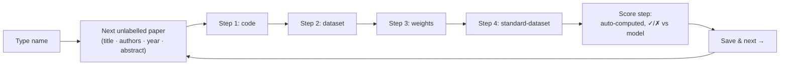

# Artifact Verification app ✅

A lightweight **static** web app (`tools/verify_app/`) that lets a human team manually verify the [classifier](../modes/classifier.md)'s artifact verdicts paper-by-paper on the **v5 200-paper audit pool** emitted by `audit/select_pool.py`. Each reviewer reads the model's verdict and evidence for an artifact, does their own Google / GitHub / Hugging Face search, and records *agree / disagree / unsure* plus a note. The frontend is plain HTML/CSS/JS (no build step) deployed to Vercel; the backend is a free Supabase Postgres that stores every verification and an append-only activity log feeding an admin dashboard.

!!! note "What it audits, and what it doesn't"
    Reviewers confirm the four artifact signals — **code / dataset / weights / standard-dataset**. They do **not** re-confirm H100 compute bands by hand: `gpu_count × wallclock × multiplier` is recomputed and adjudicated in code at selection time (see [the H100 budget model](../selection/h100-budget.md)). The legacy band-review UI was removed; only its Supabase columns are kept for old rows.

## Repository layout

```text
tools/verify_app/
  build_data.py          # one-time: makes public/papers.json + splits traces
  fetch_arxiv_meta.py    # patches papers.json with real arXiv titles/authors/abstracts
  arxiv_meta.json        # cached arXiv metadata (build_data.py merges it on rebuild)
  supabase_schema.sql    # paste into the Supabase SQL editor
  SETUP.md               # setup + Vercel deploy steps
  public/                # <-- this folder IS the website you deploy
    index.html
    config.js            # the 4 values you edit
    app.js  styles.css
    papers.json          # generated (~2.7 MB, ships with the site)
  traces_out/            # generated (~49 MB, NOT committed; uploaded to Storage)
```

| Layer | Tech |
|---|---|
| Frontend | plain HTML/CSS/JS, no build step → static files on Vercel |
| Backend | Supabase (free Postgres) — `verifications` + `activity` tables |
| Auth | name only; each reviewer types their name once. A name in `ADMIN_NAMES` unlocks the Dashboard |
| Traces | the 220 MB conversation trace is split per-paper and served on demand from Supabase Storage (optional — the app works without it) |

## Reviewer flow

Reviewers are dropped straight into the **next unlabelled paper** from a shared queue and can keep hitting *Save & next*. Everyone also gets a browsable sidebar (search + filters + paper list) to jump around instead.



1. **Header context.** The header shows the authoritative arXiv title, authors, year, and **abstract** so reviewers know what to search for.
2. **Four steps, unlocked one at a time** — code / dataset / weights / standard-dataset. Only the current step is active (later ones show 🔒 until the one above is answered; answered steps stay editable). Each step shows the model's verdict + evidence; the reviewer does their **own** search via shortcut buttons, then clicks **Agree / Disagree / Unsure**, optionally pasting the link they found and a note. Answering auto-scrolls to the next step.
3. **The score step is computed automatically** from the four artifact verdicts using the project formula and shown next to the model's score (✓ matches / ✗ differs). Reviewers never type a score.
4. **One primary button: "Save & next paper →".** It stays disabled (`Answer all 4 steps to continue (2/4)`) until every step is answered, then turns green and pulses. Trying to advance early shakes the unanswered step. De-emphasized links cover edge cases: **← previous** and **skip for now →** (logs the skip, keeps the draft). Switching papers **auto-saves** the draft; closing the tab with unsaved work warns first.

!!! tip "Score formula"
    The auto-computed score is `(no code +2) + (no dataset & non-standard +3) + (no weights +1)`, matching the classifier's scoring. See [the classifier mode](../modes/classifier.md) for how the model's score and tier are derived.

!!! example "Keyboard shortcuts"
    `a` / `d` / `u` answer the current step · `n` = save & next · `p` = previous.

### The shared queue (no double-work)

The queue is shared: **the moment any reviewer completes a paper it disappears from everyone's queue**, so people keep getting the next unprocessed one. Live updates use Supabase Realtime:

- A red **● live** banner appears when someone else is viewing the same paper *right now* (Realtime presence).
- **Everyone** gets the browsable sidebar — filters (**To label / My in-progress / Completed / Disagreements / All**), tier/score dropdowns, search, and per-paper ✓N / ⋯N reviewer markers. Work always reloads by name. Only the **Dashboard** is admin-only.

## Telemetry

Every behavioural event is appended to the `activity` table; the `detail` column is a **JSON string** so it can be sliced in SQL or the exported CSV. The "active seconds" stopwatch pauses while the tab is hidden, so time-per-paper reflects actual attention.

| event | detail captured |
|---|---|
| `login` / `logout` / `session_end` | admin flag, user-agent / active seconds at exit |
| `paper_opened` / `paper_left` | queue size / active seconds (visibility-aware) + steps answered |
| `verdict_set` | step, verdict, previous value, `via` click-or-keyboard, seconds into the paper |
| `search_click` / `link_click` | which search shortcut / header quick-link was used |
| `evidence_opened` / `context_opened` / `trace_opened` | whether they looked at the model's evidence before answering |
| `note_edited` / `found_url` | once per step per paper open |
| `saved` / `completed` | active seconds, steps answered, signals disagreed on, score match |
| `skipped` / `blocked_next` | bailed on a paper / tried Save & next before finishing |
| `tab_hidden` / `tab_visible` | leaving to search (off-tab time is excluded from active seconds) |

## Admin dashboard

A **Dashboard** tab appears only for names listed in `ADMIN_NAMES` (`public/config.js`):

- **KPI cards:** total papers, papers reviewed ≥1×, fully completed, # reviewers, # disagreements.
- **Per-reviewer table:** progress, median active time per paper, search clicks, skips, blocked-next attempts, last-active time.
- **Live activity feed** (Realtime) with telemetry detail inline.
- **Disagreement table:** every disagreement with the model (which signal, the reviewer's score, notes).
- **Export CSV** of all verifications.

## Data build (`build_data.py`)

`build_data.py` reads an extracted/trace output pair (default: `outputs/v5/audit_pool`, from `audit/select_pool.py`) and produces two outputs:

| Output | Contents |
|---|---|
| `public/papers.json` | one compact record per pool paper — everything a reviewer needs without loading the trace (ships with the site) |
| `traces_out/<custom_id>.json` | the per-paper conversation trace, split out and uploaded on demand |

How it works:

- The 220 MB `<base>_trace.jsonl` is read once, **streaming**, to (a) pull `title` / `source_url` from the first user message via `TITLE_RE` / `SOURCE_RE` and (b) split each trace into its own small file. Tool payloads are clipped (`CONTENT_CLIP = 16000`, `ARG_CLIP = 6000`) so per-trace files stay small and load fast.
- Each `papers.json` record carries the classifier's `signals`, `score`, `tier`, `central_claim`, `claim_evidence`, the H100 estimate/band/adjudication fields, and `has_trace`.
- Trace-derived titles were wrong for ~25% of papers (rows can be misaligned with `custom_id`), so `build_data.py` **re-merges `arxiv_meta.json`** on every build to override `title` and add `authors` / `year` / `abstract`. `fetch_arxiv_meta.py` populates that cache from the arXiv API, keyed by arXiv id, and only fetches ids that are missing.

```bash
# regenerate papers.json + split traces (defaults to the v5 audit pool)
python3 tools/verify_app/build_data.py

# point at a different run
python3 tools/verify_app/build_data.py --run outputs/v5/audit_pool

# also push split traces to a public Supabase Storage bucket named 'traces'
python3 tools/verify_app/build_data.py --upload
```

!!! warning "Upstream extraction gaps"
    Two source records have `score: null` (failed extraction upstream). The app shows them with empty signals so reviewers can flag them.

## Supabase schema

`supabase_schema.sql` (paste into the SQL editor) creates two tables:

- **`verifications`** — the source of truth: one row per `(paper_id, reviewer)`, with per-signal `*_verdict` / `*_note` columns, `score_verdict` / `score_suggested` / `score_note`, reviewer-found artifact URLs, and a `status` of `in_progress` | `completed`. A trigger keeps `updated_at` fresh. Legacy `h100_band_*` columns remain for old rows.
- **`activity`** — the append-only event log powering the live feed.

Auth is **name-only**: there are no Supabase accounts, the reviewer's typed name lives in the `reviewer` column, and **row-level security is permissive** (anyone with the anon key can read/write) — intended for a small, trusted internal team. Both tables are added to the `supabase_realtime` publication for push updates.

## Deploy

Full step-by-step instructions live in `tools/verify_app/SETUP.md`. The short version:

1. **Generate data:** `python3 tools/verify_app/build_data.py` (and `fetch_arxiv_meta.py` for new ids).
2. **Create a Supabase project**, run `supabase_schema.sql`, copy the **Project URL** and **anon public** key.
3. **Fill `public/config.js`** — `SUPABASE_URL`, `SUPABASE_ANON_KEY`, `ADMIN_NAMES`, and optional `TRACE_BASE_URL`.
4. *(Optional)* create a public `traces` bucket and `python3 build_data.py --upload` (needs `SUPABASE_URL` + `SUPABASE_SERVICE_KEY` env vars), then set `TRACE_BASE_URL`.
5. **Deploy to Vercel** — CLI from `public/` (`vercel` → `vercel --prod`), or Git import with **Root Directory** `tools/verify_app/public`, framework preset **Other**, empty build command.

```js title="public/config.js"
window.APP_CONFIG = {
  SUPABASE_URL: "https://YOURPROJECT.supabase.co",
  SUPABASE_ANON_KEY: "eyJhbGc...",        // anon public key (gated by RLS)
  ADMIN_NAMES: ["mithil"],                 // names that see the Dashboard tab
  TRACE_BASE_URL: "",                      // fill after uploading traces (optional)
};
```

!!! warning "The anon key ships to the browser"
    That is expected for Supabase client apps — the anon key only allows what the permissive RLS policies allow. To harden, switch to Supabase email auth and tighten policies to `auth.uid()`. Re-running `build_data.py` regenerates `papers.json`; redeploy to publish.

## See also

- [Classifier mode](../modes/classifier.md) — produces the verdicts, scores, and tiers being verified.
- [`audit/select_pool.py`](../selection/select-pool.md) — band-stratified selection that builds the v5 audit pool.
- [The H100 budget model](../selection/h100-budget.md) — why compute bands are adjudicated in code, not by reviewers.
- [The v3 viewer](v3-viewer.md) — the sibling read-only output browser.
- [Architecture overview](../architecture.md) — where the classifier sits in the end-to-end pipeline.
