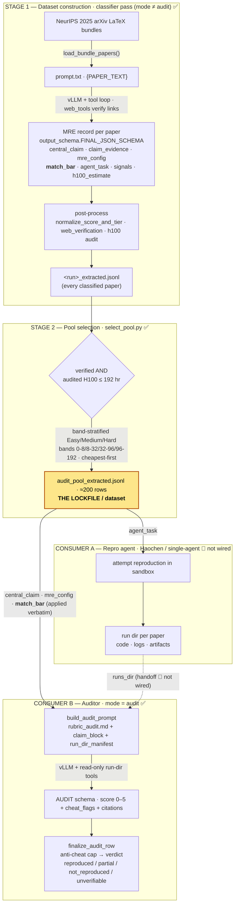

# ReproBench — system architecture (current)

How the dataset is built and consumed today. Two stages produce **the lockfile**
(the band-selected audit pool), which two consumers read: the reproduction agent
and the auditor.

> Verified against: `run_arxiv_prompt_vllm.py`, `output_schema.py`,
> `select_pool.py`, `audit_inputs.py`, `audit.py`, `rubric_audit.md`.
> Status legend: ✅ live · 🚧 not yet wired.

## Pipeline (Mermaid)



## Pipeline (ASCII fallback)

```
STAGE 1 — DATASET CONSTRUCTION  (classifier pass, mode != audit)            ✅
   NeurIPS 2025 arXiv LaTeX bundles
        │  load_bundle_papers()  →  Paper(tex_files)
        ▼
   prompt.txt {PAPER_TEXT} ──► vLLM + tool loop ──► web_tools (verify links)
        ▼
   ONE MRE record per paper   (output_schema.FINAL_JSON_SCHEMA)
     ├ central_claim, claim_evidence, paper_kind
     ├ mre_config     — smallest experiment that tests the claim
     ├ match_bar      — {kind, op, reference_value, tolerance, note}   ◄ pinned here
     ├ agent_task     — what the repro agent is told to do
     ├ verified_links, signals   (code / data / weights)
     └ h100_estimate  (compute cost)
        ▼  normalize_score_and_tier · web_verification · h100 audit
   <run>_extracted.jsonl   (every classified paper)

STAGE 2 — POOL SELECTION  (select_pool.py)                                  ✅
   keep if  verified  AND  audited H100 ≤ 192 hr
   band-stratified Easy/Medium/Hard · bands 0-8/8-32/32-96/96-192 · cheapest-first
        ▼
   audit_pool_extracted.jsonl   ◄══ THE LOCKFILE (~200 rows)
   each row = claim + mre_config + match_bar + tier + cost

        ┌──────────────────────────────┴──────────────────────────────┐
        ▼                                                              ▼
 CONSUMER A — REPRO AGENT            run dir          CONSUMER B — AUDITOR
 (Haochen · single-agent 🚧)      (code/logs/        (mode == audit) ✅
   reads agent_task                 artifacts)         rubric_audit.md
   └► attempts reproduction   ───── runs_dir ─ ─ ─►  + claim_block(claim,
      in a sandbox                  🚧 not wired         mre_config, match_bar)
   writes one run dir per paper                       + run_dir_manifest()
                                                            ▼
                                                      vLLM + read-only run-dir
                                                      tools → AUDIT schema 0–5
                                                            ▼
                                                      finalize_audit_row
                                                      anti-cheat cap → verdict
```

## The `match_bar` through-line

The pinned success bar — "how close counts as a match" — is set once and reused,
so every agent is judged against the same ruler instead of one the auditor
re-infers each run.

```
Stage 1 classifier PINS it  →  lockfile CARRIES it  →  Auditor APPLIES it verbatim
```

| `kind` | what counts as a match | example fields |
|---|---|---|
| `point_estimate` | land near a value | `op=abs_rel_within, ref=25.76, tol=0.05` |
| `threshold` | clear a floor/ceiling | `op=">=", ref=85, tol=null` |
| `direction` | beat a baseline (no tolerance band) | `op="measured_method > measured_baseline", ref=null, tol=null` |
| `magnitude` | the *size* of a delta is the target | `op="delta within tol", ref=+5, tol=0.05` |
| `none` | no checkable scalar/relation (theory/position) | all null |

Rows that predate the field (or `kind = none`) fall back to the rubric defaults in
`rubric_audit.md` C1: ±5 % for a point estimate, direction-only for a comparative.

## Known gap

Consumer A writes run dirs; Consumer B reads `runs_dir`. Nothing connects them yet
— wiring the run-bundle → `runs_dir` handoff is what turns this from an auditor into
an end-to-end benchmark.
