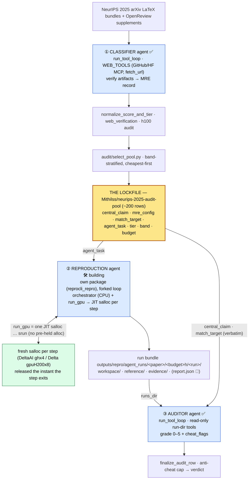

# ReproBench — system architecture

End to end: how the dataset is built, how papers are reproduced, and how those
reproductions are graded. The whole system turns on **one lockfile** (the
band-selected audit pool) and **three LLM agent roles** arranged around it. Two of
those roles — the classifier and the auditor — are *modes* of one shared
tool-calling core (`run_tool_loop`); the third — the reproduction agent — lives in
its **own package** (`src/reprocli_repro/`) and *forks* that loop's structure,
reusing only mode-agnostic primitives.

```
  CLASSIFIER agent ──► LOCKFILE ──► REPRODUCTION agent (JIT srun) ──► run bundle ──► AUDITOR agent
   (build dataset)    (the data)      (actually run the MRE)          (evidence)     (grade 0–5)
        S1                S5             S6 🛠 building                                   S7
```

> Verified against: `reprocli_vllm/` (`run_arxiv_prompt_vllm.py`,
> `runtime/tool_loop.py`, `runtime/loop_guards.py`, `vllm/io.py`, `vllm/server.py`,
> `config/config.py`, `config/cli_args.py`, `schema/output.py`, `schema/audit.py`,
> `tools/web_tools.py`, `tools/run_dir_tools.py`, `runtime/run_health.py`,
> `audit/audit.py`, `audit/select_pool.py`), `reprocli_repro/` (`cli_args.py`,
> `loop.py`, `context.py`, `inputs.py`, `workspace.py`, `reference.py`,
> `evidence.py`, `budget.py`, `cluster.py`, `slurm.py`, `compaction.py`,
> `transcript.py`, `dispatch.py`, `tools/workspace_bash.py`, `tools/files.py`),
> `reprocli_serve/`, `prompts/prompt_reproduce.txt`, `scripts/**/*.sbatch`,
> `scripts/kimi_k2_6/kimi_k2_6_multinode_interactive.md`,
> `docs/reproduction-agent-plan.md`.
> Status legend: ✅ live · 🛠 partially built (phased) · 🚧 designed, not yet wired.

## 0. The whole system (Mermaid)



Through-line for all three roles: **the model reports evidence, the code computes
every consequential label** (tier at classification; score, verdict, run-health at
audit). No agent ever grades itself — the reproduction agent runs the experiment and
**reports** what it measured; the *auditor* is the role that renders the
reproduction verdict.

---

# Part I — Dataset construction (S1–S5) ✅

Two stages produce the lockfile that the other two consumers read.

## I.1 Pipeline (ASCII)

```
STAGE 1 — DATASET CONSTRUCTION  (classifier pass, mode = classification)    ✅
   NeurIPS 2025 arXiv LaTeX bundles
        │  load_bundle_papers()  →  Paper(tex_files)
        ▼
   prompts/prompt.txt {PAPER_TEXT} ──► vLLM + tool loop ──► web_tools (verify links)
        ▼
   ONE MRE record per paper   (output_schema.FINAL_JSON_SCHEMA)
     ├ central_claim, claim_evidence, paper_kind
     ├ mre_config     — smallest experiment that tests the claim
     ├ match_target   — {config, metric, value, scope, match_bar_kind}  ◄ coherent anchor pinned here
     ├ agent_task     — what the repro agent is told to do
     ├ verified_links, signals   (code / data / weights)
     └ h100_estimate  (compute cost)
        ▼  normalize_score_and_tier · web_verification · h100 audit
   <run>_extracted.jsonl   (every classified paper)

STAGE 2 — POOL SELECTION  (audit/select_pool.py)                            ✅
   keep if  verified  AND  tier ∈ {Easy, Medium, Hard}  AND  audited H100 ≤ 192 hr
   band-stratified Easy/Medium/Hard · bands 0-8/8-32/32-96/96-192 · cheapest-first
   per-tier band weights 5/7/8/5 per 25 selected (largest-remainder to --total)
        ▼
   audit_pool_extracted.jsonl  →  published as Mithilss/neurips-2025-audit-pool
   ◄══ THE LOCKFILE (~200 rows)
   each row = claim + mre_config + match_target + agent_task + tier + cost
```

## I.2 The `match_target` through-line

The pinned success bar is a **coherent anchor tuple** —
`match_target = {config, metric, value, scope, match_bar_kind}` — set once and
reused, so every agent is judged against the same ruler instead of one the auditor
re-infers each run. The classifier pins a tuple where running `config` and
measuring `metric` over `scope` can actually yield `value` (a string, so it
tolerates `"2.37x"`, `"76.5%"`, `"8.56 kB"`, or a range). The **coherence
invariant** (config↔value, config↔scope) is enforced at classification time
(commit `327d497`): four earlier runs failed at an *incoherent anchor*, not the
tolerance — MagCache pinned `K=1` against a `2.37×` value `K=1` can't reach; AIPW
pinned an ImageNet-only `config` against a 19-benchmark-average `value`. Deriving
the bar later only relocated the incoherent claim, so it is now pinned — and
audited — upstream.

```
Stage 1 classifier PINS the tuple  →  lockfile CARRIES it
   →  Auditor ADOPTS it verbatim, filling only op/tolerance from match_bar_kind
```

Only `match_bar_kind` is pinned; **`op` and `tolerance` are not**. The auditor fills
them from one shared kind→default mapping (`rubric_audit.md` C1), so every run's
verdict applies the same ruler by construction:

| `match_bar_kind` | what counts as a match | op / tolerance (DERIVED from the kind, not pinned) |
|---|---|---|
| `point_estimate` | land near `value` | `op=abs_rel_within`, tolerance = rubric default (±5 %) |
| `threshold` | clear a floor/ceiling | `op=">="` / `"<="`, tolerance null |
| `direction` | beat a baseline (no tolerance band) | `op="measured_method > measured_baseline"`, tolerance null |
| `magnitude` | the *size* of a delta is the target | tolerance applies to the delta |
| `none` | no checkable scalar/relation (theory/position) | no scalar comparison |

Legacy rows that predate the tuple (no `match_target`) fall back to the auditor
*deriving* the bar from the claim + reported numbers, per the same rubric C1.

> The reproduction prompt does **not** render `match_target` as a separate field:
> the row's `mre_config` already states the expected value(s) inline, and the agent
> is told to adopt them verbatim. The *auditor* is the consumer that keys off the
> structured `match_target` from the lockfile row.

---

# Part II — The single agent core

There is **one agent core** (`run_tool_loop`, `reprocli_vllm/runtime/tool_loop.py`);
the classifier and auditor are *modes* of it (`resolve_mode_settings`), differing
only in prompt, toolset, and output schema. The reproduction agent (Part III) is a
**separate package that forks this loop's structure** — same skeleton (two thread
pools, `wait(FIRST_COMPLETED)`, `handle_request_done`), but its own driver,
guardrails, and tool dispatch, importing only mode-agnostic primitives from
`reprocli_vllm` (the vLLM client/io, `loop_guards`, `trace_io`, `function_tool`).

- **Single agent, not multi-agent.** One model, one conversation per item, one
  fixed toolset. Parallelism is *across items* (N independent episodes), never
  within one episode.
- **ReAct-style, `tool_choice="auto"`.** The model decides whether/which tool to
  call; the loop never scripts a tool sequence — it enforces budgets and harvests
  results.
- **Bounded autonomy.** Every episode provably terminates: a round cap, a
  repeat-call cap, and a context budget each force a final answer.
- **Trust-but-verify.** The LLM proposes; deterministic code decides every
  consequential label.

## II.1 Runtime (ASCII)

```
                          run_arxiv_prompt_vllm.main()
                          parse_args → resolve_mode_settings (mode picks prompt/tools/schema)
                                      │
        ┌─────────────────────────────┼──────────────────────────────────────────┐
        ▼                             ▼                                            ▼
 ┌──────────────┐          ┌──────────────────────┐                     ┌──────────────────┐
 │ INPUT LOADER │          │  MODEL SERVER (vLLM)  │                     │   OUTPUT SINKS    │
 │ papers +     │          │  OpenAI /v1/chat      │                     │  raw .jsonl       │
 │ prompts      │          │  completions          │                     │  extracted .jsonl │
 │ classify:    │          │  ┌─ embedded VllmServer│                    │  trace .jsonl opt │
 │  bundle text │          │  │   (subprocess, TP, │                     │  HF upload (opt)  │
 │ audit:       │          │  │   auto-tool-choice) │                    └────────▲─────────┘
 │  claim+run_dir│         │  └─ OR --vllm-server-url│                            │ OUTPUT_WRITE_LOCK
 └──────┬───────┘          └───────────▲───────────┘                             │
        │ initial_messages             │ HTTP (stateless completions)            │
        │ [system, user]               │                                         │
        ▼                              │                                         │
 ┌───────────────────────────────────────────────────────────────────────────────────────┐
 │ ORCHESTRATOR — run_tool_loop  (runtime/tool_loop.py)                                    │
 │   conversations{id → [messages]}    ← per-episode memory lives HERE, not the server     │
 │   two ThreadPoolExecutors:  requests pool → vLLM   ·   tools pool → tool layer           │
 │   event loop: wait(request_futures ∪ tool_futures, FIRST_COMPLETED)                      │
 │   GUARDRAILS (runtime/loop_guards.py): repeated_call_cutoff · round_limit · context_budget │
 └───────────────┬───────────────────────────────────────────────────────┬─────────────────┘
                 │ tool_calls present                                     │ tools OFF (final pass)
                 ▼                                                        ▼
 ┌─────────────────────────────────────┐                  ┌──────────────────────────────────┐
 │ TOOL EXECUTION LAYER (web_tools.py)  │                  │ STRUCTURED-OUTPUT FINALIZATION     │
 │  retry-once on transient + truncate  │                  │ response_format = json_schema      │
 │  classify: GitHub/HF MCP · fetch_url │                  │  classify → FINAL_RESPONSE_FORMAT  │
 │           · paper_bundle_file_…      │                  │  audit    → AUDIT_RESPONSE_FORMAT  │
 │  audit:   list/read/bash (run-dir)   │                  └────────────────┬─────────────────┘
 └─────────────────────────────────────┘                                   ▼
        results appended → next round                     ┌──────────────────────────────────┐
                                                          │ POST-PROCESSING (run_health/audit) │
                                                          │  LLM proposes · CODE decides label │
                                                          └──────────────────────────────────┘
```

## II.2 One episode — the state machine

`handle_request_done` is the transition function. Two phases: a *free
tool-exploration* phase (tools on, `tool_choice=auto`) then exactly one *forced
structured-output* phase (tools removed, `response_format=json_schema`) — which is
why the final JSON parses reliably.

```
 round 0:  request WITH tools  ([system, user-prompt])
    │
    ▼ request completes
 tools enabled?
   ├─ YES + tool_calls → repeated? → exit repeated_call_cutoff → force final
   │                   → round+1 ≥ tool_rounds? → exit round_limit
   │                   → append_tool_results (run every call) → next round
   ├─ YES, no tool_calls → re-issue ONE tools-off pass → schema-forced JSON
   └─ NO (final pass)   → record telemetry+exit_reason → write rows
    │ next request: include_tools = not force_final AND next_round < tool_rounds
    └─                              AND not context_budget_exceeded   → loop
```

Exit reasons (`natural · round_limit · repeated_call_cutoff · context_budget`)
roll into `verification_status` (`verified · incomplete · degraded`). The
reproduction agent's forked loop adds a fifth exit reason, `budget_exhausted`
(Part III.4).

## II.3 One core, two live modes

| | **Classifier** (`--mode classification`) ✅ | **Auditor** (`--mode audit`) ✅ |
|---|---|---|
| Job | Read a paper, *verify* artifacts, emit one MRE record | Grade one agent's reproduction run against the rubric |
| Input | `{PAPER_TEXT}` (bundle LaTeX + supplement) | `{CENTRAL_CLAIM}` + `{RUBRIC}` + run-dir manifest |
| Tools | GitHub/HF MCP, `fetch_url`, bundle reader | `list_run_files`, `read_run_file`, `bash`, `python` 🚧 |
| Tool scope | Open web / MCP, read-only evidence | Read-only, path-confined to `<runs-dir>/<arxiv_id>` |
| Final schema | `FINAL_RESPONSE_FORMAT` (signals, match_target, h100) | `AUDIT_RESPONSE_FORMAT` (0–5 score, cheat_flags, citations) |
| Code decides | tier, web_verification rollup, h100 audit | anti-cheat cap (high flag → 0), verdict, run-health |

The reproduction agent (Part III) is the third role, but **not** a mode of this
core — it is its own package with a forked loop.

## II.4 Statelessness & concurrency

The vLLM server is a pure completion endpoint — **all conversation memory is the
orchestrator's `conversations` dict**. That's what makes "attach to an existing
multi-node server" (`--vllm-server-url`) and embedded-server runs the same code
path, and it is exactly the property Part III exploits: the reproduction agent's
*brain* can be the same served model while its *hands* (`run_gpu`/`srun`) live
elsewhere. Up to `--request-workers` episodes run at once; request and tool pools
are separate so a slow tool never blocks a model response; rows are appended as
each item finishes under `OUTPUT_WRITE_LOCK`.

---

# Part III — The reproduction agent (S6) 🛠 building

The missing consumer is now under construction in its own package
(`src/reprocli_repro/`). Given **one lockfile row** (`agent_task`, `central_claim`,
`mre_config`, `match_target`, `tier`, `selection_band`, `audited_h100_hours`), it is an
agent that *actually runs the experiment* on the cluster under a metered
H100-hour budget and emits the run bundle the auditor grades. It is the same
`run_tool_loop` skeleton, **forked** into its own driver, whose toolset executes
real commands — the heavy ones via a just-in-time `salloc`/`srun`.

**What is built today (Phases 0–3 ✅):** the forked tool loop (`loop.py`), the
per-episode `ExecutionContext` (`context.py`), the `microcompact` context tier
(`compaction.py`), the input pipeline that turns one lockfile row into a rendered
prompt + run directory (`inputs.py`), the per-paper workspace / read-only
reference / durable evidence setup (`workspace.py`, `reference.py`, `evidence.py`),
the H100-equivalent budget meter (`budget.py`), the cluster-profile table
(`cluster.py`), the JIT `salloc`/`srun` step builder (`slurm.py`), and the
workspace-confined CPU tools (`tools/workspace_bash.py`, `tools/files.py`).

**What remains:** **Phase 4** assembles those tools plus the metered `run_gpu`
tool into `REPRO_TOOLS` and wires them through `dispatch.execute_repro_tool_call`
(today a stub) for the first end-to-end one-paper run; **Phase 5** finalizes the run bundle — the agent's structured
`report.json` (what it ran + measured, cited into `evidence/`) written for the
auditor to grade. There is **no** harness re-execution and **no** agent-written
verdict; the auditor owns the verdict. See
[`reproduction-agent-plan.md`](reproduction-agent-plan.md) for the full phase plan
(M1 one paper end-to-end on the cluster → M2 auditor-graded → M3 scaled out).

## III.1 The core design decision: decouple orchestration from GPU — via JIT allocation

The agent's *thinking* (LLM calls, file edits, dependency installs, reading
results) is cheap CPU work; only the experiment itself needs a GPU. Renting a GPU
for the whole episode while the LLM reasons would burn the H100 budget on idle
time. The original design held one GPU allocation open for the whole budget
window; the **built** design goes further — **just-in-time (JIT) allocation**:

- **Orchestrator** runs on a **login or CPU allocation** — long-lived, cheap, and
  **never holds a GPU**. It holds the agent loop, the budget meter, evidence
  capture, the bundle writer, and **all** CPU work (clone, `uv venv`, install,
  edit, inspect).
- **GPU work** is provisioned **per step**: each `run_gpu` tool call opens **one
  fresh `salloc`** sized for that step and **releases it the instant the command
  exits**. Nothing is pre-held; there is no `--allocation-jobid` and no
  pre-held-allocation mode. So idle GPU time is never charged — the budget is spent
  only on real compute.

This splits two kinds of decision cleanly:

- **Operator-set (the cluster profile — the agent's *entitlements*):** account,
  partition, node hardware (`hw`), GPUs-per-node, modules. The agent can only
  allocate on the account/partition you grant it.
- **Model-set (per `run_gpu` call):** `gpus` and a wallclock cap `minutes`. These
  size the JIT allocation and are exactly what the meter charges.

**Accepted tradeoff:** a JIT step may sit in the SLURM queue, adding latency on a
busy cluster. That is the price of an unattended pipeline that charges only real
compute and never squats on idle GPUs.

Every GPU step runs through a JIT `salloc` on the cluster profile the agent is
entitled to — there is **no** off-cluster "local" executor. A real reproduction
needs a real GPU, so `run_gpu` always provisions one rather than offering a
plain-subprocess fallback that could never reproduce anything.

## III.2 Runtime (ASCII)

```
                    LOCKFILE ROW  (one paper × budget cell)
   agent_task · central_claim · mre_config · match_target · tier · selection_band · audited_h100_hours
            (source: Mithilss/neurips-2025-audit-pool — HF dataset, hf:// file, or local .jsonl)
                              │  inputs.prepare_episodes → render prompt + resolve run dir
                              ▼
 ┌──────────────────────────────────────────────────────────────────────────────────┐
 │ ORCHESTRATOR  (login / CPU allocation — cheap, long-lived, NEVER holds a GPU)      │
 │  run_reproduce_loop  (loop.py — forked run_tool_loop skeleton)                      │
 │  reproduction LLM  → any OpenAI-compatible /v1/chat/completions endpoint,           │
 │      resolved from --vllm-server-url / $REPROCLI_SERVER_URL / $REPROCLI_ENDPOINT_FILE│
 │      (published by reprocli_serve). The repro agent never self-hosts a model.       │
 │                                                                                    │
 │  budget meter   H100-equiv = Σ gpus × elapsed_h × hw_multiplier[hw]  (budget.py)   │
 │  context mgmt   microcompact (elide stale tool results) → hard context cutoff       │
 │  evidence rec.  → commands.log · trajectory.jsonl · env.lock · patches/             │
 │                                                                                    │
 │  TOOLS (workspace-confined CPU tools ✅ built; run_gpu + dispatch wiring 🚧 Phase 4)│
 │   workspace_bash → cwd-confined shell  (git clone, uv venv, edit, inspect)         │
 │   read_file / write_file / apply_patch  (read: workspace+reference+evidence;       │
 │                                          write: workspace+evidence only)            │
 │   run_gpu        → one JIT salloc per step ─────────────────────────────┐  🚧      │
 └──────────────────────────────────────────────────────────────────────────│────────┘
        no pre-held allocation — a fresh salloc opens here, per step          │
                              │                                               ▼  salloc … srun
 ┌──────────────────────────────────────────────────────────────────────────────────┐
 │ JIT GPU STEP  (slurm.py — released the instant the command exits)                  │
 │  salloc -A <acct> -p <part> --nodes=1 --gpus=<k> --time=<min> \                     │
 │    srun --ntasks=1 bash -lc 'cd <workspace> && module load … && <cmd>'              │
 │  per-paper workspace · per-paper uv venv · --time is the budget pre-authorization   │
 │  every step: capture stdout/stderr/exit + elapsed×gpus → meter + trajectory.jsonl   │
 └──────────────────────────────────────────────────────────────────────────────────┘
                              │ budget exhausted OR agent finishes → forced final pass
                              ▼
 ┌──────────────────────────────────────────────────────────────────────────────────┐
 │ FINAL REPORT  (Phase 5 🚧 — the agent's own account, NOT a verdict)               │
 │  forced final pass (tools off) emits report.json: what was run, the metric       │
 │  value(s) observed, and citations into evidence/. The agent never grades itself —│
 │  it states what it measured; the AUDITOR decides whether it reproduced.          │
 └──────────────────────────────────────────────────────────────────────────────────┘
                              │
                              ▼
   run bundle  outputs/repro/agent_runs/<arxiv_id>/<budget>h/<run_id>/  →  Part II auditor
```

The run directory is resolved by `inputs.resolve_run_paths` to
`<runs-dir>/<arxiv_id>/<budget>h/<run_id>/` (default runs-dir
`outputs/repro/agent_runs`; `<run_id>` is a fresh time+random id so re-runs of one
paper never collide). Inside it: `workspace/` (rw — the editable clone + the
per-paper `uv` venv), `reference/` (ro — the paper LaTeX + every supplement file,
materialized from `Mithilss/neurips-2025-paper-bundles`), and `evidence/`. This is
the S6→S7 contract the existing auditor reads (it walks `<runs-dir>/<arxiv_id>`).

## III.3 Tools the reproduction agent gets

| tool | runs where | status | role |
|---|---|---|---|
| `workspace_bash` | orchestrator CPU subprocess, cwd = `workspace/` | ✅ built | clone the repo at a pinned commit, create the per-paper `uv` venv, install deps, edit, inspect — anything that does not need a GPU. Every command is appended to `evidence/commands.log` |
| `read_file` / `write_file` / `apply_patch` | orchestrator (path-confined) | ✅ built | reads span `workspace`/`reference`/`evidence`; writes only `workspace`/`evidence` (the `reference/` copy is never writable). `apply_patch` runs `git apply` and saves the diff verbatim under `evidence/patches/` |
| `list_partitions` | orchestrator (`sinfo`, read-only) | ✅ built | enumerates the cluster's partitions (node pools) — idle/total nodes, walltime, GPU gres — plus the built-in default for each known cluster, so the model can pick a `partition` for `run_gpu` instead of the profile's hardcoded default |
| `run_gpu` | one JIT `salloc … srun` per call | 🚧 Phase 4 | the experiment: training/eval/scoring. Wraps the command, captures out/err/exit, **meters** `gpus × elapsed × hw_multiplier`, enforces a per-step timeout and the **remaining** budget. Optional `partition` (from `list_partitions`) overrides the profile default for that allocation; the cluster profile pins only the default |

The CPU tools (`workspace_bash`, file tools) and the JIT substrate (`slurm.py`,
`budget.py`, `cluster.py`) are built and unit-tested; **Phase 4** is what assembles
them with the new `run_gpu` tool into `REPRO_TOOLS` and replaces the
`dispatch.execute_repro_tool_call` stub, turning the loop into a runnable
one-paper episode. The loop body, guardrails, microcompact, structured-output
finalization, and trace capture are already in place.

**The brain is provider-agnostic.** The agent's reasoning runs on **any
OpenAI-compatible `/v1/chat/completions` server, chosen purely by base URL**. The
runner resolves it from `--vllm-server-url`, else `$REPROCLI_SERVER_URL`, else the
endpoint file `reprocli_serve` publishes (`$REPROCLI_ENDPOINT_FILE`). The reused
`build_chat_completion_request` → `post_chat_completion_row` path already speaks
that protocol, so the brain is swapped by changing the URL — no provider-specific
code in the harness, and the agent never self-hosts a model.

## III.4 The budget meter (the new guardrail)

Where the classifier/auditor guardrails bound *tokens and rounds*, the
reproduction agent's hard guardrail bounds *compute* (`budget.py` +
`loop.apply_guardrails`):

```
cost(step)  = gpus × elapsed_hours × hw_multiplier[hw]          # charged on ACTUAL elapsed
worst(step) = gpus × (minutes / 60) × hw_multiplier[hw]         # pre-authorization (the --time cap)
affordable  = not budget.exhausted() AND worst ≤ budget.remaining()
if not affordable:  run_gpu refuses BEFORE launching → forces the agent to finish + report
```

SLURM bills only the run, never the queue wait, so the meter is fed elapsed *run*
time. `--time=<minutes>` is the worst-case ceiling SLURM hard-kills at, so a step
can be refused before it ever launches. `hw_multiplier` (`budget.HW_MULTIPLIER`)
reduces every part to H100-equivalent hours: Hopper-class parts (`h100`/`h200`/
`gh200`) start at ~1.0 because they share the compute die; non-Hopper entries
(`a100`≈0.5, `b200`≈2.2) are placeholders to be calibrated empirically. Every step
appends a `trajectory.jsonl` row so `budget_at_first_pass` is reconstructable.
Budget exhaustion sets `exit_reason="budget_exhausted"` and force-finals via the
same mechanism as `repeated_call_cutoff`.

## III.5 Context management — microcompact

The forked loop adds a context-management tier *ahead of* the hard tools-off
cutoff (`compaction.py`). Once the conversation crosses a **soft** threshold (a
fraction of `--max-input-tokens`), `microcompact` elides the *content* of stale
`role:"tool"` messages — each replaced by a short `[elided N chars]` placeholder —
while keeping the most recent K tool results verbatim. It is pure (no model call,
no I/O) and idempotent. This is safe precisely because **evidence is the durable
store**: every metric, working command, and artifact path is written to
`evidence/`, so eliding tool stdout from the prompt loses no ground truth. Only if
the conversation is *still* over after compaction does the loop fall back to the
hard context-budget cutoff.

## III.6 The agent reports; the auditor renders the verdict (Phase 5 🚧)

The reproduction agent's last act is its **report** — a structured account of what
it ran, the metric value(s) it observed, and citations into `evidence/`. It writes
**no verdict**: there is no `repro.yaml` submission contract and **no post-loop
harness re-execution**. Everything after the report belongs to the **auditor**
(Part II, S7), the separate LLM-as-a-judge that already reads the run bundle and
grades it. This keeps the "no agent grades itself" through-line intact — the
report's author and its grader are different roles — while removing a deterministic
re-run that only duplicated what the auditor already does.

What the auditor owns, once the report + evidence land:

- **Re-execution, if it wants it.** The auditor can recompute a metric from a saved
  artifact by `write_run_file`-ing a scoring script and running it under `bash`
  (`run_dir_tools.py`) — so a fresh measurement is the *judge's* call against the
  evidence, not a step the harness forces on every run.
- **The pinned ruler.** It adopts the lockfile's `match_target` verbatim (§I.2) and
  fills `op`/`tolerance` from the one shared `match_bar_kind`→default table
  (`rubric_audit.md` C1).
- **The verdict.** The 0–5 score → `reproduced` / `partial` / `not_reproduced` /
  `unverifiable`, with the deterministic anti-cheat cap, exactly as in
  [the auditor](modes/auditor.md). There is no second, harness-authored verdict to
  reconcile.

Trust-but-verify is unchanged, only relocated: a claim in the report that
contradicts the evidence the auditor recomputes becomes a `cheat_flag`, and a run
whose realized config/scope drifts from the pinned `config`/`scope` is graded down
rather than taken on faith. The repro agent states what it measured; the auditor
decides whether it reproduced.

## III.7 Module layout (`src/reprocli_repro/`)

```
src/reprocli_repro/                 # the S6 execution agent — its own package, forked loop
  __init__.py · __main__.py         # entry point (prepares episodes + sets up bundle today;
                                    #   drives the full loop once Phase 4 wires the toolset)
  cli_args.py                       # its own argparse (NOT resolve_mode_settings): run selection,
                                    #   workspace, cluster, brain endpoint, sampling, context mgmt
  loop.py                           # run_reproduce_loop — forked run_tool_loop skeleton
  context.py                        # ExecutionContext + Budget (per-episode mutable state)
  inputs.py                         # lockfile row → rendered prompt + RunPaths (S6→S7 contract)
  workspace.py                      # per-paper workspace + empty per-paper uv venv
  reference.py                      # read-only reference/ from the HF paper-bundle dataset
  evidence.py                       # commands.log / trajectory.jsonl / env.lock / patches/
  budget.py                         # H100-equiv meter + hw_multiplier table
  cluster.py                        # cluster profiles (deltaai / delta-h200) + per-field overrides
  slurm.py                          # JIT salloc/srun GPU-step builder + runner
  compaction.py                     # microcompact context tier (no model call)
  transcript.py                     # conversation shaping + incremental JSONL output
  dispatch.py                       # execute_repro_tool_call seam (stub until Phase 4)
  tools/
    workspace_bash.py               # cwd-confined shell ✅
    files.py                        # read_file / write_file / apply_patch ✅
    fetch.py                        # read-only fetch_url ✅
    partitions.py                   # list_partitions — sinfo pools + known-cluster defaults ✅
    run_gpu.py                      # the JIT-dispatching metered GPU tool 🚧 Phase 4
  report/                           # 🚧 Phase 5: report schema + bundle writer → report.json
                                    #   (the agent's cited account of the run; the auditor grades it)
```

Keeping repro in its own package (rather than a third `--mode`) leaves
`reprocli_vllm` untouched, holds the classifier/auditor stable, and keeps every
module under the 300-line rule. The only thing repro borrows is import-level
primitives.

---

# Part IV — The SLURM execution substrate

How GPU work is actually managed in this repo. Two distinct patterns coexist: the
classifier/auditor **pre-hold** one sbatch allocation for a whole batch job; the
reproduction agent allocates **just-in-time, per step** (Part III). Both build on
the same `salloc`/`srun` primitives.

## IV.1 Clusters & accounts

| cluster | account / partition | hardware | used for |
|---|---|---|---|
| **DeltaAI** (NCSA) | `-A betw-dtai-gh -p ghx4` | GH200, 4 GPU/node | classifier/auditor sbatch jobs; the reproduction agent's default JIT profile (`deltaai`) |
| **Delta** (NCSA) | `-A bfvr-delta-cpu -p cpu-interactive` | CPU | model downloads, CPU orchestration |
| **Delta** (NCSA) | `-A bfvr-delta-gpu -p gpuH200x8-interactive` | H200 ×8/node | interactive + multi-node model serving; the `delta-h200` JIT profile |

The reproduction agent's `cluster.py` encodes these as built-in profiles
(`deltaai` default, `delta-h200`), each carrying
account/partition/`hw`/gpus-per-node/modules/scratch-root. Per-field CLI
overrides (`--account / --partition / --gpus-per-node / --hw / --modules /
--apptainer-image / --scratch-root`) let it run on an arbitrary SLURM cluster.

## IV.2 Two allocation patterns

```bash
# A. Classifier / auditor — PRE-HELD allocation (one sbatch job holds the nodes):
salloc -A betw-dtai-gh -p ghx4 --nodes=1 --gpus-per-node=1 --time=<window>
srun --jobid=$SLURM_JOB_ID --nodes=1 --ntasks=1 bash -lc 'cd <ws> && <command>'

# B. Reproduction agent — JIT allocation (a fresh salloc PER run_gpu step, then released):
salloc -A betw-dtai-gh -p ghx4 --nodes=1 --gpus=<k> --time=<minutes> \
       srun --ntasks=1 bash -lc 'cd <workspace> && module load python/3.11.9 && <command>'
```

Pattern A is the live classifier/auditor shape (`scripts/**/*.sbatch`,
`scripts/kimi_k2_6/kimi_k2_6_multinode_interactive.md`): the allocation is the budget
container and every unit of work runs as an `srun --jobid=$SLURM_JOB_ID` step
inside it. Pattern B is the reproduction agent's `slurm.py`: the agent owns and
releases each allocation, so it holds no GPU while reasoning or installing.

Each step inherits the env block the sbatch scripts standardize (caches under
`/work/nvme/bfvr/msalunkhe/.cache/{vllm,triton,torchinductor}`, NCCL / `TORCH_NCCL_*`
tuning, `module load python/3.11.9`). The reproduction agent layers a **per-paper
`uv` venv** on top — never the shared `.venv` — so one paper's dependency install
can never poison another's.

## IV.3 Why this maps cleanly onto the agent core

The chat-completions server is stateless (Part II.4), so the reproduction agent
attaches its brain to any already-running **OpenAI-compatible endpoint by base
URL** and spends **zero** GPU budget on reasoning — GPUs are touched only by JIT
`run_gpu` steps that do real experiment work. Orchestration (CPU) and GPU steps are
physically separate allocations, and the GPU allocation exists only for the
lifetime of one step. (If the brain endpoint is itself a cluster vLLM server, it is
its own long-lived allocation — never one metered against the paper's H100 budget.)

---

# Part V — Status & the one remaining handoff

| stage | component | status |
|---|---|---|
| S1 | Classifier agent → MRE records | ✅ live |
| S5 | `audit/select_pool.py` → lockfile (~200 rows, HF dataset) | ✅ live |
| S6 | **Reproduction agent (JIT srun) → run bundle** | 🛠 **building** — Phases 0–3 done; Phase 4 (toolset wiring + `run_gpu`) + Phase 5 (`report.json` bundle) remain |
| S7 | Auditor agent (`--mode audit`) + anti-cheat cap | ✅ live |

The open edge is now narrow: the package, forked loop, budget meter, JIT SLURM
substrate, evidence store, and confined CPU tools all exist. **Phase 4** assembles
them with the `run_gpu` tool for the first end-to-end one-paper run on the cluster
(Milestone M1 — every GPU step JIT-`salloc`s on the `deltaai` profile); **Phase 5**
finalizes the `report.json` bundle the agent emits; M2 runs the existing auditor
over that bundle and M3 scales past the first hand-checked paper.

### Known caveats carried forward

- The reproduction loop is built but **not yet driven end-to-end**: `__main__`
  prepares episodes and sets up the bundle today; `dispatch.execute_repro_tool_call`
  is a stub until Phase 4 wires `REPRO_TOOLS`.
- The auditor re-scores artifacts (recompute a metric from a saved output) via
  `bash` + `python3` (`run_dir_tools.py`); there is no dedicated interpreter tool.
- `workspace_bash` is a cwd-confined shell (same posture as the auditor's `bash`)
  — fine for our own agents over hand-checked papers. **Sandboxing untrusted paper
  code is Phase 8**: a hardened Apptainer wrap (`--containall --cleanenv --no-home
  --nv`) in `slurm.py`, a credential split so the GPU step runs with no keys, and
  prefetch-then-run-offline for gated data/weights. The `--apptainer-image` /
  `--modules` / `--scratch-root` profile fields are the seams for it.

> Sibling pages [`modes/reproduction.md`](modes/reproduction.md) and
> [`slurm/clusters.md`](slurm/clusters.md) still describe the pre-`reprocli_repro`
> design in places; this overview is the current source of truth for S6.
