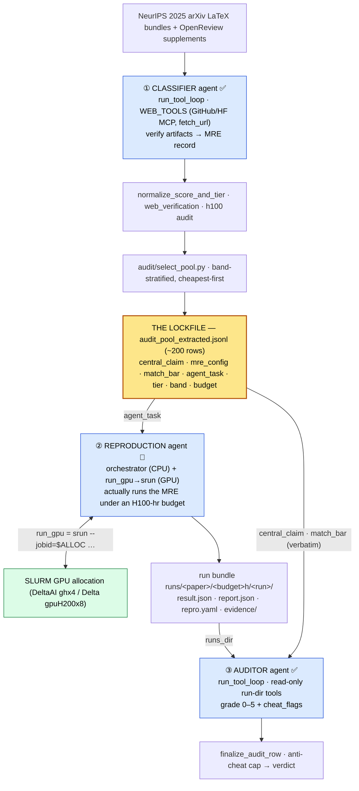

# ReproBench — system architecture

End to end: how the dataset is built, how papers are reproduced, and how those
reproductions are graded. The whole system turns on **one lockfile** (the
band-selected audit pool) and **three LLM agent roles** arranged around it — all
three reuse one tool-calling agent core, only their tools, prompt, and output
schema differ.

```
  CLASSIFIER agent ──► LOCKFILE ──► REPRODUCTION agent (srun) ──► run bundle ──► AUDITOR agent
   (build dataset)    (the data)     (actually run the MRE)       (evidence)     (grade 0–5)
        S1                S5                  S6 🚧                                   S7
```

> Verified against: `run_arxiv_prompt_vllm.py`, `runtime/tool_loop.py`, `config/cli_args.py`,
> `vllm/io.py`, `vllm/server.py`, `runtime/loop_guards.py`, `config/config.py`,
> `schema/output.py`, `schema/audit.py`, `tools/web_tools.py`,
> `tools/run_dir_tools.py`, `runtime/run_health.py`, `audit/audit.py`, `audit/select_pool.py`,
> `scripts/*.sbatch`, `scripts/delta_scripts.sh`,
> `scripts/kimi_k2_6_multinode_interactive.md`.
> Status legend: ✅ live · 🚧 designed, not yet wired.

## 0. The whole system (Mermaid)



Through-line for all three roles: **the model reports evidence, the code computes
every consequential label** (tier, score, verdict, run-health, and the
reproduction verdict). No agent ever grades itself.

---

# Part I — Dataset construction (S1–S5) ✅

Two stages produce the lockfile that the other two consumers read.

## I.1 Pipeline (ASCII)

```
STAGE 1 — DATASET CONSTRUCTION  (classifier pass, mode = classification)    ✅
   NeurIPS 2025 arXiv LaTeX bundles
        │  load_bundle_papers()  →  Paper(tex_files)
        ▼
   prompts/prompt.txt {PAPER_TEXT} ──► vLLM + tool loop ──► web_tools (verify links)
        ▼
   ONE MRE record per paper   (output_schema.FINAL_JSON_SCHEMA)
     ├ central_claim, claim_evidence, paper_kind
     ├ mre_config     — smallest experiment that tests the claim
     ├ match_bar      — {kind, op, reference_value, tolerance, note}   ◄ pinned here
     ├ agent_task     — what the repro agent is told to do
     ├ verified_links, signals   (code / data / weights)
     └ h100_estimate  (compute cost)
        ▼  normalize_score_and_tier · web_verification · h100 audit
   <run>_extracted.jsonl   (every classified paper)

STAGE 2 — POOL SELECTION  (audit/select_pool.py)                            ✅
   keep if  verified  AND  audited H100 ≤ 192 hr
   band-stratified Easy/Medium/Hard · bands 0-8/8-32/32-96/96-192 · cheapest-first
        ▼
   audit_pool_extracted.jsonl   ◄══ THE LOCKFILE (~200 rows)
   each row = claim + mre_config + match_bar + agent_task + tier + cost
```

## I.2 The `match_bar` through-line

The pinned success bar — "how close counts as a match" — is set once and reused,
so every agent is judged against the same ruler instead of one the auditor
re-infers each run.

```
Stage 1 classifier PINS it  →  lockfile CARRIES it  →  Auditor APPLIES it verbatim
```

| `kind` | what counts as a match | example fields |
|---|---|---|
| `point_estimate` | land near a value | `op=abs_rel_within, ref=25.76, tol=0.05` |
| `threshold` | clear a floor/ceiling | `op=">=", ref=85, tol=null` |
| `direction` | beat a baseline (no tolerance band) | `op="measured_method > measured_baseline", ref=null, tol=null` |
| `magnitude` | the *size* of a delta is the target | `op="delta within tol", ref=+5, tol=0.05` |
| `none` | no checkable scalar/relation (theory/position) | all null |

Rows that predate the field (or `kind = none`) fall back to the rubric defaults in
`rubric_audit.md` C1: ±5 % for a point estimate, direction-only for a comparative.

---

# Part II — The single agent core

There is **one agent core** (`run_tool_loop`, `runtime/tool_loop.py`); the classifier and
auditor are *modes* of it (`resolve_mode_settings`), differing only in prompt,
toolset, and output schema. The reproduction agent (Part III) is the same skeleton
with an execution toolset bolted on.

- **Single agent, not multi-agent.** One model, one conversation per item, one
  fixed toolset. Parallelism is *across items* (N independent episodes), never
  within one episode.
- **ReAct-style, `tool_choice="auto"`.** The model decides whether/which tool to
  call; the loop never scripts a tool sequence — it enforces budgets and harvests
  results.
- **Bounded autonomy.** Every episode provably terminates: a round cap, a
  repeat-call cap, and a context budget each force a final answer.
- **Trust-but-verify.** The LLM proposes; deterministic code decides every
  consequential label.

## II.1 Runtime (ASCII)

```
                          run_arxiv_prompt_vllm.main()
                          parse_args → resolve_mode_settings (mode picks prompt/tools/schema)
                                      │
        ┌─────────────────────────────┼──────────────────────────────────────────┐
        ▼                             ▼                                            ▼
 ┌──────────────┐          ┌──────────────────────┐                     ┌──────────────────┐
 │ INPUT LOADER │          │  MODEL SERVER (vLLM)  │                     │   OUTPUT SINKS    │
 │ papers +     │          │  OpenAI /v1/chat      │                     │  raw .jsonl       │
 │ prompts      │          │  completions          │                     │  extracted .jsonl │
 │ classify:    │          │  ┌─ embedded VllmServer│                    │  trace .jsonl opt │
 │  bundle text │          │  │   (subprocess, TP, │                     │  HF upload (opt)  │
 │ audit:       │          │  │   auto-tool-choice) │                    └────────▲─────────┘
 │  claim+run_dir│         │  └─ OR --vllm-server-url│                            │ OUTPUT_WRITE_LOCK
 └──────┬───────┘          └───────────▲───────────┘                             │
        │ initial_messages             │ HTTP (stateless completions)            │
        │ [system, user]               │                                         │
        ▼                              │                                         │
 ┌───────────────────────────────────────────────────────────────────────────────────────┐
 │ ORCHESTRATOR — run_tool_loop  (runtime/tool_loop.py)                                    │
 │   conversations{id → [messages]}    ← per-episode memory lives HERE, not the server     │
 │   two ThreadPoolExecutors:  requests pool → vLLM   ·   tools pool → tool layer           │
 │   event loop: wait(request_futures ∪ tool_futures, FIRST_COMPLETED)                      │
 │   GUARDRAILS (runtime/loop_guards.py): repeated_call_cutoff · round_limit · context_budget │
 └───────────────┬───────────────────────────────────────────────────────┬─────────────────┘
                 │ tool_calls present                                     │ tools OFF (final pass)
                 ▼                                                        ▼
 ┌─────────────────────────────────────┐                  ┌──────────────────────────────────┐
 │ TOOL EXECUTION LAYER (web_tools.py)  │                  │ STRUCTURED-OUTPUT FINALIZATION     │
 │  retry-once on transient + truncate  │                  │ response_format = json_schema      │
 │  classify: GitHub/HF MCP · fetch_url │                  │  classify → FINAL_RESPONSE_FORMAT  │
 │           · paper_bundle_file_…      │                  │  audit    → AUDIT_RESPONSE_FORMAT  │
 │  audit:   list/read/bash (run-dir)   │                  └────────────────┬─────────────────┘
 └─────────────────────────────────────┘                                   ▼
        results appended → next round                     ┌──────────────────────────────────┐
                                                          │ POST-PROCESSING (run_health/audit) │
                                                          │  LLM proposes · CODE decides label │
                                                          └──────────────────────────────────┘
```

## II.2 One episode — the state machine

`handle_request_done` is the transition function. Two phases: a *free
tool-exploration* phase (tools on, `tool_choice=auto`) then exactly one *forced
structured-output* phase (tools removed, `response_format=json_schema`) — which is
why the final JSON parses reliably.

```
 round 0:  request WITH tools  ([system, user-prompt])
    │
    ▼ request completes
 tools enabled?
   ├─ YES + tool_calls → repeated? → exit repeated_call_cutoff → force final
   │                   → round+1 ≥ tool_rounds? → exit round_limit
   │                   → append_tool_results (run every call) → next round
   ├─ YES, no tool_calls → re-issue ONE tools-off pass → schema-forced JSON
   └─ NO (final pass)   → record telemetry+exit_reason → write rows
    │ next request: include_tools = not force_final AND next_round < tool_rounds
    └─                              AND not context_budget_exceeded   → loop
```

Exit reasons (`natural · round_limit · repeated_call_cutoff · context_budget`)
roll into `verification_status` (`verified · incomplete · degraded`).

## II.3 One core, two live modes

| | **Classifier** (`--mode classification`) ✅ | **Auditor** (`--mode audit`) ✅ |
|---|---|---|
| Job | Read a paper, *verify* artifacts, emit one MRE record | Grade one agent's reproduction run against the rubric |
| Input | `{PAPER_TEXT}` (bundle LaTeX + supplement) | `{CENTRAL_CLAIM}` + `{RUBRIC}` + run-dir manifest |
| Tools | GitHub/HF MCP, `fetch_url`, bundle reader | `list_run_files`, `read_run_file`, `bash`, `python` 🚧 |
| Tool scope | Open web / MCP, read-only evidence | Read-only, path-confined to `<runs-dir>/<arxiv_id>` |
| Final schema | `FINAL_RESPONSE_FORMAT` (signals, match_bar, h100) | `AUDIT_RESPONSE_FORMAT` (0–5 score, cheat_flags, citations) |
| Code decides | tier, web_verification rollup, h100 audit | anti-cheat cap (high flag → 0), verdict, run-health |

## II.4 Statelessness & concurrency

The vLLM server is a pure completion endpoint — **all conversation memory is the
orchestrator's `conversations` dict**. That's what makes "attach to an existing
multi-node server" (`--vllm-server-url`) and embedded-server runs the same code
path, and it is exactly the property Part III exploits: the reproduction agent's
*brain* can be the same served model while its *hands* (`srun`) live elsewhere.
Up to `--request-workers` episodes run at once; request and tool pools are
separate so a slow tool never blocks a model response; rows are appended as each
item finishes under `OUTPUT_WRITE_LOCK`.

---

# Part III — The reproduction agent (S6) 🚧 designed, not yet wired

The missing consumer: given **one lockfile row** (`agent_task`, `central_claim`,
`mre_config`, `match_bar`, `tier`, `band`, `budget_h100_hours`), an agent that
*actually runs the experiment* on the cluster under a metered H100-hour budget and
emits the run bundle the auditor grades. It is the same `run_tool_loop` skeleton,
but its toolset executes real commands — the heavy ones via `srun`.

## III.1 The core design decision: decouple orchestration from GPU

The agent's *thinking* (LLM calls, file edits, dependency installs, reading
results) is cheap CPU work; only the experiment itself needs a GPU. Renting a GPU
for the whole episode while the LLM reasons would burn the H100 budget on idle
time. So:

- **Orchestrator** runs on a **login or CPU allocation** — long-lived, cheap, no
  GPU. It holds the agent loop, the budget meter, evidence capture, and the
  bundle writer.
- **GPU work** is dispatched as discrete **`srun` steps** into a GPU allocation
  held open for the budget window. **The allocation is the budget container; each
  `run_gpu` tool call is one `srun` step inside it.**

This matches the repo's existing split — sbatch/`salloc` holds the nodes,
`srun --jobid=$SLURM_JOB_ID --nodes=1 --ntasks=1 … bash -lc '…'` runs each step
(see `scripts/kimi_k2_6_multinode_interactive.md` §5 and `delta_scripts.sh`).

## III.2 Runtime (ASCII)

```
                    LOCKFILE ROW  (one paper × budget cell)
       agent_task · central_claim · mre_config · match_bar · tier · band · budget_h100
                              │
                              ▼
 ┌──────────────────────────────────────────────────────────────────────────────────┐
 │ ORCHESTRATOR  (login / CPU allocation — cheap, long-lived, NO GPU)                 │
 │  run_tool_loop core (same skeleton as classifier/auditor)                          │
 │  reproduction LLM  → any OpenAI-compatible /v1/chat/completions endpoint,           │
 │                      selected by base URL (swap the brain by changing the URL)      │
 │                                                                                    │
 │  budget meter   cumulative H100-equiv = Σ gpus × wallclock × hw_multiplier (R9)    │
 │  evidence rec.  → commands.log · trajectory.jsonl · env.lock · patches/            │
 │                                                                                    │
 │  TOOLS                                                                             │
 │   workspace_bash → CPU step  (git clone, uv venv, edit, inspect)  [orchestrator]   │
 │   run_gpu        → srun step into the held GPU allocation ───────────────┐         │
 │   read_file / write_file / apply_patch  (workspace-confined)             │         │
 │   write_repro_yaml / submit  → the agent's submission contract           │         │
 └──────────────────────────────────────────────────────────────────────────│────────┘
            salloc holds N GPUs for the budget window                        │ srun --jobid=$ALLOC
                              │                                               ▼
 ┌──────────────────────────────────────────────────────────────────────────────────┐
 │ GPU ALLOCATION  (DeltaAI ghx4 GH200×N / Delta gpuH200x8 — reserved for this cell)  │
 │  srun --jobid=$ALLOC --nodes=1 --ntasks=1 bash -lc 'cd <workspace> && <cmd>'        │
 │  per-paper workspace on NVMe · per-paper uv venv · network egress (reads GitHub)    │
 │  every step: capture stdout/stderr/exit + wallclock×gpus → meter + trajectory.jsonl │
 └──────────────────────────────────────────────────────────────────────────────────┘
                              │ budget exhausted OR agent writes repro.yaml → stops
                              ▼
 ┌──────────────────────────────────────────────────────────────────────────────────┐
 │ HARNESS RE-EXECUTION  (CORE-Bench style — the verdict the agent CANNOT write)      │
 │  one final srun step runs repro.yaml's scoring entrypoint FRESH → parse metric     │
 │  apply match_bar → result.json {status, measured, within_tolerance,                │
 │                                 budget_at_first_pass, integrity.flags}             │
 └──────────────────────────────────────────────────────────────────────────────────┘
                              │
                              ▼
   run bundle  runs/<paper_id>/<budget>h/<run_id>/   →   Part II auditor (--mode audit)
```

## III.3 Tools the reproduction agent gets

| tool | runs where | role |
|---|---|---|
| `workspace_bash` | orchestrator / CPU `srun` step | clone the repo at a pinned commit, create the per-paper `uv` venv, install deps, edit files, inspect data — anything that does not need a GPU |
| `run_gpu` | `srun --jobid=$ALLOC` into the GPU allocation | the experiment: training/eval/scoring. Wraps the command, captures out/err/exit, **meters** `gpus × wallclock × hw_multiplier`, enforces a per-step timeout and the **remaining** budget |
| `read_file` / `write_file` / `apply_patch` | orchestrator (workspace-confined) | structured edits; `apply_patch` feeds `patches/author_code.diff` (R11 integrity) |
| `write_repro_yaml` + `submit` | orchestrator | the submission contract: the scoring entrypoint command + where the metric lands. `submit` ends the episode |

The toolset swaps in via the same `resolve_mode_settings` seam (a new
`--mode reproduce`); the loop body, guardrails, structured-output finalization,
and trace capture are unchanged from Part II.

**The brain is provider-agnostic.** The agent's reasoning runs on **any
OpenAI-compatible `/v1/chat/completions` server, chosen purely by base URL** — the
existing `--vllm-server-url` + `build_chat_completion_request` →
`post_chat_completion_row` path already speaks that protocol, so the brain is
swapped by changing the URL (a cluster vLLM server, or any other OpenAI-compatible
gateway), with no provider-specific code in the harness.

## III.4 The budget meter (the new guardrail)

Where the classifier/auditor guardrails bound *tokens and rounds*, the
reproduction agent's hard guardrail bounds *compute*. `run_gpu` is wrapped so:

```
remaining = budget_h100_hours − Σ(step.gpus × step.wallclock_h × hw_multiplier)
if remaining ≤ 0:  run_gpu refuses → forces the agent toward write_repro_yaml/submit
```

`hw_multiplier` comes from the H100-equivalence table (report-format R9), so a
GH200 step and an H200 step are both charged in H100-equivalent hours. Every step
appends a `trajectory.jsonl` row (`{t, h100_hours_consumed, measured, note}`) so
`budget_at_first_pass` is reconstructable.

## III.5 The verdict is harness-written, not agent-written

The agent's last act is `repro.yaml` (the submission contract) — it never writes
`result.json`. The harness then **re-executes the scoring entrypoint fresh** in a
final `srun` step, parses the metric, applies the lockfile's `match_bar`, and
writes `result.json`:

| `status` | meaning | counts in the success curve as |
|---|---|---|
| `reproduced` | ≥1 in-tolerance measurement within budget | success |
| `out_of_tolerance` | a measurement exists; best is outside tolerance | failure (measured) |
| `no_result` | no valid measurement before budget/termination | failure (unmeasured) |
| `invalid_run` | harness/infra fault | excluded, rerun |

An agent claim that contradicts the harness measurement is recorded as an
`integrity.flag`, not silently resolved. This is the same trust-but-verify posture
as Parts I–II, applied to execution. The full bundle layout (`report.json`,
checklist R1–R12, failure taxonomy E1–E8, `evidence/`) is the report-format spec;
this section pins only the *execution architecture* around it.

## III.6 Proposed module layout

```
src/reprocli_repro/                 # the S6 execution agent (mode = reproduce)
  __init__.py
  cli_args.py        # --mode reproduce wiring; reuses resolve_mode_settings seam
  slurm.py           # salloc/srun wrappers, allocation lifecycle, node discovery
  budget.py          # H100-equiv meter + hw_multiplier table (R9)
  workspace.py       # per-paper workspace + uv venv + pinned-commit clone
  evidence.py        # commands.log / trajectory.jsonl / env.lock / patches capture
  tools/
    workspace_bash.py
    run_gpu.py       # the srun-dispatching tool
src/reprocli/report/                # the bundle layer (also feeds the auditor)
  schema.py · validate.py · render.py   # report.json/result.json schema + report.md
  reexecute.py       # harness re-runs repro.yaml → result.json (CORE-Bench style)
```

Splitting `reprocli_vllm` (classifier+auditor) from `reprocli_repro` (execution)
also closes the TODO to separate classification/audit from the harness, and keeps
every module under the 300-line rule.

---

# Part IV — The SLURM execution substrate

How GPU work is actually managed in this repo today (the ground the reproduction
agent builds on).

## IV.1 Clusters & accounts

| cluster | account / partition | hardware | used for |
|---|---|---|---|
| **DeltaAI** (NCSA) | `-A betw-dtai-gh -p ghx4` | GH200, 4 GPU/node | the classifier/auditor sbatch jobs (`scripts/*.sbatch`) |
| **Delta** (NCSA) | `-A bfvr-delta-cpu -p cpu-interactive` | CPU | model downloads, CPU orchestration |
| **Delta** (NCSA) | `-A bfvr-delta-gpu -p gpuH200x8-interactive` | H200 ×8/node | interactive + multi-node model serving |

## IV.2 The allocation → step pattern

```bash
# 1. Hold GPUs for the budget window (the budget container)
salloc -A betw-dtai-gh -p ghx4 --nodes=1 --gpus-per-node=1 \
       --cpus-per-task=16 --mem=64G --time=<budget-derived>

# 2. Orchestrator (CPU, this shell) drives the agent loop and fires steps:
srun --jobid=$SLURM_JOB_ID --nodes=1 --ntasks=1 \
     bash -lc 'cd <workspace> && <agent command>'
```

Each `srun` step inherits the env block the sbatch scripts already standardize:
caches under `/projects/bgnp/msalunkhe/.cache/{vllm,triton,torchinductor}`, NCCL /
`TORCH_NCCL_*` tuning, `module load python/3.11.9`, and (for the agent's own venv)
a **per-paper `uv` venv** rather than the shared `.venv` — per the
decouple-and-isolate intent so one paper's dependency install can never poison
another's.

## IV.3 Why this maps cleanly onto the agent core

The chat-completions server is stateless (Part II.4), so the reproduction agent
attaches its brain to any already-running **OpenAI-compatible endpoint by base
URL** and spends **zero** GPU budget on reasoning — the GPU allocation is touched
only by `run_gpu`/`srun` steps that do real experiment work. Orchestration and GPU
are physically different allocations, exactly as the design requires. (If that
endpoint is itself a cluster vLLM server, it is its own allocation — never the one
metered against the paper's H100 budget.)

---

# Part V — Status & the one remaining handoff

| stage | component | status |
|---|---|---|
| S1 | Classifier agent → MRE records | ✅ live |
| S5 | `audit/select_pool.py` → lockfile (~200 rows) | ✅ live |
| S6 | **Reproduction agent (srun) → run bundle** | 🚧 **designed here, not built** |
| S7 | Auditor agent (`--mode audit`) + anti-cheat cap | ✅ live |

The single open edge: **S6 must emit one run dir per paper at
`<runs-dir>/<arxiv_id>` matching `run_dir_manifest`** (no `outputs/v5/agent_runs/`
exists yet). Building `src/reprocli_repro/` (Part III.6) is what turns this from a
classifier-plus-auditor into an end-to-end benchmark — and the `run_gpu`→`srun`
tool (Part III.3) is the piece that makes the agent "actually reproduce stuff."

### Known caveats carried forward

- The auditor re-scores artifacts (recompute a metric from a saved output) via
  `bash` + `python3` (`run_dir_tools.py`); there is no dedicated interpreter tool.
- The audit `bash` is full shell scoped to the run dir — fine for grading our own
  agents locally; container/seccomp is the prerequisite before grading untrusted
  runs. The reproduction agent's `run_gpu`/`workspace_bash` need the same
  sandboxing treatment before running untrusted paper code at scale.
</content>
