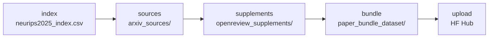

# Building the dataset — `build_dataset`

One command-line entrypoint drives dataset construction (stage S1 in the [architecture overview](../architecture.md)). `python -m reprocli_data.build_dataset` runs the full five-stage pipeline — index → sources → supplements → bundle → upload. It's a thin argparse wrapper over `pipeline/*` stage functions; the heavy lifting lives in `reprocli_data/pipeline/`.

!!! note "Rebuild + push shortcut"
    The former `reprocli_data.publish_bundle` one-shot rebuild-and-push was removed (dead code — no callers). Use `python -m reprocli_data.build_dataset --stages bundle,upload --force` instead: it re-runs only the `bundle` and `upload` stages, reading the existing index/sources/supplements from disk and force-replacing the bundle output.

!!! note "Where the stages are documented"
    This page is the exhaustive **flag reference**. For what each stage *does* to the data, see [Dataset stages](../dataset/stages.md); for the Parquet row layout the bundle stage emits, see the [Bundle schema](../dataset/bundle-schema.md).

## Stage pipeline ✅

The five stages always execute in a fixed order, regardless of the order you list them in `--stages` (`pipeline/common.py`, `STAGES`). A subset runs only those stages; missing inputs are read from disk.



| Stage | Function (`reprocli_data/pipeline/…`) | Produces |
| --- | --- | --- |
| `index` | `index.py` → `stage_index` | `<data-dir>/neurips2025_index.csv` |
| `sources` | `sources.py` → `stage_sources` | `<data-dir>/arxiv_sources/` + `manifest.csv` |
| `supplements` | `supplements.py` → `stage_supplements` | `<data-dir>/openreview_supplements/` + `manifest.csv` |
| `bundle` | `bundle.py` → `stage_bundle` | `<data-dir>/paper_bundle_dataset/` (shards + card + stats) |
| `upload` | `output.py` → `stage_upload` | push to the Hugging Face Hub |

!!! tip "How stage selection resolves"
    `resolve_stages()` parses `--stages`, rejects any unknown token with a `SystemExit` listing the valid stages, then **adds `upload` if `--upload` is passed**, and finally re-orders the requested set into canonical `STAGES` order. So `--stages bundle,index` still runs `index` first.

    When `index` is **not** in the selected stages, records are loaded from the existing `neurips2025_index.csv` via `read_index_csv()` — which `SystemExit`s if that file is missing or is missing a required column.

---

## `python -m reprocli_data.build_dataset`

Source: `reprocli_data/build_dataset.py`.

### Flag reference

Every flag, its default, and its meaning, exactly as registered in `parse_args()`.

| Flag | Default | Meaning |
| --- | --- | --- |
| `--stages` | `index,sources,supplements,bundle` | Comma-separated subset of `index, sources, supplements, bundle, upload`. Always executed in that canonical order; unknown tokens abort. |
| `--data-dir` | `data` | Root for all pipeline artifacts. Created with `mkdir(parents=True, exist_ok=True)` on startup. |
| `--limit` | _(none)_ | Process at most this many papers (`records[:limit]`). Falsy/absent → all papers. |
| `--force` / `--overwrite` | `False` | Refetch the index, re-download existing source/supplement dirs, and **replace** the existing bundle output. Both spellings set the same `force` dest. |
| `--workers` | `8` | Thread-pool size for the `sources` and `supplements` download stages. |
| `--delay` | `0.25` | Minimum seconds between **arXiv** requests across all workers (global throttle). |
| `--supplement-delay` | `0.75` | Minimum seconds between **OpenReview** attachment requests across all workers. |
| `--retries` | `3` | Per-request retry count for both download stages. |
| `--timeout` | `60.0` | Per-request HTTP timeout (seconds) for the `sources` stage. |
| `--keep-archive` | `False` | Keep the raw downloaded arXiv archive alongside the extracted source. |
| `--notes-json` | `<data-dir>/openreview_notes.json` | Path to the OpenReview notes cache used by the `supplements` stage. |
| `--venue-id` | `NeurIPS.cc/2025/Conference` | OpenReview venue id to fetch notes for (`pipeline/attachments.py`, `DEFAULT_VENUE_ID`). |
| `--api-base` | `https://api2.openreview.net` | OpenReview API base URL (`OPENREVIEW_API`). |
| `--shard-size-mb` | `512` | Target logical size per Parquet shard (`train-NNNNN.parquet`). |
| `--batch-size-mb` | `64` | Flush the row buffer to a shard once it reaches this many logical MB. Coerced to `max(1, value)`. |
| `--batch-rows` | `64` | Flush the row buffer once it holds this many rows. Coerced to `max(1, value)`. |
| `--compression` | `zstd` | Parquet compression codec passed to the shard writer. |
| `--upload` | `False` | Adds `upload` to the stage set so the bundle is pushed after building. |
| `--repo-id` | `Mithilss/neurips-2025-paper-bundles` | Hugging Face dataset repo to upload to (`pipeline/output.py`, `DEFAULT_REPO_ID`). |
| `--private` | `False` | Create/keep the Hub repo private. |
| `--commit-message` | `Upload NeurIPS 2025 paper bundle dataset` | Commit message for the Hub upload. |
| `--allow-failures` | `False` | Exit `0` even if some downloads failed. Without it, any failure makes the process exit `1`. |
| `--dry-run` | `False` | Print up to the first 10 in-scope `arxiv_id / openreview_id / source_url` rows and exit `0` before any download. |

!!! warning "Exit codes & failure handling"
    Download failures from the `sources` and `supplements` stages are summed into a `failures` counter. After all stages run, if `failures > 0` the tool prints `N download(s) failed.` and returns `1` — **unless `--allow-failures` is set**, in which case it still returns `0`. The `bundle` stage refuses to overwrite an existing `paper_bundle_dataset/` directory unless `--force` is passed (raises `SystemExit`).

### Examples

!!! example "Full pipeline, build only (no upload)"
    ```bash
    python -m reprocli_data.build_dataset --data-dir data --workers 16
    ```

!!! example "Smoke test on 10 papers without downloading"
    ```bash
    python -m reprocli_data.build_dataset --limit 10 --dry-run
    ```

!!! example "Build and push to the Hub in one shot"
    ```bash
    python -m reprocli_data.build_dataset --upload \
      --repo-id Mithilss/neurips-2025-paper-bundles
    ```

!!! example "Re-bundle only (sources/supplements already on disk)"
    ```bash
    python -m reprocli_data.build_dataset --stages bundle --force
    ```

---

## Upload behavior ✅

`build_dataset` routes uploads through `stage_upload()` in `pipeline/output.py`:

1. `validate_dataset_folder()` checks the folder exists, contains `README.md` (the dataset card), and has at least one `data/*.parquet` shard — otherwise `SystemExit`.
2. `HfApi().create_repo(repo_id, repo_type="dataset", exist_ok=True, private=…)` then `upload_folder(...)` with the chosen commit message.
3. Prints the resulting `https://huggingface.co/datasets/<repo-id>` URL.

!!! note "Credentials"
    Hub uploads use your ambient `huggingface_hub` auth. OpenReview fetches in the `supplements` stage read `OPENREVIEW_USERNAME` / `OPENREVIEW_PASSWORD` from the environment (`pipeline/attachments.py`, `build_client`).

## See also

- [Dataset stages](../dataset/stages.md) — what each stage does to the data.
- [Bundle schema](../dataset/bundle-schema.md) — the one-row-per-paper Parquet layout.
- [Dataset overview](../dataset/index.md) — where this output feeds downstream.
- [The lockfile](../selection/lockfile.md) — the audit pool selected from this dataset.
- [Architecture](../architecture.md) — how dataset construction (S1) fits the whole system.
