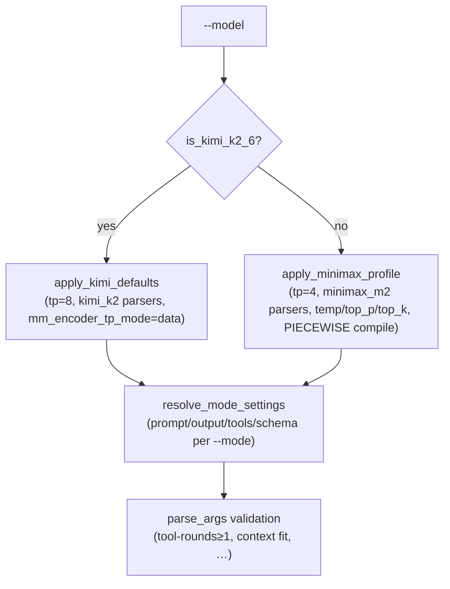

# `run_arxiv_prompt_vllm.py` — flag reference

The entry point `src/run_arxiv_prompt_vllm.py` runs one of the ReproBench LLM
agent roles over a set of papers using a vLLM backend. Its `--mode` flag picks
the role: `classification` curates the artifact tier from paper text + web
tools, `audit` grades an agent reproduction run against the rubric. Every flag
below is defined in `config/cli_args.py` (`parse_args`); model-shaped defaults
are filled in afterward by `config/minimax_defaults.py`, and per-mode
prompt/output/tool defaults by `resolve_mode_settings`. See
[the architecture overview](../architecture.md) for how the roles fit together.

!!! note "How to read the defaults"
    Argparse `default=` values come from `config/cli_args.py` (most string/path
    constants live in `config/config.py`). Flags marked **profile** below have a
    literal argparse default of `None` and are resolved by
    `apply_model_defaults` in `config/minimax_defaults.py` based on `--model`.
    Flags marked **mode** are resolved by `resolve_mode_settings` from the
    selected `--mode`.

---

## Mode

`--mode` selects the agent role. Each role swaps its prompt, output sink,
system message, response schema, and tool set via `resolve_mode_settings`
(`config/cli_args.py`).

| Value | Status | What it does |
| --- | --- | --- |
| `classification` | ✅ | Curates the artifact tier: reads paper text + bundled OpenReview supplement, verifies code/data/checkpoint evidence with web tools (`WEB_TOOLS`), emits an MRE record. Default. |
| `audit` | ✅ | Grades **one** agent reproduction attempt per paper against the rubric, using read-only run-dir tools (`AUDIT_TOOLS`) scoped to `<runs-dir>/<arxiv_id>`. |
| `reproduce` | 🚧 | The reproduction agent (actually runs the MRE under an H100-hour budget) is **not** a `--mode` of this script — it is a separate, not-yet-wired orchestrator. There is no `reproduce` choice here. |

| Flag | Type | Default | Help |
| --- | --- | --- | --- |
| `--mode` | choice `{classification, audit}` | `classification` | classification curates the artifact tier; audit grades an agent reproduction attempt against the rubric. |

See [the classifier mode](../modes/classifier.md), [the auditor mode](../modes/auditor.md),
and [the reproduction mode](../modes/reproduction.md) for the per-role flow.

---

## Model & server

Where the model runs. Set `--vllm-server-url` to reuse an existing
chat-completions server; otherwise the runner launches an embedded local vLLM
server (`vllm/server.py`).

| Flag | Type | Default | Help |
| --- | --- | --- | --- |
| `--model` | str | `MiniMaxAI/MiniMax-M2.7` (`DEFAULT_MODEL`) | Model id or local path. Selects the engine profile (see [Engine profiles](#engine-profiles-minimax-vs-kimi)). |
| `--vllm-server-url` | str | `None` | Existing vLLM chat-completions server base URL. When set, the runner skips launching its embedded local server. |
| `--vllm-cache-dir` | path | `None` → `default_cache_dir(model)` | Sets `VLLM_CACHE_ROOT` for the embedded server. Resolved from the model when unset (`vllm/cache.py`). |

!!! note
    `--model` doubles as the **profile selector**. `is_kimi_k2_6(model)` in
    `config/minimax_defaults.py` matches `moonshotai/Kimi-K2.6`, a path ending
    in `/Kimi-K2.6`, or a local `config.json` whose `architectures` start with
    `KimiK25`. Everything else takes the MiniMax profile.

---

## Dataset & input

Which papers to run. In `classification` the paper list comes from the
paper-bundle dataset (filtered to papers with `tex_files`); in `audit` the
paper list **is** the claims pool (`load_mre_records`), and `--runs-dir` supplies
the run directory per paper.

| Flag | Type | Default | Help |
| --- | --- | --- | --- |
| `--dataset` | str | `Mithilss/neurips-2025-paper-bundles` (`DEFAULT_VLLM_DATASET`) | Paper-bundle dataset with LaTeX and OpenReview supplements. (classification only) |
| `--num-prompts` | int | `None` (all papers) | Run a random sample of N papers instead of the full set. Must be ≥ 1. |
| `--paper-ids-file` | path | `None` | Run only the arXiv ids listed in this file (one per line), e.g. the output of `python -m reprocli_vllm.rerun select`. |
| `--prompt-file` | path | `prompts/prompt.txt` (classification) · `prompts/prompt_audit.txt` (audit, `AUDIT_PROMPT_FILE`) | **mode**-resolved prompt template. Must contain `{PAPER_TEXT}` (classification) or `{CENTRAL_CLAIM}` (audit). |
| `--claims` | path | `outputs/v5/audit_pool_extracted.jsonl` (`AUDIT_CLAIMS_DEFAULT`) | **audit only.** Audit-pool rows (classifier extracted output) carrying the `central_claim` per paper, injected into the audit prompt. A local JSONL path or an `hf://datasets/<owner>/<name>/<file>` reference. |
| `--rubric-file` | path | `rubric_audit.md` (`AUDIT_RUBRIC_FILE`) | **audit only.** Audit rubric markdown injected into the audit prompt. |
| `--runs-dir` | path | `outputs/v5/agent_runs` (`AUDIT_RUNS_DIR_DEFAULT`) | **audit only.** Root directory of agent reproduction runs; the auditor reads one run dir per paper at `<runs-dir>/<arxiv_id>` via the read-only run-dir tools. |

!!! tip "Audit defaults come from `config/config.py`"
    In `audit` mode the argparse default for `--claims`, `--rubric-file`,
    `--runs-dir`, `--prompt-file`, `--output`, and `--extracted-output` is
    literal `None`; `resolve_mode_settings` then substitutes the `AUDIT_*`
    constants. Pass an explicit value to override.

See [the bundle schema](../dataset/bundle-schema.md) for `--dataset` row shape,
[the lockfile](../selection/lockfile.md) for `--claims`, and
[run-dir tools](../tools/run-dir-tools.md) for what the auditor sees under
`--runs-dir`.

---

## Generation & sampling

Token budgets and sampling. Sampling params (`--temperature`, `--top-p`,
`--top-k`) are **profile** defaults — `None` until `apply_model_defaults` fills
them.

| Flag | Type | Default | Help |
| --- | --- | --- | --- |
| `--max-tokens` | int | `8192` | Max output tokens per request. |
| `--max-input-tokens` | int | `128000` | Max input tokens admitted into the conversation. Must be ≥ 1. |
| `--temperature` | float | **profile**: `1.0` | Sampling temperature. |
| `--top-p` | float | **profile**: `0.95` | Nucleus sampling cutoff. |
| `--top-k` | int | **profile**: MiniMax `40`, Kimi unset | Top-k cutoff. If set, must be ≥ 1. |

!!! warning "Context-fit check"
    `parse_args` enforces `--max-input-tokens + --max-tokens <= --max-model-len`
    and errors out otherwise. Because `--max-model-len` is itself a profile
    default (`MAX_MODEL_LEN = 196608`), lowering it can make the default token
    budgets invalid.

---

## Tool-loop budgets

How long the agent keeps calling tools before being forced to emit its final
answer (`runtime/tool_loop.py`). Both modes set `use_tools = True`.

| Flag | Type | Default | Help |
| --- | --- | --- | --- |
| `--tool-rounds` | int | `10` | Max tool-calling rounds before the final-answer turn. Must be ≥ 1. |
| `--max-repeated-tool-calls` | int | `2` | Cap on identical tool calls before they are blocked (loop guard). Must be ≥ 1. |
| `--request-workers` | int | `8` | Concurrent papers in flight; clamped to `min(workers, len(papers))`. Must be ≥ 1. |

See [the tool loop](../agent-core/tool-loop.md) and
[the guardrails](../agent-core/guardrails.md) for how these budgets are spent
and enforced.

---

## Output sinks

Where responses, extracted records, and traces are written. Like the audit
input paths, `--output` / `--extracted-output` are `None` at parse time and
resolved per mode.

| Flag | Type | Default | Help |
| --- | --- | --- | --- |
| `--output` | path | `outputs/neurips_2025_minimax_m2_trial.jsonl` (`DEFAULT_OUTPUT`) · audit: `outputs/v5/audit_pool_audit_verdicts.jsonl` (`AUDIT_DEFAULT_OUTPUT`) | Raw per-paper response JSONL. |
| `--extracted-output` | path | `..._extracted.jsonl` (`DEFAULT_EXTRACTED_OUTPUT`) · audit: `outputs/v5/audit_pool_audit_verdicts_extracted.jsonl` (`AUDIT_DEFAULT_EXTRACTED`) | Parsed/structured records JSONL. |
| `--trace-output` | path | `None` → `trace_output_path(--output)` | Per-round tool-call trace JSONL. Derived from `--output` when unset (`runtime/trace_io.py`). |
| `--save-round-jsonl` | flag | off | Write per-round intermediate JSONL during the loop (`runtime/tool_loop.py`, `hf_upload.py`). |
| `--stream-first-response` | flag | off | Stream the first response of the first paper to stderr (round 0 only). |

### Hugging Face upload sinks

Optional incremental push of run outputs to a HF dataset repo (`hf_upload.py`).

| Flag | Type | Default | Help |
| --- | --- | --- | --- |
| `--hf-repo` | str | `None` | HF dataset repo id (e.g. `Mithilss/neurips-2025-results`). When set, run outputs are pushed there incrementally and at the end. |
| `--hf-path-in-repo` | str | `""` | Optional subfolder inside the HF repo for the uploaded files. |
| `--hf-upload-every` | float | `10.0` | Minutes between incremental HF uploads. Must be > 0. |
| `--hf-private` | flag | off | Create the HF repo as private when it does not exist yet. |

---

## vLLM engine args

Passed through to the embedded server command line in `vllm/server.py`. They are
**ignored** when `--vllm-server-url` points at an external server. Most are
profile defaults; the booleans/strings below are appended only when truthy.

| Flag | Type | Default | Notes |
| --- | --- | --- | --- |
| `--tensor-parallel-size` | int | **profile**: MiniMax `4`, Kimi `8` | `--tensor-parallel-size`. |
| `--max-model-len` | int | **profile**: `196608` (`MAX_MODEL_LEN`) | `--max-model-len`; also bounds the context-fit check. |
| `--gpu-memory-utilization` | float | **profile**: `0.95` | `--gpu-memory-utilization`. |
| `--tool-call-parser` | str | **profile**: MiniMax `minimax_m2`, Kimi `kimi_k2` | `--tool-call-parser` (server always runs with `--enable-auto-tool-choice`). |
| `--reasoning-parser` | str | **profile**: MiniMax `minimax_m2`, Kimi `kimi_k2` | `--reasoning-parser`. |
| `--distributed-executor-backend` | choice `{mp, ray}` | `None` (server default) | Appended only when set. |
| `--tokenizer-mode` | str | `None` | Appended only when set. |
| `--kv-cache-dtype` | str | `None` | Appended only when set. |
| `--block-size` | int | `None` | Appended only when truthy. |
| `--mm-encoder-tp-mode` | str | **profile**: Kimi `data`, MiniMax unset | Appended only when set. |
| `--structured-outputs-backend` | str | `None` (server auto) | Passed as `--structured-outputs-config.backend` (e.g. `xgrammar`). |
| `--compilation-config` | str (JSON) | **profile**: MiniMax `{"cudagraph_mode":"PIECEWISE"}`, Kimi unset | vLLM compilation JSON override; appended only when truthy. |

!!! note "`--trust-remote-code` is implicit"
    There is no `--trust-remote-code` CLI flag. `apply_model_defaults` sets
    `args.trust_remote_code = True` for **both** profiles, so the embedded
    server is always launched with `--trust-remote-code`.

See [SLURM clusters](../slurm/clusters.md) and [the sbatch scripts](../slurm/sbatch.md)
for how these are set when launching on DeltaAI / Delta.

---

## Engine profiles (MiniMax vs Kimi) {#engine-profiles-minimax-vs-kimi}

`apply_model_defaults(args)` branches on `--model`. Flags left as their argparse
default of `None` get filled per profile; an explicit value on the command line
always wins.

| Resolved setting | MiniMax profile | Kimi-K2.6 profile |
| --- | --- | --- |
| `tensor_parallel_size` | `4` | `8` |
| `max_model_len` | `196608` | `196608` |
| `gpu_memory_utilization` | `0.95` | `0.95` |
| `tool_call_parser` | `minimax_m2` | `kimi_k2` |
| `reasoning_parser` | `minimax_m2` | `kimi_k2` |
| `mm_encoder_tp_mode` | (unset) | `data` |
| `temperature` / `top_p` / `top_k` | `1.0` / `0.95` / `40` | (unset → server defaults) |
| `compilation_config` | `{"cudagraph_mode":"PIECEWISE"}` | (unset) |
| `trust_remote_code` | `True` | `True` |



---

## Validation rules

`parse_args` rejects the run (via `parser.error`) when any of these fail:

- `--tool-rounds` ≥ 1
- `--num-prompts` ≥ 1 (when provided)
- `--request-workers` ≥ 1
- `--max-repeated-tool-calls` ≥ 1
- `--max-input-tokens` ≥ 1
- `--hf-upload-every` > 0
- `--top-k` ≥ 1 (when provided)
- `--max-input-tokens + --max-tokens` ≤ `--max-model-len`

!!! example "Minimal classification run"
    ```bash
    python src/run_arxiv_prompt_vllm.py \
      --mode classification \
      --num-prompts 5 \
      --prompt-file prompts/prompt.txt
    ```

!!! example "Audit a batch of agent runs"
    ```bash
    python src/run_arxiv_prompt_vllm.py \
      --mode audit \
      --claims outputs/v5/audit_pool_extracted.jsonl \
      --runs-dir outputs/v5/agent_runs \
      --rubric-file rubric_audit.md
    ```

---

## See also

- [Building the dataset](build-dataset.md) — the sibling CLI that produces `--dataset`.
- [The lockfile](../selection/lockfile.md) — what `--claims` rows carry.
- [The tool loop](../agent-core/tool-loop.md) and [structured output](../agent-core/structured-output.md).
- [Web tools](../tools/web-tools.md) (classification) and [run-dir tools](../tools/run-dir-tools.md) (audit).
