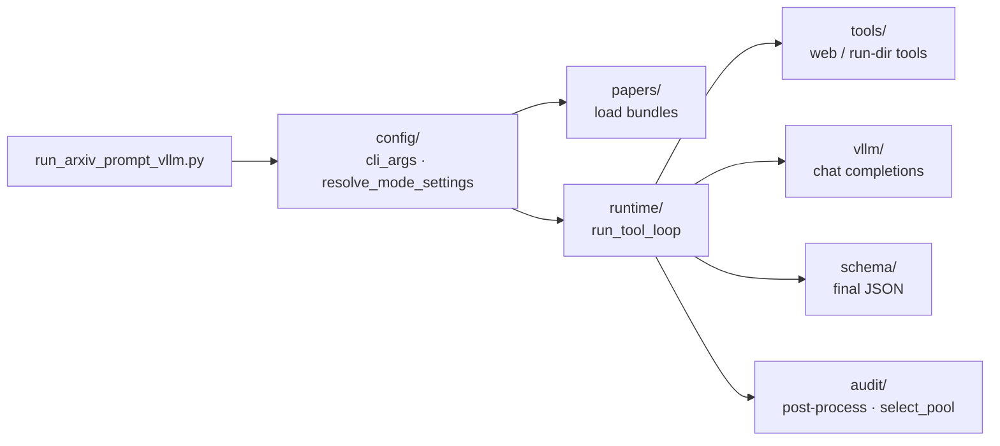

# Repository layout & conventions

This page is the map for contributors and future agents: where each piece of ReproBench lives and the rules that keep it that way. The repo is organized around the [system architecture](../architecture.md) — one lockfile, three LLM agent roles sharing a single tool-calling core — so the package boundaries follow those roles, not arbitrary feature folders. Read this before adding a module; it tells you which package something belongs in and which file it should *not* outgrow.

## The one rule that shapes every file

!!! warning "300-line hand-written source limit"
    From `CLAUDE.md` and `AGENTS.md`:

    - Keep hand-written source files **under 300 lines**; `*.txt` and `*.md` files may exceed 300 lines.
    - Split code into focused modules **before** a file crosses that limit.
    - Generated data, paper text dumps, binary artifacts, and model outputs are **exempt**.

This is why `reprocli_vllm` is a set of small subpackages rather than a few large files, and why the largest source modules in the tree sit right under the cap (e.g. `tools/run_dir_tools.py` at ~296 lines). When a module approaches the limit, factor the cohesive part out into a sibling module — see the recent "Reorganize reprocli_vllm into focused subpackages" history for the pattern.

## Top-level tree

```text
reprocli/
├── src/
│   ├── run_arxiv_prompt_vllm.py     ✅ entry point — main() for classify & audit
│   ├── reprocli_vllm/               ✅ the agent core (classifier + auditor)
│   ├── reprocli_data/               ✅ dataset build/publish pipeline
│   ├── reprocli_openai/             ✅ gpt-5.5 recheck of Hard no-code rows
│   └── data/get_premade.py          ✅ Paper Digest "with code" scraper (one-off)
├── tools/                           ✅ review apps + analysis scripts (not importable pkg)
│   ├── verify_app/                  ✅ classifier-output review app
│   ├── v3_viewer/                   ✅ run/quality viewer
│   ├── plot_audit_pool.py · tier_composition.py · upload_audit_pool_hf.py
├── scripts/                         ✅ SLURM sbatch + interactive notes
├── tests/                           ✅ pytest, mirrors reprocli_vllm subpackages
├── docs/                            this MkDocs Material site
├── prompt.txt · prompt_audit.txt · rubric_audit.md   prompts + audit rubric
├── data/ · outputs/                 generated datasets, run bundles, model outputs
└── CLAUDE.md · AGENTS.md · README.md · mkdocs.yml · requirements.txt
```

!!! note "Import root"
    `src/` is on `PYTHONPATH` (the sbatch scripts set `export PYTHONPATH=…/src`), so packages import as `reprocli_vllm.*`, `reprocli_data.*`, `reprocli_openai.*`. The entry point runs as `python3 src/run_arxiv_prompt_vllm.py`; the data/recheck tools run as `python -m reprocli_data.build_dataset` / `python -m reprocli_openai.recheck`.

## Where things live

| Path | Role | Read more |
|---|---|---|
| `src/run_arxiv_prompt_vllm.py` | `main()` — parses args, picks mode, loads inputs, runs the loop | [run-arxiv CLI](../cli/run-arxiv.md) |
| `src/reprocli_vllm/` | The agent core: classifier + auditor modes of one tool loop | [agent core](../agent-core/index.md) |
| `src/reprocli_data/` | Build & publish the NeurIPS-2025 paper bundle dataset | [build-dataset CLI](../cli/build-dataset.md), [dataset](../dataset/index.md) |
| `src/reprocli_openai/` | Re-check Hard-tier no-code rows on gpt-5.5 (Responses API) | [classifier](../modes/classifier.md) |
| `tools/verify_app/`, `tools/v3_viewer/` | Browser apps to review classifier output & runs | [verify app](../apps/verify-app.md), [v3 viewer](../apps/v3-viewer.md) |
| `tools/*.py` | Pool plots, tier composition, HF upload of the lockfile | [select-pool](../selection/select-pool.md) |
| `scripts/*.sbatch`, `delta_scripts.sh`, `*.md` | SLURM launch + interactive multi-node notes | [clusters](../slurm/clusters.md), [sbatch](../slurm/sbatch.md) |
| `tests/` | pytest suite, one subpackage per `reprocli_vllm` subpackage | [testing](testing.md) |

## `src/reprocli_vllm/` — the agent core ✅

One core (`run_tool_loop`, `runtime/tool_loop.py`) drives both the classifier (`--mode classification`) and the auditor (`--mode audit`); they differ only in prompt, toolset, and output schema. The subpackages split that core along the lines the [architecture overview](../architecture.md) describes.

| Subpackage | What's in it | Key modules |
|---|---|---|
| `config/` | CLI args, defaults, mode resolution, placeholders | `cli_args.py`, `config.py`, `minimax_defaults.py` |
| `papers/` | Load arXiv LaTeX bundles + OpenReview supplements into `Paper` | `papers.py`, `bundles.py`, `supplements.py` |
| `runtime/` | The tool loop, guardrails, run-health, MRE records, trace I/O | `tool_loop.py`, `loop_guards.py`, `run_health.py`, `mre_records.py`, `rerun.py`, `trace_io.py` |
| `tools/` | Tool layer: web/MCP tools (classify) + run-dir tools (audit) | `web_tools.py`, `run_dir_tools.py`, `github_mcp.py`, `huggingface_mcp.py`, `mcp_client.py`, `paper_bundle.py` |
| `schema/` | Structured-output schemas for each mode | `output.py` (classifier), `audit.py` (auditor) |
| `audit/` | Auditor post-processing + pool selection (the lockfile) | `audit.py`, `select_pool.py`, `h100.py`, `inputs.py` |
| `vllm/` | The embedded/attached model server + chat-completions I/O | `server.py`, `client.py`, `io.py`, `cache.py` |
| (top level) | HF upload of run outputs | `hf_upload.py` |

!!! tip "Which subpackage does new code go in?"
    Loop mechanics and budgets → `runtime/`. A new tool the model can call → `tools/` (and register it in the mode's toolset). A change to what the model must *emit* → `schema/`. Anything that turns model evidence into a computed label (tier, score, verdict, selection) → `audit/`. Talking to the model server → `vllm/`.



See the [tool loop](../agent-core/tool-loop.md), [guardrails](../agent-core/guardrails.md), and [structured output](../agent-core/structured-output.md) pages for how `runtime/`, `loop_guards.py`, and `schema/` fit together, and the [classifier](../modes/classifier.md) / [auditor](../modes/auditor.md) mode pages for the two live roles.

## `src/reprocli_data/` — dataset pipeline ✅

Builds the one-row-per-paper bundle that the classifier reads. `build_dataset.py` is the CLI; the `pipeline/` subpackage holds the five stages (`index → sources → supplements → bundle → upload`), again split to stay under the line limit.

| Module | Stage / role |
|---|---|
| `build_dataset.py` | CLI dispatcher over the five stages |
| `pipeline/index.py` | Snapshot pre-matched arXiv ids from the NeurIPS2025 dataset |
| `pipeline/sources.py` | Download + extract arXiv e-print packages |
| `pipeline/supplements.py`, `attachments.py` | OpenReview supplementary material |
| `pipeline/bundle.py` | Assemble the Parquet bundle |
| `pipeline/output.py`, `common.py` | Shared paths, filenames, writers |
| `publish_bundle.py` | Push the bundle folder to the Hugging Face Hub |

Details on each stage and the emitted schema live in [dataset stages](../dataset/stages.md) and the [bundle schema](../dataset/bundle-schema.md).

## `src/reprocli_openai/` — recheck ✅

`recheck.py` re-checks the audit-pool's Hard-tier no-code rows on gpt-5.5 using the synchronous OpenAI Responses API (the Batch queue was too slow), with web search and strict structured outputs. It reuses `reprocli_vllm.config` placeholders, appends raw responses to `results_raw.jsonl` for resume, and is invoked as `python -m reprocli_openai.recheck` (`--status` for progress).

## `tools/` and `scripts/`

`tools/` is **not** an importable package — it holds standalone review apps and analysis scripts:

- `verify_app/` — review classifier output (see [verify app](../apps/verify-app.md)).
- `v3_viewer/` — view runs / quality (see [v3 viewer](../apps/v3-viewer.md)).
- `plot_audit_pool.py`, `tier_composition.py`, `upload_audit_pool_hf.py` — pool analysis + publishing the [lockfile](../selection/lockfile.md).

`scripts/` holds the SLURM substrate: `paper_classification.sbatch`, `paper_classification_kimi_k2_6.sbatch`, `paper_verification.sbatch`, the `delta_scripts.sh` helpers, and `kimi_k2_6_multinode_interactive.md`. See [clusters](../slurm/clusters.md) and [sbatch](../slurm/sbatch.md).

## `tests/`

The suite mirrors the `reprocli_vllm` subpackages — one test directory per subpackage — so a change in `audit/` lands tests in `tests/audit/`, a change in `runtime/` lands them in `tests/runtime/`, and so on (`tests/{audit,papers,runtime,schema,tools,vllm}/`). Keep that mapping when you add modules. See [testing](testing.md).

## 🚧 Proposed split: `src/reprocli_repro/`

The reproduction agent (stage S6) is **designed but not yet wired** — see [reproduction mode](../modes/reproduction.md) and architecture §III. When it is built, the plan ([architecture §III.6](../architecture.md)) is to add a new top-level package rather than grow `reprocli_vllm`, which keeps the classifier/auditor separate from the execution harness and every module under the 300-line rule:

```text
src/reprocli_repro/        🚧 the S6 execution agent (mode = reproduce)
  cli_args.py              --mode reproduce wiring; reuses resolve_mode_settings seam
  slurm.py                 salloc/srun wrappers, allocation lifecycle, node discovery
  budget.py                H100-equiv meter + hw_multiplier table
  workspace.py             per-paper workspace + uv venv + pinned-commit clone
  evidence.py              commands.log / trajectory.jsonl / env.lock / patches capture
  tools/
    workspace_bash.py      CPU steps
    run_gpu.py             the srun-dispatching tool

src/reprocli/report/       🚧 the bundle layer (also feeds the auditor)
  schema.py · validate.py · render.py · reexecute.py
```

!!! note "Why a separate package, not more files in `reprocli_vllm`"
    The reproduction agent shares the `run_tool_loop` skeleton but bolts on an execution toolset and a compute-budget guardrail. Splitting it out closes the standing TODO to separate classification/audit from the harness, and means the GPU/`srun` machinery never bloats the classifier/auditor modules past the line limit.
