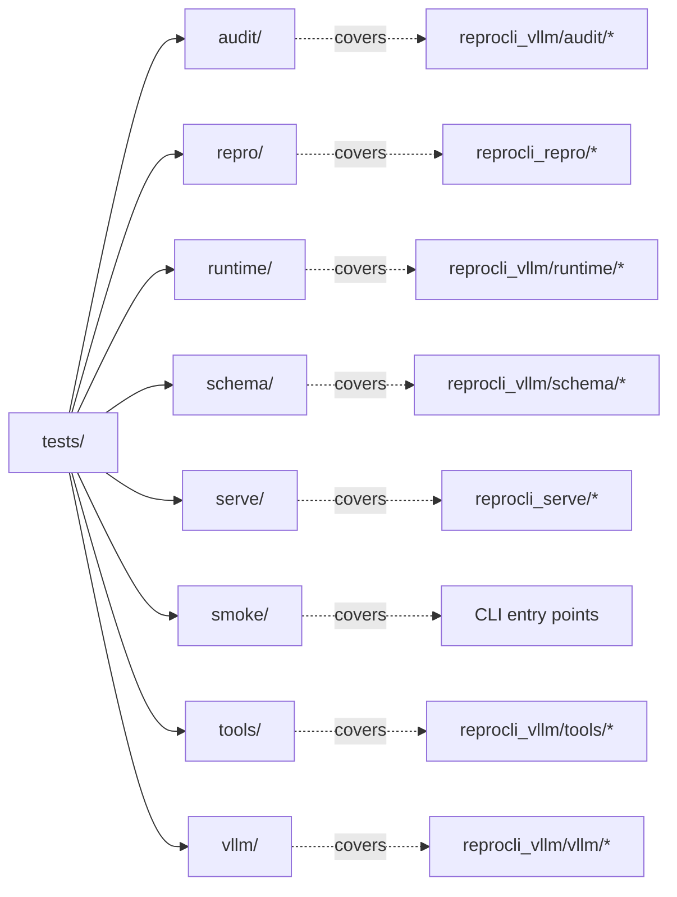

# Testing

The test suite lives under `tests/` and exercises the pure, deterministic logic of the agent core — scoring, schema constraints, loop guards, path-safety, and run-directory tools — without standing up a vLLM server or hitting the network. Tests are fast and hermetic: they import from `src/`, build fixtures in temp directories, and assert on plain dicts. New behavior ships with a test in the matching subpackage.

!!! note "Verified against"
    `tests/` (all modules), `tests/runtime/test_tool_loop_outputs.py`, `tests/audit/test_audit.py`, `tests/schema/test_output_schema.py`, `tests/tools/test_run_dir_tools.py`, `tests/repro/test_audit_bundle.py`, `runtime/tool_loop.py`.

## Running the suite ✅

The project uses a `src/` layout with no installed package, so `src` must be on the import path. Every test file already does `sys.path.insert(0, .../src)`, but the canonical convention across the repo (the `PYTHONPATH=src python3 -m ...` invocations in the root `README.md`) is `PYTHONPATH=src`. Run from the repo root:

```bash
# Whole suite (pytest discovers both unittest and pytest-style tests)
PYTHONPATH=src python3 -m pytest tests -q

# One subpackage
PYTHONPATH=src python3 -m pytest tests/audit -q

# One module / one test
PYTHONPATH=src python3 -m pytest tests/audit/test_audit.py -q
PYTHONPATH=src python3 -m pytest tests/audit/test_audit.py::test_score_5_is_reproduced -q
```

!!! tip "pytest is the universal runner"
    Most modules subclass `unittest.TestCase`, but two (`tests/audit/test_audit.py`, `tests/tools/test_run_dir_tools.py`) are written as bare pytest functions that use the `tmp_path` fixture. `pytest` runs both styles; plain `python3 -m unittest` will **not** collect the pytest-style modules. Prefer `pytest`.

!!! note "No pytest config file"
    There is no `pyproject.toml`, `pytest.ini`, `setup.cfg`, or `conftest.py`. Discovery relies on pytest defaults (`test_*.py`, `Test*` classes, `test_*` functions). Runtime deps come from `requirements.txt`; `pytest` itself is a dev tool you install separately.

## Layout

Tests mirror the source subpackage they cover. Each directory is a Python package (`__init__.py` present) but holds no shared fixtures.



## What each subpackage covers

| Subpackage | Modules | Covers |
| --- | --- | --- |
| `tests/audit` | `test_audit.py`, `test_h100_audit.py` | The [auditor](../modes/auditor.md) finalizer and prompt builder (`reprocli_vllm/audit/audit.py`, `audit/inputs.py`) and the [H100 compute-budget](../selection/h100-budget.md) banding/arithmetic checks (`audit/h100.py`). |
| `tests/repro` | `test_budget.py`, `test_cluster.py`, `test_slurm.py`, `test_sandbox.py`, `test_run_gpu.py`, `test_workspace.py`, `test_reference.py`, `test_inputs.py`, `test_evidence.py`, `test_context.py`, `test_guardrails.py`, `test_report.py`, `test_audit_bundle.py`, `test_postgrest.py`, … | The [reproduction agent](../modes/reproduction.md) (`reprocli_repro/*`): the budget meter, JIT-SLURM/Apptainer step builder, workspace/reference/evidence setup, `run_gpu`, and the `report.json` bundle. `test_audit_bundle.py` drives the **unchanged** auditor over an S6 bundle. |
| `tests/runtime` | `test_loop_guards.py`, `test_run_health.py`, `test_runtime_cleanup.py`, `test_tool_loop_outputs.py` | The [tool loop](../agent-core/tool-loop.md) [guardrails](../agent-core/guardrails.md) (`runtime/loop_guards.py`, `tools/result_limits.py`), health/telemetry finalization (`runtime/run_health.py`), CLI arg defaults (`run_arxiv_prompt_vllm.py`), and incremental output writing (`runtime/tool_loop.py`). |
| `tests/schema` | `test_output_schema.py` | The model-facing [structured-output](../agent-core/structured-output.md) JSON schema and the deterministic dataset-construction scoring (`reprocli_vllm/schema/output.py`). |
| `tests/serve` | `test_endpoint.py`, `test_launch.py`, `test_network_profiles.py`, `test_serve_env.py` | The [model server](../slurm/serve.md) (`reprocli_serve/*`): endpoint publish/read, the built `vllm serve` command, serve-profile resolution, and env wiring. |
| `tests/smoke` | `test_cli_smoke.py` | The CLI entry points parse args and wire defaults without a server. |
| `tests/tools` | `test_run_dir_tools.py` | The auditor's [run-directory tools](../tools/run-dir-tools.md) with path-traversal safety (`reprocli_vllm/tools/run_dir_tools.py`, dispatch via `tools/web_tools.py`). |
| `tests/vllm` | `test_client.py`, `test_endpoint.py`, `test_retry.py`, `test_vllm_batch_io.py` | Chat-completion request construction, endpoint discovery, transient-error retry, and when `response_format` vs `tools` is attached (`reprocli_vllm/vllm/*`). |

### Representative cases

!!! example "Code, not the model, enforces the rules"
    The suite pins the invariants that protect the benchmark from a model gaming its own output:

    - **Anti-cheat cap** — `tests/audit/test_audit.py::test_high_flag_caps_score_to_zero`: a `high`-severity cheat flag forces `score` to `0`, `verdict` to `not_reproduced`, and records the model's `reported_score`. `finalize_audit_row` owns this, not the model.
    - **Deterministic scoring** — `tests/schema/test_output_schema.py::test_normalize_preserves_mismatched_model_values`: a model-emitted `score: 516` is overwritten by the rubric-derived value and the original is preserved as `reported_score`. The model schema is asserted to **not** request `score`, `tier`, or `web_verification`.
    - **Path safety** — `tests/tools/test_run_dir_tools.py::test_read_run_file_blocks_traversal` and `test_write_run_file_blocks_traversal`: `../` escapes the bound run dir are rejected; `run_bash` executes inside the run dir; overwriting an existing file is refused.
    - **Loop guards** — `tests/runtime/test_loop_guards.py`: failed tool calls are not counted toward the repeat-cutoff, the context budget trips before the hard token limit, and oversized tool results are clamped with a truncation note.

## The tool loop under test

`runtime/tool_loop.py` orchestrates the async request/tool fan-out and is hard to unit-test end-to-end (it needs a live server). Tests target its **deterministic seams** rather than `run_tool_loop` itself:

- `prepare_incremental_outputs` and `append_completed_outputs` — exercised by `tests/runtime/test_tool_loop_outputs.py`, which drives a final row through `extracted_response`/`append_trace_row` and asserts the per-paper `score`, `tier`, `verification_status`, and trace `custom_id` land in the right JSONL files.
- The guard helpers it calls (`repeated_tool_call`, `record_tool_call`, `context_budget_exceeded` from `runtime/loop_guards.py`) are tested directly in `tests/runtime/test_loop_guards.py`.

!!! tip "Prefer testing the seam"
    When adding loop behavior, factor the decision into a small pure helper (as the loop already does with its guards) and test that, instead of trying to mock the `ThreadPoolExecutor` fan-out in `run_tool_loop`.

## Conventions for new tests

!!! warning "New modules ship with tests"
    A new module in `reprocli_vllm` should land with a test in the matching `tests/<subpackage>/` directory. Untested deterministic logic — scoring, schema shape, path safety, parsing — is the kind of thing this suite exists to lock down.

When writing a test:

| Convention | Detail |
| --- | --- |
| Import path | Start with `sys.path.insert(0, str(Path(__file__).resolve().parents[2] / "src"))` (copy from any sibling test) so the module also runs standalone. |
| Style | Either `unittest.TestCase` or bare pytest functions are fine — `pytest` collects both. Match the neighbors in the directory. |
| Temp dirs | Use the pytest `tmp_path` fixture (pytest style) or `tempfile.TemporaryDirectory()` (unittest style). Never write into the repo or a real run dir. |
| No network / no GPU | Build fixtures as plain dicts; mock external calls with `unittest.mock.patch` (see `tests/runtime/test_runtime_cleanup.py`, `tests/repro/test_run_gpu.py`). |
| File size | The [300-line limit](layout.md) applies to test files too — split before crossing it. |

## Related pages

- [Repository layout](layout.md) — where source and tests sit.
- [Architecture overview](../architecture.md) — the three agent roles these tests guard.
- [Guardrails](../agent-core/guardrails.md) and [the tool loop](../agent-core/tool-loop.md) — the runtime logic most heavily tested.
