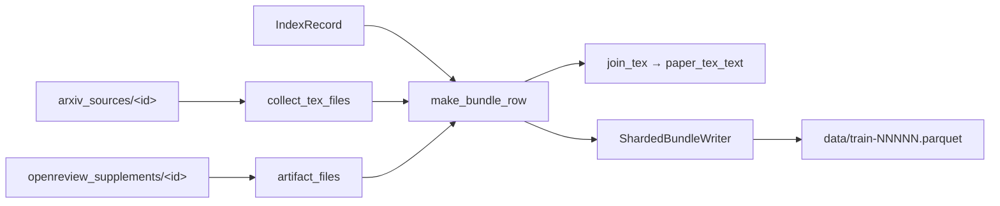

# Bundle Parquet Schema

The bundle stage assembles a **one-row-per-paper** Parquet dataset from the extracted arXiv sources and OpenReview supplements. Each row groups a paper's decoded `.tex` files (and their concatenation) with the OpenReview supplementary files matched by forum id. This page documents the exact column set, defined in `reprocli_data/pipeline/output.py` and populated by `reprocli_data/pipeline/bundle.py`.

!!! note "Where this fits"
    The schema is the final artifact of the `bundle` stage. See [Dataset Stages](stages.md) for how `index → sources → supplements → bundle → upload` produce it, and the [Dataset Overview](index.md) for context.

## Dataset name on the Hub ✅

The bundle is published to the dataset repo **`Mithilss/neurips-2025-paper-bundles`** (`DEFAULT_REPO_ID` in `pipeline/output.py`). The reproduction agent reads it per paper through `reprocli_repro/reference.py` (`find_bundle_row` / `materialize_reference`), which streams the dataset and writes one paper's LaTeX + supplements into a read-only `reference/` directory for a run.

!!! warning "The intermediate file-level dataset is gone"
    The old per-file dataset (`Mithilss/neurips-2025-arxiv-latex-sources`) is **no longer produced**. Bundles are built directly from the extracted source directories under `<data-dir>/arxiv_sources/`. There is exactly one published artifact now: the bundle.

## Top-level columns

Eleven columns, in this order, declared as the PyArrow `SCHEMA` in `pipeline/output.py` and filled by `make_bundle_row()` in `pipeline/bundle.py`.

| Column | Arrow type | Meaning |
| --- | --- | --- |
| `arxiv_id` | `string` | arXiv id (may carry a `vN` suffix), pre-matched from `ai-conferences/NeurIPS2025`. Rows are sorted by this id before sharding. |
| `title` | `string` | Whitespace-normalized paper title from the upstream NeurIPS dataset. |
| `openreview_id` | `string` | OpenReview forum/note id parsed from the upstream `paper_url`; used to match supplements. Empty string if none. |
| `arxiv_id_source` | `string` | How the upstream dataset derived the arXiv match (provenance label). |
| `paper_source_url` | `string` | arXiv e-print URL the source tarball was fetched from (`https://arxiv.org/e-print/<id>`). |
| `paper_status` | `string` | Source download status from the sources manifest; defaults to `"downloaded"` when absent. |
| `paper_tex_files` | `list<TEX_STRUCT>` | Per-`.tex`-file records (see [Paper `.tex` files](#nested-struct-paper-tex-files-paper_tex_files)). |
| `paper_tex_text` | `string` | All `.tex` files concatenated, each prefixed with a `% FILE: <relative_path>` header, joined by blank lines. |
| `supplement_source_url` | `string` | OpenReview supplement source URL from the supplements manifest; empty string if no supplement. |
| `supplement_status` | `string` | `"downloaded"` if any supplement file is present, otherwise `"missing"`. |
| `supplement_files` | `list<FILE_STRUCT>` | Per-supplement-file records (see [Supplement files](#nested-struct-supplement-files-supplement_files)). |

!!! note "Provenance, not matching"
    `arxiv_id`, `title`, `openreview_id`, and `arxiv_id_source` originate from the pre-matched `ai-conferences/NeurIPS2025` dataset. Papers without an arXiv id are dropped upstream in the `index` stage — no fuzzy title matching happens anywhere (`pipeline/index.py`).

## Nested struct: paper `.tex` files (`paper_tex_files`)

A `list` of structs, one per `.tex` file under the paper's source directory, collected by `collect_tex_files()` in `pipeline/bundle.py`. Only files whose suffix case-folds to `.tex` are included; each file is read in full and decoded.

| Field | Arrow type | Meaning |
| --- | --- | --- |
| `relative_path` | `string` | POSIX path of the file relative to the paper's source root. |
| `filename` | `string` | Base filename. |
| `file_size` | `int64` | Raw byte length of the file. |
| `sha256` | `string` | SHA-256 hex digest of the raw bytes. |
| `text` | `string` | Decoded text (UTF-8, then Latin-1 fallback); empty string if neither decode succeeds. |

!!! tip "`paper_tex_text` is derived"
    `paper_tex_text` is just `join_tex(paper_tex_files)` — the per-file `text` fields concatenated with `% FILE:` banners. It is the convenient single-string view; `paper_tex_files` is the structured source of truth.

## Nested struct: supplement files (`supplement_files`)

A `list` of structs, one per file in the matched OpenReview supplement archive, collected by `artifact_files()` in `pipeline/bundle.py`. Unlike `.tex` records, supplement structs always carry the raw bytes, so binary artifacts (figures, checkpoints, archives) round-trip losslessly.

| Field | Arrow type | Meaning |
| --- | --- | --- |
| `relative_path` | `string` | POSIX path relative to the supplement root. |
| `filename` | `string` | Base filename. |
| `extension` | `string` | Case-folded file suffix (e.g. `.py`, `.png`). |
| `file_size` | `int64` | Raw byte length. |
| `sha256` | `string` | SHA-256 hex digest of the raw bytes. |
| `is_text` | `bool` | `true` when the extension is in the text allow-list **and** the bytes decoded. |
| `text` | `string` | Decoded text for recognized text extensions; `null` otherwise. |
| `content` | `binary` | Raw file bytes (always present). |

!!! note "Which supplement files decode to text"
    `text` is populated only when the extension is in the `TEXT_EXTENSIONS` set in `pipeline/bundle.py` **and** the bytes decode under UTF-8 or Latin-1. That set covers LaTeX/docs/config suffixes like `.tex`, `.bib`, `.cls`, `.csv`, `.json`, `.md`, `.txt`, `.yaml`, and `.yml`; notably `.py` is **not** in it, so Python supplement files keep `text = null` and are reachable only through `content`. This is why the reproduction agent's `reference.py` materializer writes each supplement file from its raw `content` bytes (preserving `.py` and other binaries) and only falls back to `text` for LaTeX sources.

## Row construction flow



Papers whose source directory is missing or empty are counted in `papers_skipped_no_source` and excluded — `logical_bytes` (sum of `.tex` + supplement `file_size`) drives sharding only, not the schema.

## On-disk layout

`stage_bundle()` writes the dataset folder under `<data-dir>/paper_bundle_dataset/` (`BUNDLE_DIRNAME`):

| Path | Produced by | Contents |
| --- | --- | --- |
| `data/train-NNNNN.parquet` | `ShardedBundleWriter` | Sharded rows; shard size targeted by `--shard-size-mb`. |
| `README.md` | `write_bundle_readme()` | Hugging Face dataset card with the `data/train-*.parquet` config and a snapshot of counts. |
| `dataset_stats.json` | `write_bundle_stats()` | `Stats` dataclass plus the run config (dataset name, shard/batch knobs, compression). |

!!! example "Build, then upload"
    ```bash
    PYTHONPATH=src python3 -m reprocli_data.build_dataset --stages bundle --force
    PYTHONPATH=src python3 -m reprocli_data.build_dataset --stages upload
    ```
    `stage_upload()` validates the folder (card + at least one shard) and pushes it to `Mithilss/neurips-2025-paper-bundles`. See the [build-dataset CLI](../cli/build-dataset.md) for every flag.

## Related pages

- [Dataset Stages](stages.md) — the pipeline that fills this schema.
- [build-dataset CLI](../cli/build-dataset.md) — flags for sharding, batching, and upload.
- [The lockfile](../selection/lockfile.md) — the audited audit pool the bundle ultimately feeds.
