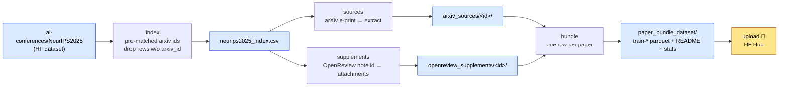

# Dataset pipeline ✅

The dataset pipeline turns the NeurIPS 2025 paper list into a single
one-row-per-paper Parquet dataset of **paper bundles**: each row groups a
paper's decoded arXiv `.tex` sources with its matched OpenReview supplementary
material. It is the first step of the whole system — its output was the
[corpus the upstream classifier pass read](../architecture.md) when building the
lockfile. The entry point is `reprocli_data/build_dataset.py`, which drives five
focused stage modules under `reprocli_data/pipeline/`.

!!! note "What this section covers"
    This page is the section landing: it explains the build command, the
    resume-friendly stage model, and how arXiv ids are matched. The two child
    pages go deeper:

    - **[Stages](stages.md)** — what each stage downloads, where it writes,
      throttling/retries, and resume semantics.
    - **[Bundle schema](bundle-schema.md)** — the exact Parquet columns,
      struct shapes, and dataset card.

    For the CLI flag reference, see [`build-dataset`](../cli/build-dataset.md).

## One command

The whole dataset builds end to end from one module invocation
(`reprocli_data/build_dataset.py`):

```bash
PYTHONPATH=src python3 -m reprocli_data.build_dataset --data-dir data --workers 8
```

!!! example "Smoke test (5 papers into a scratch dir)"
    ```bash
    PYTHONPATH=src python3 -m reprocli_data.build_dataset \
      --limit 5 --data-dir data/smoke --workers 2 --allow-failures
    ```

`--limit N` truncates the in-scope records to the first `N`; `--allow-failures`
returns `0` even when some downloads fail (otherwise a failed download makes the
run exit `1`). `--dry-run` prints up to 10 `arxiv_id / openreview_id /
source_url` rows and exits without downloading anything.

## Provenance: ids come pre-matched, no fuzzy matching

The `index` stage (`pipeline/index.py`) loads the
[`ai-conferences/NeurIPS2025`](https://huggingface.co/datasets/ai-conferences/NeurIPS2025)
Hugging Face dataset (`split="train"`) and keeps the columns `title`,
`paper_url`, `type`, `arxiv_id`, `arxiv_id_source`. Matching is done **upstream**
— this pipeline never fuzzy-matches titles to arXiv.

!!! warning "Papers without an arxiv_id are dropped"
    A row is kept only if `arxiv_id` is non-empty **and** matches
    `ARXIV_ID_RE` (a strict arXiv-id regex). The stage also drops malformed ids
    and de-duplicates by version-stripped base id. Each kept row becomes an
    `IndexRecord`, and the OpenReview note id is parsed out of `paper_url`
    (the `?id=` query param or the last path segment) — never from the title.

The snapshot is written to `data/neurips2025_index.csv`
(`INDEX_FILENAME = "neurips2025_index.csv"`) with columns
`arxiv_id, title, openreview_id, arxiv_id_source, type, source_url`. On a later
run the stage reloads this CSV unless `--force` is passed.

## Stages

The five stages are fixed in order by `STAGES` in `pipeline/common.py`:

| Stage | Module | Produces | Default |
|-------|--------|----------|---------|
| `index` | `pipeline/index.py` | `neurips2025_index.csv` snapshot of pre-matched ids | ✅ on |
| `sources` | `pipeline/sources.py` | extracted arXiv e-print dirs under `arxiv_sources/` + `manifest.csv` | ✅ on |
| `supplements` | `pipeline/supplements.py` | OpenReview attachments under `openreview_supplements/` + `manifest.csv` | ✅ on |
| `bundle` | `pipeline/bundle.py` | `paper_bundle_dataset/` Parquet shards + card + stats | ✅ on |
| `upload` | `pipeline/output.py` | push the bundle folder to the Hugging Face Hub | 🚧 opt-in |

By default `--stages` is `index,sources,supplements,bundle` (upload is left
out). `--upload` adds `upload` to the set; passing an unknown stage name is a
hard error. Whatever subset you request, stages always run in the order above
(`resolve_stages` filters `STAGES`, it does not reorder by request).

```bash
# Rebuild just the Parquet bundle from already-downloaded files
PYTHONPATH=src python3 -m reprocli_data.build_dataset --stages bundle --force

# Push an existing bundle folder to the Hub
PYTHONPATH=src python3 -m reprocli_data.build_dataset --stages upload
```

See **[Stages](stages.md)** for the per-stage download, throttle, and manifest
details.

## Resume-friendly by design

Every download stage is idempotent and skips work that already exists, so an
interrupted run can simply be re-invoked:

- **`sources`** — if a paper's extracted dir already exists and is non-empty,
  the worker returns `skipped_existing` instead of re-downloading
  (`download_source_one` in `pipeline/sources.py`).
- **`supplements`** — already-downloaded attachments are skipped unless
  overwritten; OpenReview notes are cached to
  `data/openreview_notes.json` (`NOTES_CACHE_FILENAME`) and reused on the next
  run.
- **`bundle`** — refuses to overwrite an existing `paper_bundle_dataset/`
  output unless `--force` is given (`stage_bundle` raises a `SystemExit`).

`--force` (alias `--overwrite`) flips all three: it refetches the index,
re-downloads existing source/supplement dirs, and replaces the bundle output.



## What the bundle contains

The `bundle` stage walks records sorted by `arxiv_id`, skips any paper without a
downloaded source dir (counted as `papers_skipped_no_source`), and writes one
row per remaining paper into zstd-compressed, size-targeted Parquet shards
(`train-00000.parquet`, …) via `ShardedBundleWriter`. Alongside the shards it
writes a dataset card (`README.md`) and a `dataset_stats.json` snapshot.

Each row carries the paper's `.tex` files (decoded text + sha256), a
concatenated `paper_tex_text`, and the matched supplement files (text or raw
bytes). The full column list and struct fields are documented on the
**[Bundle schema](bundle-schema.md)** page.

!!! tip "Memory on shared filesystems"
    The builder batches paper rows in memory before flushing Parquet. On a
    memory-constrained shared-filesystem run, lower `--batch-size-mb` (default
    64) or `--batch-rows` (default 64); `--shard-size-mb` (default 512) targets
    the on-disk shard size.

## Output layout

Under `--data-dir` (default `data/`):

```text
data/
├── neurips2025_index.csv          # index snapshot
├── openreview_notes.json          # cached OpenReview notes
├── arxiv_sources/
│   ├── <arxiv_id>/...             # extracted e-print files
│   └── manifest.csv               # per-paper download status
├── openreview_supplements/
│   ├── <arxiv_id>/...             # downloaded attachments
│   ├── openreview_jobs.csv        # matched supplement jobs
│   └── manifest.csv               # per-paper download status
└── paper_bundle_dataset/
    ├── data/train-*.parquet       # the dataset shards
    ├── README.md                  # dataset card
    └── dataset_stats.json         # snapshot counts + build config
```

## Upload 🚧

`upload` validates the bundle folder (card present, at least one Parquet shard)
and pushes it to a Hugging Face dataset repo via `huggingface_hub`. The default
target is `Mithilss/neurips-2025-paper-bundles`
(`DEFAULT_REPO_ID` in `pipeline/output.py`); override with `--repo-id`, and set
`--private` / `--commit-message` as needed. Upload needs an `HF_TOKEN` and is
off unless you pass `--upload` or `--stages upload`.

!!! note "Optional credentials"
    `OPENREVIEW_USERNAME` / `OPENREVIEW_PASSWORD` authenticate OpenReview note
    fetching for the `supplements` stage; `HF_TOKEN` authenticates the
    `upload` stage. Neither is required for `index`, `sources`, or `bundle`.
