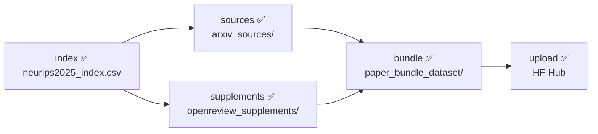

# Dataset pipeline stages

The dataset builder is one CLI (`reprocli_data/build_dataset.py`) with five ordered
stages that turn the pre-matched `ai-conferences/NeurIPS2025` index into a
one-row-per-paper Parquet bundle on the Hugging Face Hub. Every stage reads and
writes under one `--data-dir` (default `data/`), so partial runs resume cleanly.
Papers without a pre-matched `arxiv_id` are dropped; **nothing in this pipeline
fuzzy-matches titles** — supplements are matched only by OpenReview forum id
(`pipeline/supplements.py`).

!!! note "Invocation"
    There is no console-script entry point. Run the module directly:
    ```bash
    PYTHONPATH=src python3 -m reprocli_data.build_dataset --data-dir data --workers 8
    ```
    See [the build-dataset CLI page](../cli/build-dataset.md) for the full flag
    reference, and [the bundle schema](bundle-schema.md) for the Parquet layout.

## Stage order and selection

The canonical order is fixed in `pipeline/common.py`:

```python
STAGES = ("index", "sources", "supplements", "bundle", "upload")
```

`--stages` takes a comma-separated subset; `resolve_stages` re-sorts it back into
`STAGES` order, so you cannot reorder stages. Unknown stage names raise
`SystemExit`. `--upload` is sugar that adds `upload` to whatever set you asked
for. The default is `index,sources,supplements,bundle` (upload is opt-in).



When `index` is **not** in the requested stages, `main()` still loads scope by
reading the existing `neurips2025_index.csv` via `read_index_csv` (which exits
with a helpful message if the CSV is absent). `--limit N` truncates the record
list to the first `N` after the index is loaded, and applies to every stage in
the run. `--dry-run` prints up to 10 `arxiv_id / openreview_id / source_url`
rows and exits before any download.

### Flags that span every stage

| Flag | Default | Applies to | Effect |
| --- | --- | --- | --- |
| `--data-dir` | `data` | all | Root for every artifact below. |
| `--stages` | `index,sources,supplements,bundle` | all | Subset to run, always in `STAGES` order. |
| `--limit N` | — | all | Process at most the first `N` papers. |
| `--force` / `--overwrite` | off | index, sources, supplements, bundle | Refetch / re-download / replace existing outputs. |
| `--workers` | `8` | sources, supplements | Thread-pool size for downloads. |
| `--allow-failures` | off | sources, supplements | Return exit `0` even if downloads failed. |
| `--dry-run` | off | all | List scope and exit. |

!!! warning "`--force` is shared"
    A single `--force` re-runs the index fetch, re-downloads existing source and
    supplement dirs, **and** replaces the bundle output. To re-bundle without
    re-downloading, scope the run: `--stages bundle --force`.

Failure accounting: `main()` sums `status == "failed"` results from the
`sources` and `supplements` stages. If any failed, it prints a count and returns
exit `1` — unless `--allow-failures` is set, in which case it returns `0`. The
`bundle` and `upload` stages do not contribute to this count.

---

## index ✅

`pipeline/index.py` — snapshot the pre-matched arXiv ids and titles.

| | |
| --- | --- |
| **Input** | The `ai-conferences/NeurIPS2025` HF dataset (`train` split), columns `title, paper_url, type, arxiv_id, arxiv_id_source`. |
| **Output** | `<data-dir>/neurips2025_index.csv` (`INDEX_FILENAME`), columns `arxiv_id, title, openreview_id, arxiv_id_source, type, source_url`. |
| **Returns** | A list of `IndexRecord` used as scope for all later stages. |

`load_neurips_index()` keeps a row only when `arxiv_id` is non-empty and matches
`ARXIV_ID_RE` (e.g. `2501.01234`, `2501.01234v2`, or the old `hep-th/9901001`
scheme). It deduplicates on the version-stripped base id and logs counts of
`missing`/`malformed`/`duplicate` rows. `openreview_id` is derived from
`paper_url` by `parse_openreview_id` — first the `?id=` query param, else the
last non-`forum`/`pdf` path segment. `source_url` is the arXiv e-print URL from
`arxiv_eprint_url` (`https://arxiv.org/e-print/<id>`).

!!! tip "Resume"
    `stage_index` reuses an existing `neurips2025_index.csv` and prints
    "*pass `--force` to refetch*". `--force` re-pulls the upstream dataset and
    rewrites the CSV. `read_index_csv` validates that all `INDEX_COLUMNS` are
    present and tells you to re-run with `--force` if a column is missing.

---

## sources ✅

`pipeline/sources.py` — download and extract arXiv e-print packages.

| | |
| --- | --- |
| **Input** | `IndexRecord.source_url` (arXiv e-print URL). |
| **Output** | One dir per paper at `<data-dir>/arxiv_sources/<arxiv_id>/` (`/` in ids becomes `_` via `safe_dirname`), plus `<data-dir>/arxiv_sources/manifest.csv`. |

Each paper is fetched on a `ThreadPoolExecutor` (`--workers`, default 8). A
shared `RequestThrottle` enforces `--delay` (default `0.25` s) as the minimum
gap between arXiv requests across all workers. `unpack_source_package` tries a
`tar` archive first, then gzip-decompresses and retries tar, then falls back to
writing a single `source.tex` (or `<id>.source`) file. HTML responses
(rate-limit / error pages) are rejected via `looks_like_html`. Downloads land in
a temp dir and are atomically renamed into place (`replace_with_tmp`), so a
crash never leaves a half-written paper dir.

| Flag | Default | Effect |
| --- | --- | --- |
| `--workers` | `8` | Concurrent downloads. |
| `--delay` | `0.25` | Min seconds between arXiv requests (all workers). |
| `--retries` | `3` | HTTP retry attempts per paper. |
| `--timeout` | `60.0` | Per-request timeout (seconds). |
| `--keep-archive` | off | Also write the raw `.e-print` archive alongside extracted files. |
| `--force` | off | Re-download dirs that already have content. |

!!! tip "Resume"
    A paper dir that exists and is non-empty returns `skipped_existing` unless
    `--force` is set, so re-running the stage only fetches the missing papers.
    Per-paper outcomes (`downloaded` / `skipped_existing` / `failed`) are
    recorded in `manifest.csv`, which the bundle stage reads back.

---

## supplements ✅

`pipeline/supplements.py` + `pipeline/attachments.py` — match papers to
OpenReview notes by **forum id** and download supplementary material.

| | |
| --- | --- |
| **Input** | `IndexRecord.openreview_id` matched against OpenReview notes for the venue. |
| **Output** | One dir per paper at `<data-dir>/openreview_supplements/<arxiv_id>/`, plus `openreview_jobs.csv` and `manifest.csv` in that dir. |
| **Notes cache** | `<data-dir>/openreview_notes.json` (`NOTES_CACHE_FILENAME`), overridable with `--notes-json`. |

`load_or_fetch_notes` reuses the cached notes JSON if present; otherwise it
fetches all notes for `--venue-id` (default `NeurIPS.cc/2025/Conference`) from
`--api-base` (default `https://api2.openreview.net`) and caches them.
`index_notes_by_id` keys notes by both `id` and `forum`, and
`match_supplement_jobs` looks each paper up by its `openreview_id` — **there is
no title fallback**. A job is created only when the note has a content field
whose key contains "supplement" (`supplement_attachment`); the attachment URL is
taken from the field value or built via `attachment_url(note_id, field_name)`.
The matcher logs how many papers were dropped for: no OpenReview id, id not
found, or no supplement field.

Downloads run on a sliding-window thread pool (`--workers`) with a separate
`RequestThrottle` set by `--supplement-delay` (default `0.75` s). Each archive is
unpacked as zip, then tar, then written as a single
`supplementary_material.bin` (`unpack_archive`). Auth uses
`OPENREVIEW_USERNAME` / `OPENREVIEW_PASSWORD` env vars if set (`build_client`).

| Flag | Default | Effect |
| --- | --- | --- |
| `--workers` | `8` | Concurrent attachment downloads. |
| `--supplement-delay` | `0.75` | Min seconds between OpenReview requests. |
| `--retries` | `3` | Attachment fetch retries (a 404 aborts immediately). |
| `--venue-id` | `NeurIPS.cc/2025/Conference` | OpenReview venue to enumerate. |
| `--api-base` | `https://api2.openreview.net` | OpenReview API base URL. |
| `--notes-json` | `<data-dir>/openreview_notes.json` | Notes cache path. |
| `--force` | off | Re-download dirs that already have content. |

!!! tip "Resume"
    A non-empty supplement dir is `skipped_existing` unless `--force`. The notes
    cache also short-circuits the expensive `get_all_notes` call on re-runs —
    delete `openreview_notes.json` (or point `--notes-json` elsewhere) to force a
    refetch of the note list.

---

## bundle ✅

`pipeline/bundle.py` + `pipeline/output.py` — assemble the one-row-per-paper
Parquet dataset.

| | |
| --- | --- |
| **Input** | `arxiv_sources/`, `openreview_supplements/`, and both stages' `manifest.csv` files. |
| **Output** | `<data-dir>/paper_bundle_dataset/` (`BUNDLE_DIRNAME`) containing `data/train-NNNNN.parquet` shards, `README.md` (dataset card), and `dataset_stats.json`. |

Records are processed sorted by `arxiv_id`. A paper with no non-empty source dir
is counted as `papers_skipped_no_source` and dropped — supplements alone never
produce a row. `make_bundle_row` reads every `.tex` under the source dir
(decoded UTF-8 → latin-1, with per-file `sha256`), joins them into
`paper_tex_text`, and attaches all supplement files (with raw `content` bytes and
decoded `text` for known text extensions). See [the bundle schema
page](bundle-schema.md) for the full column list.

`ShardedBundleWriter` buffers rows and flushes to a new shard when a logical-byte
target is reached. The flush cadence is tunable:

| Flag | Default | Effect |
| --- | --- | --- |
| `--shard-size-mb` | `512` | Target logical bytes per Parquet shard (`train-*.parquet`). |
| `--batch-size-mb` | `64` | Flush buffered rows once they reach this many logical MB (floored at 1). |
| `--batch-rows` | `64` | Flush after this many buffered rows (floored at 1). |
| `--compression` | `zstd` | Parquet compression codec. |
| `--force` | off | Required to overwrite an existing bundle dir. |

!!! warning "Bundle is not incremental"
    If `paper_bundle_dataset/` already exists, the stage **exits** unless
    `--force` is passed, and `--force` deletes and rebuilds the whole dir
    (`shutil.rmtree`). Re-bundle with `--stages bundle --force` after a fresh
    download pass. "Logical bytes" is the summed `file_size` of a row's files,
    not the compressed on-disk size, so shards may be smaller than
    `--shard-size-mb` on disk.

---

## upload ✅

`pipeline/output.py::stage_upload` — push the bundle folder to the Hugging Face
Hub.

| | |
| --- | --- |
| **Input** | `<data-dir>/paper_bundle_dataset/` (`BUNDLE_DIRNAME`). |
| **Output** | A dataset repo on the Hub, default `Mithilss/neurips-2025-paper-bundles` (`DEFAULT_REPO_ID`). |

`validate_dataset_folder` first checks the dir exists, has a `README.md` card,
and has at least one `data/*.parquet` shard (otherwise `SystemExit`). It then
`create_repo(..., exist_ok=True)` and `upload_folder` the entire bundle.

| Flag | Default | Effect |
| --- | --- | --- |
| `--upload` | off | Adds `upload` to the run (or list it in `--stages`). |
| `--repo-id` | `Mithilss/neurips-2025-paper-bundles` | Target HF dataset repo. |
| `--private` | off | Create the repo private. |
| `--commit-message` | `Upload NeurIPS 2025 paper bundle dataset` | Commit message for the upload. |

!!! note "Upload-only run"
    Upload is decoupled from building; you can push an already-built bundle with
    `--stages upload`. It does not contribute to the download-failure exit code.
    `--force` has no effect on this stage.

---

## Artifact map

| Path under `--data-dir` | Constant | Written by |
| --- | --- | --- |
| `neurips2025_index.csv` | `INDEX_FILENAME` | index |
| `arxiv_sources/<id>/` + `manifest.csv` | `SOURCES_DIRNAME` | sources |
| `openreview_supplements/<id>/` + `manifest.csv` + `openreview_jobs.csv` | `SUPPLEMENTS_DIRNAME` | supplements |
| `openreview_notes.json` | `NOTES_CACHE_FILENAME` | supplements |
| `paper_bundle_dataset/` | `BUNDLE_DIRNAME` | bundle |

This dataset is the upstream input to the rest of the system; see
[the dataset overview](index.md) and [the architecture page](../architecture.md)
for how the bundle feeds the audit pool / [lockfile](../selection/lockfile.md) and,
downstream, the reproduction agent's per-paper `reference/` material.
