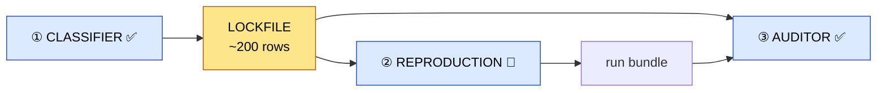
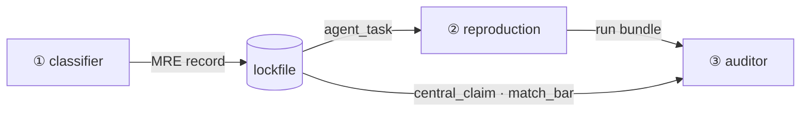

# Core concepts

The mental model for ReproBench in one page. The whole benchmark turns on **one lockfile** (a band-stratified audit pool) and **three LLM agent roles** arranged around it. Read this first; every term below links to its deep page. Status legend follows the [architecture overview](../architecture.md): ✅ live · 🚧 designed, not yet wired.



!!! tip "The through-line"
    The model reports **evidence**; deterministic code computes **every consequential label** (tier, score, verdict, run-health, band). No agent grades itself. Keep this in mind and the rest of the system falls into place.

## Glossary

| Term | One-line definition | Deep page |
|---|---|---|
| **MRE record** | The one structured record a classifier emits per paper: claim + minimal experiment + success bar + cost. The atomic row of the dataset. | [Dataset stages](../dataset/stages.md) |
| **`central_claim`** | The single, checkable result a paper is reduced to — what reproduction has to land. | [Bundle schema](../dataset/bundle-schema.md) |
| **`match_bar`** | The pinned success bar ("how close counts as a match"), set once and reused verbatim by the auditor. | [Bundle schema](../dataset/bundle-schema.md) |
| **lockfile / audit pool** | `audit_pool_extracted.jsonl` (~200 rows) — the selected, frozen dataset all consumers read. | [Lockfile](../selection/lockfile.md) |
| **tier** | Reproduction difficulty (Easy / Medium / Hard), computed from artifact-availability signals. | [Select pool](../selection/select-pool.md) |
| **band** | H100-hour cost bucket used to stratify selection (`0-8` / `8-32` / `32-96` / `96-192`). | [H100 budget](../selection/h100-budget.md) |
| **H100 budget / `h100_estimate`** | The compute cost of one MRE in H100-equivalent hours; caps and budgets the reproduction run. | [H100 budget](../selection/h100-budget.md) |
| **run bundle** | The evidence directory a reproduction run emits at `<runs-dir>/<arxiv_id>` for the auditor to grade. | [Bundle schema](../dataset/bundle-schema.md) |
| **classifier role** | Agent that reads a paper and emits one MRE record. | [Classifier mode](../modes/classifier.md) |
| **reproduction role** | Agent that actually runs the experiment under a metered budget. | [Reproduction mode](../modes/reproduction.md) |
| **auditor role** | Agent that grades one run bundle 0–5 against the rubric. | [Auditor mode](../modes/auditor.md) |

---

## MRE record ✅

The **Minimal Reproducible Experiment** record is the one structured object the classifier emits per paper, defined by `FINAL_JSON_SCHEMA` in `schema/output.py`. It is the atomic row of the dataset. Required fields:

| Field | What it holds |
|---|---|
| `central_claim` / `claim_evidence` | the checkable result + where in the paper it is stated |
| `paper_kind` | `empirical` · `theoretical` · `position` · `survey` |
| `mre_config` | the smallest experiment that tests the claim (free text) |
| `match_bar` | the pinned success bar (see below) |
| `agent_task` | what the reproduction agent is told to do |
| `verified_links` / `signals` | code / dataset / weights artifacts, each with a verification state |
| `h100_estimate` | the compute-cost object (see below) |

After the model returns, `normalize_score_and_tier` recomputes `score`/`tier` from `signals` and keeps the model's value as `reported_score`/`reported_tier` if it disagreed — the code, not the model, owns the label.

→ Deep dive: [Dataset stages](../dataset/stages.md) and [Bundle schema](../dataset/bundle-schema.md).

## `central_claim` ✅

The paper boiled down to **one result a reproduction must reproduce** — a single string the classifier extracts and the auditor restates as a checkable target (audit schema field C1, `schema/audit.py`). Pairs with `claim_evidence`, the quote/location backing it.

## `match_bar` and its kinds ✅

The **pinned success bar**: "how close counts as a match," set once by the classifier and carried in the lockfile so every agent is judged against the same ruler instead of one the auditor re-infers per run. It is a structured object — `match_bar_schema()` in `schema/output.py` — with required fields `kind`, `op`, `reference_value`, `tolerance`, `note`.

```text
Stage 1 classifier PINS it  →  lockfile CARRIES it  →  Auditor APPLIES it verbatim
```

The five `MATCH_BAR_KINDS`:

| `kind` | what counts as a match | example fields |
|---|---|---|
| `point_estimate` | land near a value | `op=abs_rel_within, reference_value=25.76, tolerance=0.05` |
| `threshold` | clear a floor/ceiling | `op=">=", reference_value=85, tolerance=null` |
| `direction` | beat a baseline (no tolerance band) | `op="measured_method > measured_baseline", reference/tolerance=null` |
| `magnitude` | the *size* of a delta is the target | `op="delta within tol", reference_value=+5, tolerance=0.05` |
| `none` | no checkable scalar/relation (theory/position) | all null |

!!! note
    `reference_value`/`tolerance` are nullable; they are `null` whenever the kind has no single scalar to be near (`direction`/`none`). Rows that predate the field, or `kind = none`, fall back to the `rubric_audit.md` C1 defaults.

→ Deep dive: [Bundle schema](../dataset/bundle-schema.md).

## The lockfile / audit pool ✅

`audit_pool_extracted.jsonl` (~200 rows) — **the frozen data** every downstream consumer reads. It is produced by `audit/select_pool.py` from a classifier run: keep a row only if `verification_status == "verified"`, its `tier` is one of the three evaluated tiers, and its audited H100 hours sit at or below the 192 cap. Selection is band-stratified, cheapest-first within each band, with per-tier band weights `5/7/8/5` per 25 selected (`BAND_WEIGHTS`); a deficit in an expensive band refills from the next cheapest band in the same tier. Each kept row gains `audited_h100_hours`, `h100_hours_adjudicated`, and `selection_band`.

→ Deep dive: [Lockfile](../selection/lockfile.md) and [Select pool](../selection/select-pool.md).

## tier (Easy / Medium / Hard) ✅

Reproduction difficulty, computed deterministically from the four artifact `signals` (`deterministic_score_and_tier` in `schema/output.py`): missing code adds 2 to the difficulty score, missing-and-nonstandard dataset adds 3, missing weights adds 1. `tier_for_score` then maps the score:

| score | tier |
|---|---|
| 0 | Easy |
| 1 | Medium |
| 2 | Hard |
| 3 *and* dataset available or standard | Hard |
| otherwise | `Artifact-Blocked` |

Only `Easy` / `Medium` / `Hard` (`EVAL_TIERS` in `select_pool.py`) are evaluated; `Artifact-Blocked` and non-empirical (`Out-of-Scope-Non-Empirical`) rows are logged-only.

→ Deep dive: [Select pool](../selection/select-pool.md).

## band (H100-hour buckets) ✅

The compute-cost bucket a row is binned into for stratified selection, assigned by `h100_band` in `audit/h100.py`:

| band | H100-equivalent hours |
|---|---|
| `0-8` | 0 to 8 |
| `8-32` | 8 to 32 |
| `32-96` | 32 to 96 |
| `96-192` | 96 to 192 |
| `>192` | over the cap → excluded (`OVER_CAP_BAND`) |

Bands keep the pool from collapsing onto the cheapest papers: selection draws across all four buckets so the benchmark spans real compute scales.

→ Deep dive: [H100 budget](../selection/h100-budget.md).

## H100 budget / `h100_estimate` ✅

`h100_estimate` (`h100_estimate_schema()` in `schema/output.py`) is the classifier's structured **compute-cost estimate**: `hours`, `basis_kind`, `gpu_count`, `gpu_type`, `wallclock_hours`, `h100_equivalent_multiplier`, and a free-text `basis`. The harness audits the arithmetic — `recomputed_hours` recomputes `gpu_count × wallclock × multiplier` and flags a mismatch over 20% (`audit/h100.py`). When the stated number looks inflated and the multiplier is sane, the recomputed value is **adjudicated** to win (`audited_h100_hours`, `select_pool.py`). The same hours number becomes the reproduction agent's spend cap.

!!! note "Why H100-equivalent?"
    A GH200 or H200 step is charged in H100-equivalent hours via `h100_equivalent_multiplier`, so cost is comparable across the heterogeneous [clusters](../slurm/clusters.md).

→ Deep dive: [H100 budget](../selection/h100-budget.md).

## run bundle 🚧

The evidence directory one reproduction run emits, at `<runs-dir>/<arxiv_id>`, that the auditor reads. The reproduction agent is **designed but not yet wired** (S6), so this is the one open edge of the system. The planned bundle holds `report.json` (the agent's cited account of what it ran and measured — **not** a verdict) and an `evidence/` tree, alongside `workspace/` and `reference/`. There is no harness-written `result.json` and no `repro.yaml`: the auditor authors the verdict. The auditor consumes the bundle read-only via `run_dir_manifest` (`tools/run_dir_tools.py`).

→ Deep dive: [Bundle schema](../dataset/bundle-schema.md) and [Reproduction mode](../modes/reproduction.md).

## The three agent roles

All three reuse **one tool-calling agent core** (`run_tool_loop`, `runtime/tool_loop.py`); only the prompt, toolset, and output schema differ. See [Agent core](../agent-core/index.md) for the shared loop.



### ① Classifier ✅

Reads a paper bundle, **verifies** code/data/weights artifacts with web + MCP tools, and emits one MRE record (`FINAL_RESPONSE_FORMAT`). Run via `--mode classification`. → [Classifier mode](../modes/classifier.md).

### ② Reproduction 🚧

Given one lockfile row, **actually runs the experiment** on the cluster under a metered H100-hour budget and writes the run bundle. Same loop skeleton, with an execution toolset (`workspace_bash`, `run_gpu` → `srun`) bolted on; designed but not yet built. → [Reproduction mode](../modes/reproduction.md).

### ③ Auditor ✅

Reads the `central_claim` + `match_bar` + one run bundle and **grades it 0–5** with `cheat_flags` (`AUDIT_RESPONSE_FORMAT`, `schema/audit.py`). Deterministic post-processing (`finalize_audit_row`, `audit/audit.py`) enforces the anti-cheat rule in code: **any high-severity cheat flag caps the score at 0**, then derives the coarse `verdict`. Run via `--mode audit`. → [Auditor mode](../modes/auditor.md).

!!! warning "The auditor never trusts its own arithmetic"
    The 0–5 `score` is the model's; the `verdict`, the high-flag cap, and run-health are computed downstream in `audit/audit.py`. The model proposes; the code decides.

---

## Where to go next

- [Quickstart](quickstart.md) — run the classifier and auditor end to end.
- [Architecture overview](../architecture.md) — the full S1–S7 pipeline and the SLURM substrate.
- [Agent core](../agent-core/index.md) — the one `run_tool_loop` all three roles share.
