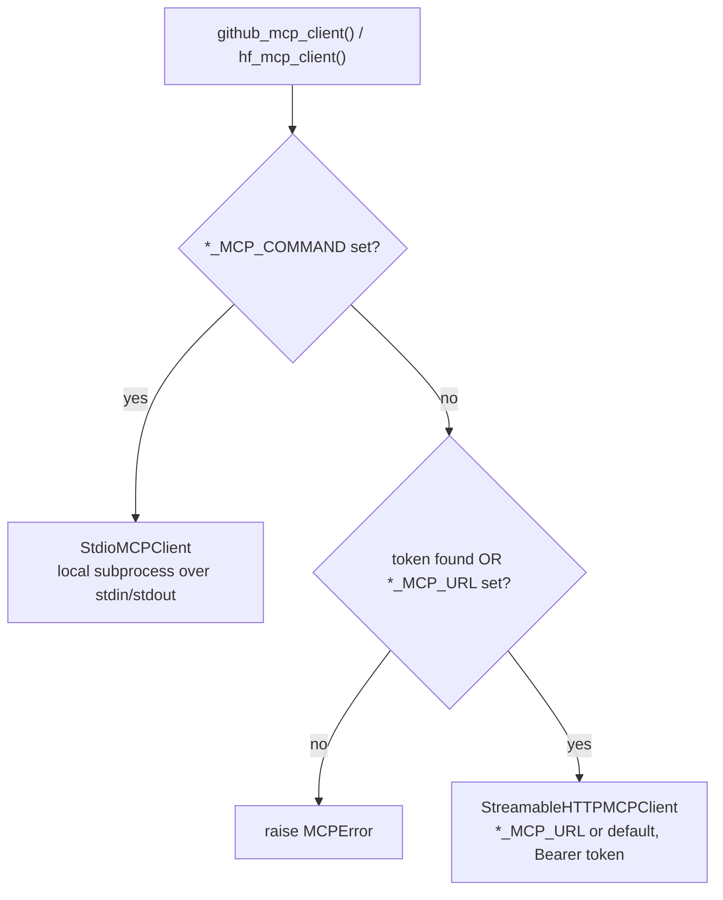

# Installation

ReproBench (`reprocli`) is a source checkout, not a packaged install: there is no
`pyproject.toml` or `setup.py`. You create a Python environment, install the
deps in `requirements.txt`, and run the entry point with `PYTHONPATH=src` so the
`reprocli_vllm`, `reprocli_data`, and `reprocli_openai` packages resolve. This
page covers the environment, the dependency set (including the vLLM nightly
extra index), and every credential / MCP-override environment variable the tool
layer reads.

!!! note "What needs a GPU"
    The classifier and auditor agents drive a vLLM OpenAI-compatible server. To
    run the embedded server you need CUDA GPUs; to grade or smoke-test against an
    already-running server you only need CPU + `--vllm-server-url`. See
    [the architecture overview](../architecture.md) for the role split and
    [Quickstart](quickstart.md) for first commands.

## 1. Python environment

The cluster jobs target **Python 3.11** (`module load python/3.11.9` in
`scripts/**/*.sbatch`). Create an isolated environment with `uv`:

```bash
# from the repo root
uv venv --python 3.11 .venv
source .venv/bin/activate
```

!!! tip "uv is the project standard"
    The reproduction-agent design (`reprocli_repro` 🚧) provisions a **per-paper
    `uv` venv** rather than a shared one, per [the architecture doc](../architecture.md)
    §IV.2. Using `uv` here keeps the local dev environment consistent with that
    intent. Plain `python -m venv` + `pip` works too.

## 2. Install dependencies

All runtime deps live in `requirements.txt`:

```text
--extra-index-url https://wheels.vllm.ai/nightly

datasets
huggingface_hub
openreview-py
vllm
```

Install them:

```bash
uv pip install -r requirements.txt
```

!!! warning "The vLLM nightly extra index is load-bearing"
    The first line, `--extra-index-url https://wheels.vllm.ai/nightly`, pins
    `vllm` to the **nightly wheel channel**. The Kimi K2.6 / MiniMax M2 paths use
    parsers and flags (`kimi_k2` tool/reasoning parsers,
    `--mm-encoder-tp-mode data`) that may not be in a stable vLLM release. Keep
    the `--extra-index-url` line when you reinstall, or `pip` will resolve `vllm`
    from PyPI and you may get an older build.

| Package | Why it is needed |
|---|---|
| `vllm` | the OpenAI-compatible model server (embedded or attached) |
| `datasets` | loads the paper-bundle dataset and writes/reads JSONL results |
| `huggingface_hub` | model/dataset downloads and incremental result uploads (`--hf-repo`) |
| `openreview-py` | dataset build only — fetches OpenReview supplements |

## 3. Run with `PYTHONPATH=src`

There is no install step that puts the packages on `sys.path`, so every
invocation prepends `src/`. The entry point is `src/run_arxiv_prompt_vllm.py`;
`scripts/**/*.sbatch` set `export PYTHONPATH=.../reprocli/src` for exactly this.

```bash
# agent entry point (classifier is the default mode)
PYTHONPATH=src python3 src/run_arxiv_prompt_vllm.py --help

# dataset builder (module form)
PYTHONPATH=src python3 -m reprocli_data.build_dataset --help
```

The default model is `MiniMaxAI/MiniMax-M2.7` (`DEFAULT_MODEL` in
`config/config.py`); pass `--model moonshotai/Kimi-K2.6` for the Kimi path. See
[`run-arxiv`](../cli/run-arxiv.md) and [`build-dataset`](../cli/build-dataset.md)
for the full flag sets, and [Quickstart](quickstart.md) for ready-to-run
commands.

!!! example "Attach to an existing server (no embedded GPU launch)"
    ```bash
    PYTHONPATH=src python3 src/run_arxiv_prompt_vllm.py \
      --vllm-server-url "http://${HEAD_IP}:8000" \
      --model moonshotai/Kimi-K2.6 \
      --num-prompts 2 --tool-rounds 12 \
      --dataset Mithilss/neurips-2025-paper-bundles \
      --output outputs/smoke.jsonl \
      --extracted-output outputs/smoke_extracted.jsonl \
      --max-model-len 196608
    ```
    When set, `--vllm-server-url` makes the runner skip launching its embedded
    server (`config/cli_args.py`).

## 4. Credentials & MCP overrides

The agent's web tools reach GitHub and Hugging Face through **MCP servers**
(`tools/github_mcp.py`, `tools/huggingface_mcp.py`). Both default to a **remote
streamable-HTTP MCP endpoint** and authenticate with a bearer token from the
environment; you can instead point them at a different HTTP URL or a **local
stdio MCP command**.

### Token resolution

Each client checks several env var names in order and uses the first that is set:

- **GitHub** (`github_token()`): `GITHUB_MCP_TOKEN` → `GITHUB_TOKEN` → `GH_TOKEN`.
- **Hugging Face** (`hf_token()`): `HF_MCP_TOKEN` → `HF_TOKEN` → `HUGGINGFACE_TOKEN`.

!!! warning "GitHub MCP tools require a token (or an explicit URL/command)"
    `github_mcp_client()` raises `MCPError` ("Set `GITHUB_MCP_TOKEN`,
    `GITHUB_TOKEN`, `GH_TOKEN`, or `GITHUB_MCP_COMMAND`…") unless a token is
    found **or** `GITHUB_MCP_URL` is set. The HF client raises the equivalent
    unless a token is found **or** `HF_MCP_URL` is set. The token is sent as
    `Authorization: Bearer <token>` to the remote server.

### Environment variable reference

| Variable | Purpose | Default |
|---|---|---|
| `GITHUB_TOKEN` | GitHub bearer token for the GitHub MCP server (`GITHUB_MCP_TOKEN` and `GH_TOKEN` are also accepted, in that priority order) | _unset_ — required unless `GITHUB_MCP_URL`/`GITHUB_MCP_COMMAND` is set |
| `GITHUB_MCP_URL` | Override the streamable-HTTP GitHub MCP endpoint | `https://api.githubcopilot.com/mcp/` |
| `GITHUB_MCP_COMMAND` | Run a **local stdio** GitHub MCP server instead of HTTP, e.g. `github-mcp-server stdio` (passes the token through as `GITHUB_PERSONAL_ACCESS_TOKEN`) | _unset_ (HTTP path used) |
| `GITHUB_MCP_TOOLSETS` | Comma-separated toolsets sent as the `X-MCP-Toolsets` header (HTTP); also exported as `GITHUB_TOOLSETS` for the stdio server | `repos,git,issues,pull_requests` |
| `HF_TOKEN` | Hugging Face bearer token for the HF MCP server (`HF_MCP_TOKEN`, `HUGGINGFACE_TOKEN` also accepted, in that priority order); also used for dataset/result uploads | _unset_ — required unless `HF_MCP_URL`/`HF_MCP_COMMAND` is set |
| `HF_MCP_URL` | Override the streamable-HTTP Hugging Face MCP endpoint | `https://huggingface.co/mcp` |
| `HF_MCP_COMMAND` | Run a **local stdio** HF MCP server instead of HTTP | _unset_ (HTTP path used) |
| `OPENREVIEW_USERNAME` | OpenReview login for the dataset builder's supplement-download stage | _unset_ (anonymous; some notes may be inaccessible) |
| `OPENREVIEW_PASSWORD` | OpenReview password, paired with `OPENREVIEW_USERNAME` | _unset_ |

!!! note "Scope of each variable"
    `GITHUB_*` and `HF_MCP_*`/`HF_TOKEN` are read by the **classifier**'s web
    tool layer (`WEB_TOOLS`: GitHub/HF MCP + `paper_bundle_file_contents`). The
    **auditor** does *not* use these MCP servers — audit mode swaps in read-only
    run-dir tools (`list_run_files` / `read_run_file` / `bash` over
    `<runs-dir>/<arxiv_id>`), so it needs none of the GitHub/HF MCP credentials.
    `OPENREVIEW_USERNAME` / `OPENREVIEW_PASSWORD` and `HF_TOKEN` (for upload) are
    read only by the **dataset builder** (`reprocli_data`); see
    [build-dataset](../cli/build-dataset.md) and the
    [dataset overview](../dataset/index.md).

### How the MCP client is chosen



The client is memoized with `@cache`, so the first tool call fixes the transport
for the process. Both transports share `mcp_client.py`
(`StdioMCPClient` / `StreamableHTTPMCPClient`), which speak MCP protocol
`2025-06-18`.

!!! example "Use local stdio MCP servers (no remote calls)"
    ```bash
    export GITHUB_TOKEN=ghp_...
    export GITHUB_MCP_COMMAND="github-mcp-server stdio"
    export HF_TOKEN=hf_...
    export HF_MCP_COMMAND="hf-mcp-server"   # any stdio HF MCP binary
    ```
    With `*_MCP_COMMAND` set, the HTTP URL is ignored and the binary is launched
    via `shlex.split` as a subprocess.

## Next steps

- [Quickstart](quickstart.md) — first classifier and audit runs.
- [Concepts](concepts.md) — the lockfile and three agent roles.
- [Web tools](../tools/web-tools.md) — the GitHub / HF / `fetch_url` tool surface.
- [SLURM clusters](../slurm/clusters.md) and [sbatch](../slurm/sbatch.md) — running on DeltaAI / Delta.
