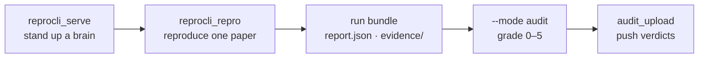

# Quickstart

The fastest paths to a first ReproBench result. The lockfile (the ~200-paper
audit pool) is already published, so the product loop is **serve a brain →
reproduce a paper → audit the run → upload the verdict**. Each command below is
copy-pasteable; run them from the repo root with `PYTHONPATH=src` (or activate the
project `.venv`).



Both agents are **URL-only brains**: they attach to the server by base URL and
never launch a model themselves. Set the endpoint once and every step reuses it:

```bash
export REPROCLI_SERVER_URL="http://${HEAD_IP}:8000"
```

---

## Step 1 — Serve a brain ✅

Stand up the vLLM chat-completions server the two agents attach to. It must run on
a GPU allocation; `reprocli_serve` picks the model's profile
(`reprocli_serve/profiles.py`) and publishes an endpoint JSON consumers can read.

```bash
python -m reprocli_serve --model MiniMaxAI/MiniMax-M2.7
```

For Kimi K2.6, pass its id and any profile overrides (e.g. `--tensor-parallel-size 8`).
The full flag set is on the [serving page](../slurm/serve.md).

!!! tip "Attach by endpoint file"
    `reprocli_serve` writes an endpoint JSON (default under `$REPROCLI_ENDPOINT_FILE`).
    Point the agents at it with `--vllm-server-url`, `$REPROCLI_SERVER_URL`, or
    `$REPROCLI_ENDPOINT_FILE` — all three resolve the same way.

---

## Step 2 — Reproduce one paper ✅

Run one lockfile paper's minimal experiment. The orchestrator loop runs on cheap
CPU/login; only the experiment steps touch a GPU, via the `run_gpu` tool that
JIT-allocates a fresh DeltaAI GH200 `salloc` per step and releases it the instant
the step exits.

```bash
python -m reprocli_repro \
  --paper-id 2110.03155 \
  --vllm-server-url "http://${HEAD_IP}:8000"
```

| flag | effect |
|---|---|
| `--paper-id 2110.03155` | the single arXiv id to reproduce |
| `--lockfile` | lockfile source (default `Mithilss/reprobench-splits`) |
| `--split` | published split: `test` (94-paper benchmark, default) or `validation` (dev); `eval`/`dev` aliases accepted |
| `--budget-h100-hours` | flat per-episode compute ceiling; omit to derive it from the paper's `selection_band` |
| `--partition` | override the `deltaai` profile's default partition (`ghx4`) for `run_gpu` allocations |
| `--apptainer-image` | base `.sif` backing the mandatory Apptainer sandbox |

The run bundle lands at `<runs-dir>/<arxiv_id>/<budget>h/<run_id>/` (default
runs-dir `$REPRO_WORK_ROOT/agent_runs`) with `report.json` (the agent's cited
account of what it ran and measured — **not** a verdict), an `evidence/` tree,
`workspace/`, and a read-only `reference/`. This directory is the S6→S7 contract
the auditor reads.

---

## Step 3 — Audit the run ✅

Grade the run bundle against the rubric. The auditor is `run_arxiv_prompt_vllm.py`
in its only mode, `--mode audit`; it explores each `<runs-dir>/<arxiv_id>` with the
path-confined run-dir tools (`list_run_files` / `read_run_file` / `bash` /
`write_run_file`) and emits a 0–5 score plus cheat flags.

```bash
python3 src/run_arxiv_prompt_vllm.py --mode audit \
  --runs-dir "$REPRO_WORK_ROOT/agent_runs" \
  --vllm-server-url "http://${HEAD_IP}:8000" \
  --output outputs/audit_verdicts.jsonl
```

The final verdict is derived downstream from the model's score plus the
deterministic anti-cheat cap (`finalize_audit_row`) — the model proposes, the code
decides. With no endpoint resolvable, the auditor exits with an error; it never
self-hosts.

---

## Step 4 — Upload verdicts (optional) ✅

Push the audit verdicts and run stats to Supabase for the run viewer:

```bash
python3 -m reprocli_repro.audit_upload --verdicts outputs/audit_verdicts.jsonl
```

Needs `SUPABASE_URL` (or `--supabase-url`) and `SUPABASE_SERVICE_KEY`; it is
best-effort and no-ops if those are unset.

---

## Building a smoke dataset (optional)

The lockfile is pre-built, but if you want to reconstruct the paper-bundle corpus
it was drawn from, the dataset builder pulls pre-matched arXiv ids from
`ai-conferences/NeurIPS2025`, downloads arXiv e-print sources and OpenReview
supplements, and writes a one-row-per-paper Parquet bundle
(`reprocli_data.build_dataset`).

```bash
PYTHONPATH=src python3 -m reprocli_data.build_dataset \
  --limit 5 --data-dir data/smoke --workers 2 --allow-failures
```

| flag | effect |
|---|---|
| `--limit 5` | process at most 5 papers |
| `--data-dir data/smoke` | write all artifacts under a scratch dir |
| `--workers 2` | parallel download workers |
| `--allow-failures` | keep going if a paper fails to download |

Stages run in order `index,sources,supplements,bundle[,upload]` and are
resume-friendly. For the full build, stage subsets, `--force`, and Hub upload, see
[build-dataset](../cli/build-dataset.md) and the [dataset pipeline](../dataset/stages.md).

---

## Next steps

- [Concepts](concepts.md) — the lockfile, the agent roles, `match_bar`.
- [CLI reference: `run_arxiv_prompt_vllm.py`](../cli/run-arxiv.md) — every audit flag in full.
- [Reproduction mode](../modes/reproduction.md) — what the reproduction agent does per paper.
- [Serving (reprocli_serve)](../slurm/serve.md) and [sbatch scripts](../slurm/sbatch.md) — running at scale on DeltaAI.
- [Architecture overview](../architecture.md) — how the lockfile, reproduction, and audit fit together.
