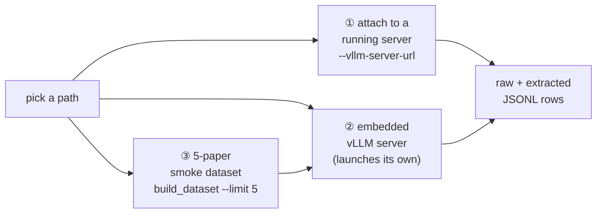

# Quickstart

The fastest paths to a first ReproBench result. Each path below is copy-pasteable
and runs the same entry point — `src/run_arxiv_prompt_vllm.py` — which loads the
paper-bundle dataset, drives the tool-calling agent core (`runtime/tool_loop.py`),
and appends raw + extracted JSONL rows as papers finish. Pick a path by whether a
vLLM server already exists, whether you want the runner to launch its own, or
whether you just need a tiny dataset to point it at.

!!! note "Prerequisites"
    Install the package and its deps first — see
    [Installation](installation.md). Run all commands from the repo root. The
    classifier defaults to model `MiniMaxAI/MiniMax-M2.7` and dataset
    `Mithilss/neurips-2025-paper-bundles`; both are overridable per command.



---

## Path 1 — Attach to a running vLLM server ✅

If an OpenAI-compatible vLLM server is already up (e.g. a multi-node Kimi serve on
the cluster), pass its base URL with `--vllm-server-url`. The runner skips
launching its own embedded server and just streams chat completions to that
endpoint — conversation memory lives in the orchestrator, so attaching to an
external server and embedding one are the same code path (`main()` in
`run_arxiv_prompt_vllm.py`).

```bash
python3 src/run_arxiv_prompt_vllm.py \
  --vllm-server-url "http://${HEAD_IP}:8000" \
  --model moonshotai/Kimi-K2.6 \
  --num-prompts 2 \
  --tool-rounds 12 \
  --max-input-tokens 128000 \
  --max-tokens 8192 \
  --request-workers 2 \
  --stream-first-response \
  --dataset Mithilss/neurips-2025-paper-bundles \
  --output outputs/neurips_2025_kimi_k2_6_multinode_smoke.jsonl \
  --extracted-output outputs/neurips_2025_kimi_k2_6_multinode_smoke_extracted.jsonl \
  --save-round-jsonl \
  --max-model-len 196608
```

!!! tip "Match `--model` to the served alias"
    A trailing `/v1` on the URL is stripped automatically
    (`normalized_server_url`). If the server was launched without a served-model
    alias, set `--model` to the exact name vLLM printed at startup (e.g. a local
    path like `/work/hdd/bfvr/msalunkhe/models/`), or requests will 404.

This is the cheapest first result: two papers against an already-warm server, no
model load time. Drop `--num-prompts` and raise `--request-workers` once you trust
the wiring.

---

## Path 2 — Launch an embedded vLLM server ✅

Omit `--vllm-server-url` and the runner starts one local vLLM server itself
(`VllmServer`, `vllm/server.py`) inside a `with` block, runs the tool loop against
it, and tears it down on exit. This is the production path the sbatch scripts use.
Below is the canonical MiniMax M2 command from the README, trimmed to a small
sample for a first run.

```bash
python3 src/run_arxiv_prompt_vllm.py \
  --num-prompts 5 \
  --tool-rounds 12 \
  --max-input-tokens 128000 \
  --max-tokens 8192 \
  --request-workers 16 \
  --stream-first-response \
  --dataset Mithilss/neurips-2025-paper-bundles \
  --vllm-cache-dir /work/nvme/bfvr/msalunkhe/MiniMax-M2.7/vllm_cache \
  --distributed-executor-backend mp \
  --output outputs/neurips_2025_minimax_m2_trial.jsonl \
  --extracted-output outputs/neurips_2025_minimax_m2_trial_extracted.jsonl \
  --save-round-jsonl \
  --max-model-len 196608 \
  --compilation-config '{"cudagraph_mode":"PIECEWISE"}'
```

To try Kimi K2.6 instead, add its model id and parser flags (8-way tensor
parallelism, `kimi_k2` tool/reasoning parsers):

```bash
python3 src/run_arxiv_prompt_vllm.py \
  --model moonshotai/Kimi-K2.6 \
  --num-prompts 5 \
  --tool-rounds 12 \
  --max-input-tokens 128000 \
  --max-tokens 8192 \
  --request-workers 16 \
  --stream-first-response \
  --dataset Mithilss/neurips-2025-paper-bundles \
  --vllm-cache-dir /work/nvme/bfvr/msalunkhe/Kimi-K2.6/vllm_cache \
  --distributed-executor-backend mp \
  --output outputs/neurips_2025_kimi_k2_6_trial.jsonl \
  --extracted-output outputs/neurips_2025_kimi_k2_6_trial_extracted.jsonl \
  --save-round-jsonl \
  --max-model-len 196608 \
  --tensor-parallel-size 8 \
  --tool-call-parser kimi_k2 \
  --reasoning-parser kimi_k2 \
  --mm-encoder-tp-mode data
```

!!! warning "This needs GPUs"
    An embedded run loads the full model — run it inside a GPU allocation, not on
    a login node. On the cluster, submit
    `scripts/minimax_m2/paper_classification.sbatch` (MiniMax, 4×GH200) or
    `scripts/kimi_k2_6/paper_classification_kimi_k2_6.sbatch` (Kimi, 8 GPU) rather than
    invoking Python by hand. See the [SLURM scripts](../slurm/sbatch.md) page.

---

## Path 3 — Build a 5-paper smoke dataset ✅

No dataset locally? Build a tiny one first. The pipeline pulls pre-matched arXiv
ids from `ai-conferences/NeurIPS2025`, downloads arXiv e-print sources and
OpenReview supplements, and writes a one-row-per-paper Parquet bundle
(`reprocli_data.build_dataset`).

```bash
PYTHONPATH=src python3 -m reprocli_data.build_dataset \
  --limit 5 --data-dir data/smoke --workers 2 --allow-failures
```

| flag | effect |
|---|---|
| `--limit 5` | process at most 5 papers |
| `--data-dir data/smoke` | write all artifacts under a scratch dir |
| `--workers 2` | parallel download workers |
| `--allow-failures` | keep going if a paper fails to download |

Stages run in order `index,sources,supplements,bundle[,upload]` and are
resume-friendly. Point the classifier at the local bundle by passing the built
output to `--dataset`. For the full end-to-end build, stage subsets, `--force`,
and Hub upload, see [build-dataset](../cli/build-dataset.md) and the
[dataset pipeline](../dataset/stages.md).

---

## `--num-prompts` sampling

`--num-prompts N` selects **N papers at random** (`random.sample` in
`select_papers`, `run_arxiv_prompt_vllm.py`) — it is not the first N rows. Omit
the flag entirely to process the **full dataset**. In classification mode, only
papers that have LaTeX (`tex_files`) are eligible before sampling.

```bash
# random 5 papers
--num-prompts 5
# whole dataset (no flag)
```

!!! tip "Pin specific papers instead of sampling"
    To run an exact set of arXiv ids, write them one-per-line to a file and pass
    `--paper-ids-file ids.txt` — it filters the dataset to those ids (and warns on
    any not found) before `--num-prompts` sampling applies.

---

## Where results land

| output | flag | contents |
|---|---|---|
| raw rows | `--output` | full per-paper response (one JSONL row per paper) |
| extracted rows | `--extracted-output` | parsed MRE record / structured fields |
| per-round trace | `--save-round-jsonl` | optional tool-loop trace JSONL |
| Hub upload | `--hf-repo` | optional incremental push to a HF dataset repo |

Rows are appended as each paper finishes, so you can `tail -f` the output mid-run.

---

## Next steps

- [Concepts](concepts.md) — the lockfile, the three agent roles, `match_bar`.
- [CLI reference: `run_arxiv_prompt_vllm.py`](../cli/run-arxiv.md) — every flag in
  full, with per-mode defaults.
- [Classifier mode](../modes/classifier.md) — what the classification pass
  actually produces.
- [SLURM clusters](../slurm/clusters.md) and [sbatch scripts](../slurm/sbatch.md)
  — running at scale on DeltaAI / Delta.
- [Architecture overview](../architecture.md) — how dataset, reproduction, and
  audit fit together.
