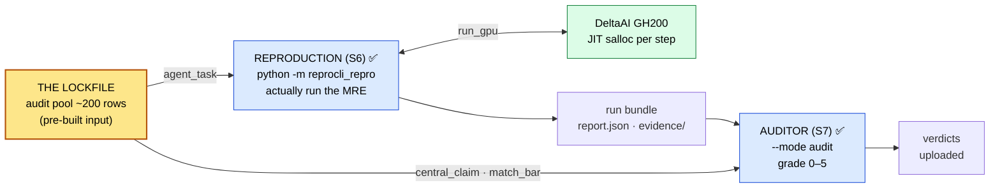

# ReproBench

**A benchmark for reproducing ML-paper claims.** ReproBench grades whether an LLM
agent can reproduce a paper's central result. It turns on **one lockfile** (a
band-selected audit pool of ~200 NeurIPS 2025 papers, built by an upstream
classifier pass and published as a frozen input) plus two live agent surfaces that
consume it: a **reproduction agent** that actually runs each paper's experiment and
an **auditor** that grades the run. Both agents attach their reasoning to a vLLM
server you stand up; only their tools, prompt, and output schema differ.



The through-line: **the model reports evidence, deterministic code computes every
consequential label** (score, verdict, run-health). The reproduction agent runs the
experiment and reports what it measured; the auditor — a different role — renders
the verdict. No agent ever grades itself.

## What's here

<div class="grid cards" markdown>

-   :material-rocket-launch: **[Getting started](getting-started/installation.md)**

    Install the environment, run your first reproduction and audit, and learn the
    core vocabulary — lockfile, MRE record, `match_bar`, tiers, and the H100 budget.

-   :material-sitemap: **[System architecture](architecture.md)**

    The full end-to-end design: how the dataset is built, how papers are
    reproduced, and how reproductions are graded — with mermaid diagrams.

-   :material-cog: **[The agent core](agent-core/index.md)**

    One `run_tool_loop` behind the auditor, forked into the reproduction agent. The
    ReAct-style loop, its guardrails, and the forced structured-output finalization.

-   :material-database: **[Dataset pipeline](dataset/index.md)**

    One command builds the NeurIPS 2025 paper-bundle dataset end to end:
    index → sources → supplements → bundle → upload.

-   :material-lock: **[Lockfile & selection](selection/lockfile.md)**

    How ~200 papers are band-stratified, cheapest-first, into the audit pool
    that every downstream agent reads.

-   :material-console: **[CLI reference](cli/run-arxiv.md)**

    Every flag for the auditor (`run_arxiv_prompt_vllm.py --mode audit`) and
    `reprocli_data.build_dataset`.

</div>

## The live surfaces at a glance

| Surface | Command | Job |
|---|---|---|
| **Reproduction (S6)** | `python -m reprocli_repro` | Actually run one lockfile paper's minimal experiment on DeltaAI under a metered H100-hour budget, emitting the run bundle |
| **Auditor (S7)** | `python3 src/run_arxiv_prompt_vllm.py --mode audit` | Grade one reproduction run bundle against the rubric (0–5) and cheat-flag it |
| **Serving** | `python -m reprocli_serve` | Stand up the vLLM chat-completions server both agents attach to by URL |

Both agents are URL-only brains: they resolve their endpoint from
`--vllm-server-url` / `$REPROCLI_SERVER_URL` / `$REPROCLI_ENDPOINT_FILE` (published
by `reprocli_serve`) and never self-host a model. See **[Agent modes](modes/auditor.md)**
for the full breakdown of the auditor and reproduction roles.

## Quickstart

With the lockfile already published, the product is **reproduce → audit → upload**.
First stand up a brain, then reproduce one paper against it:

```bash
# 1. serve the brain (on a GPU node)
python -m reprocli_serve --model MiniMaxAI/MiniMax-M2.7

# 2. reproduce one lockfile paper (orchestrator on CPU/login; run_gpu JIT-allocs GH200)
python -m reprocli_repro \
  --paper-id 2110.03155 \
  --vllm-server-url "http://${HEAD_IP}:8000"
```

Then grade the run bundle it wrote:

```bash
python3 src/run_arxiv_prompt_vllm.py --mode audit \
  --runs-dir /work/nvme/bfvr/msalunkhe/reprocli/agent_runs \
  --vllm-server-url "http://${HEAD_IP}:8000"
```

Full commands, flags, and cluster recipes live in
**[Getting started](getting-started/quickstart.md)** and the
**[CLI reference](cli/run-arxiv.md)**.

---

!!! note "Reading these docs locally"
    This site is built with [MkDocs Material](https://squidfunk.github.io/mkdocs-material/).
    Serve it with live reload from the repo root:

    ```bash
    .venv-docs/bin/mkdocs serve
    ```

    Then open <http://127.0.0.1:8000>.
