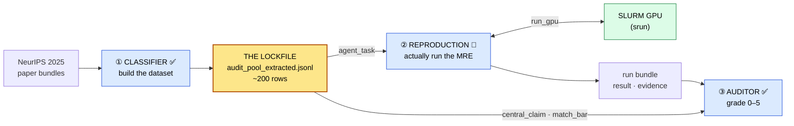

# ReproBench

**A benchmark for reproducing ML-paper claims.** ReproBench turns a stream of
NeurIPS 2025 papers into a graded reproducibility benchmark using **one lockfile**
(a band-selected audit pool of ~200 papers) and **three LLM agent roles** arranged
around it — all three sharing a single tool-calling agent core. Only their tools,
prompt, and output schema differ.



The through-line for all three roles: **the model reports evidence, deterministic
code computes every consequential label** (tier, score, verdict, run-health). No
agent ever grades itself.

## What's here

<div class="grid cards" markdown>

-   :material-rocket-launch: **[Getting started](getting-started/installation.md)**

    Install the environment, run your first classification, and learn the core
    vocabulary — lockfile, MRE record, `match_bar`, tiers, and the H100 budget.

-   :material-sitemap: **[System architecture](architecture.md)**

    The full end-to-end design: how the dataset is built, how papers are
    reproduced, and how reproductions are graded — with mermaid diagrams.

-   :material-cog: **[The agent core](agent-core/index.md)**

    One `run_tool_loop`, two live modes. The ReAct-style loop, its guardrails,
    and the forced structured-output finalization.

-   :material-database: **[Dataset pipeline](dataset/index.md)**

    One command builds the NeurIPS 2025 paper-bundle dataset end to end:
    index → sources → supplements → bundle → upload.

-   :material-lock: **[Lockfile & selection](selection/lockfile.md)**

    How ~200 papers are band-stratified, cheapest-first, into the audit pool
    that every downstream agent reads.

-   :material-console: **[CLI reference](cli/run-arxiv.md)**

    Every flag for `run_arxiv_prompt_vllm.py` and `reprocli_data.build_dataset`.

</div>

## The three roles at a glance

| | Job | Input | Status |
|---|---|---|---|
| **① Classifier** (`--mode classification`) | Read a paper, verify artifacts, emit one MRE record | Paper bundle LaTeX + supplement | :material-check-circle:{ .live } live |
| **② Reproduction** (`--mode reproduce`) | Actually run the minimal experiment under an H100-hour budget | One lockfile row | :material-wrench-clock: designed |
| **③ Auditor** (`--mode audit`) | Grade one reproduction run against the rubric (0–5) | Central claim + rubric + run-dir | :material-check-circle:{ .live } live |

See **[Agent modes](modes/classifier.md)** for the full breakdown of each role.

## Quickstart

Run the classifier over a handful of papers (attaching to an already-running
vLLM server):

```bash
python3 src/run_arxiv_prompt_vllm.py \
  --vllm-server-url "http://${HEAD_IP}:8000" \
  --model moonshotai/Kimi-K2.6 \
  --num-prompts 5 \
  --tool-rounds 12 \
  --dataset Mithilss/neurips-2025-paper-bundles \
  --output outputs/smoke.jsonl \
  --extracted-output outputs/smoke_extracted.jsonl \
  --save-round-jsonl
```

Build the paper-bundle dataset from scratch:

```bash
PYTHONPATH=src python3 -m reprocli_data.build_dataset --data-dir data --workers 8
```

Full commands, flags, and cluster recipes live in
**[Getting started](getting-started/quickstart.md)** and the
**[CLI reference](cli/run-arxiv.md)**.

---

!!! note "Reading these docs locally"
    This site is built with [MkDocs Material](https://squidfunk.github.io/mkdocs-material/).
    Serve it with live reload from the repo root:

    ```bash
    .venv-docs/bin/mkdocs serve
    ```

    Then open <http://127.0.0.1:8000>.
