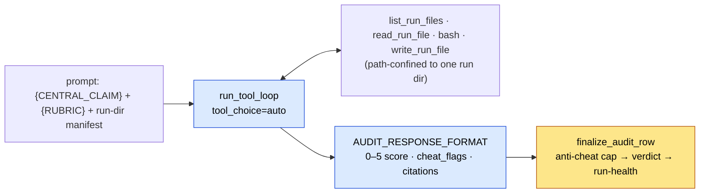

# Auditor mode (`--mode audit`) ✅

The auditor is the third LLM role (S7): it grades **one** agent reproduction run against the paper's central claim and the audit rubric (`rubric_audit.md`, at the repo root). It is a *mode* of the single agent core ([the tool loop](../agent-core/tool-loop.md)) — same `run_tool_loop`, only the prompt, toolset, and output schema change. The model proposes a 0–5 score plus cited evidence; deterministic code in `audit/audit.py` then enforces the non‑negotiable anti‑cheat cap and derives every consequential label. No agent ever grades itself.

!!! info "Where this fits"
    `CLASSIFIER → LOCKFILE → REPRODUCTION agent → run bundle → AUDITOR`. The auditor reads the lockfile's `central_claim` + `match_bar` for the target and the reproduction agent's run dir for the evidence. See the [architecture overview](../architecture.md) for the full pipeline.

## Inputs

The audit prompt is assembled by `audit/inputs.py::build_audit_prompt`, which fills three placeholders in the audit prompt template (`config/config.py`):

| Placeholder | Filled from | Source |
|---|---|---|
| `{CENTRAL_CLAIM}` | the paper's claim record (`claim_block`) | audit pool / lockfile (`--claims`) |
| `{RUBRIC}` | `rubric_audit.md`, read verbatim (`load_audit_rubric`) | fixed (`AUDIT_RUBRIC_FILE`; the `--rubric-file` flag was removed) |
| `{RUN_BUNDLE}` | a text manifest of the run dir (`load_run_bundle` → `run_dir_manifest`) | `<runs-dir>/<arxiv_id>` |

The driver (`run_arxiv_prompt_vllm.py`) builds one `Paper(arxiv_id, run_dir=run_dir_for(...))` per row, looks up the matching claim record by `arxiv_id`, and calls `build_audit_prompt`. Mode defaults (prompt, rubric, claims, runs‑dir, schema, tools) are wired in `config/cli_args.py::resolve_mode_settings`.

### The claim block

`claim_block` (`audit/inputs.py`) renders the `central_claim` text, then appends any `claim_evidence` / `mre_config` as "Reported numbers / experiment context", and finally the pinned `match_bar`:

!!! warning "`match_bar` is applied verbatim, never re-inferred"
    When the record carries a `match_bar`, the claim block injects it as the **frozen lockfile target** with explicit instructions to *adopt it verbatim as the C1 bar — do NOT re‑infer it*. The bar (`kind`, `op`, `reference_value`, `tolerance`) was pinned once by the classifier and carried through the lockfile, so every agent is judged against the same ruler. The auditor only re‑derives a bar (per `rubric_audit.md` C1 defaults) for older rows with no `match_bar` or `kind = "none"`. See the [`match_target` through-line](../architecture.md#i2-the-match_target-through-line).

### The run-dir manifest

`run_dir_manifest` (`tools/run_dir_tools.py`) lists every file under `<runs-dir>/<arxiv_id>` (recursive, skipping `.git`/`__pycache__`/`.venv`/`node_modules`), capped at `RUN_MANIFEST_MAX_ENTRIES` (200) entries, with byte sizes. It is only a seed — the auditor opens file contents on demand through the run‑dir tools.

When there is no run to inspect, the manifest is explicit that **the only defensible verdict is `unverifiable` with score 0**:

| Condition | Manifest text |
|---|---|
| No `--runs-dir` configured | `RUN_BUNDLE_NO_DIR_TEXT` (`audit/inputs.py`) |
| Run dir does not exist | `(No run directory found at … score 0.)` |
| Run dir empty | `(Run directory … is empty; verdict unverifiable, score 0.)` |

## Tools — path-confined to one run dir

The auditor's toolset is `AUDIT_TOOLS` (`tools/run_dir_tools.py`), dispatched via `AUDIT_TOOL_HANDLERS`. It reads, writes *new* files, and runs shell commands, but every tool is scoped to the single run directory by `_resolve_within`, which rejects absolute paths, `\\`, and any `..` segment, and re‑checks that the resolved path stays inside the run dir. See the [run-dir tools page](../tools/run-dir-tools.md) for the full reference.

| Tool | Effect | Key bounds (`config/config.py`) |
|---|---|---|
| `list_run_files` | list files/dirs (optional `recursive`) | `RUN_MANIFEST_MAX_ENTRIES` = 200, sets `truncated` |
| `read_run_file` | read one text file by relative path | `max_chars` default 40k, max 200k |
| `bash` | run a shell command with the run dir as cwd | `BASH_TIMEOUT` = 60s; `ok = (returncode == 0)` |
| `write_run_file` | write a **new** file (e.g. a re-scoring script) | refuses to overwrite; ≤ 200k chars |

!!! note "Re-scoring goes through the disk, not a hidden interpreter"
    There is deliberately **no separate Python tool**. To recompute a metric from a saved artifact, the auditor `write_run_file`s a script and runs it with `bash` (`python3 …`), so every computation lands on disk and stays citable. `write_run_file` never clobbers an agent artifact — the run dir is the evidence under audit.



## Output — `AUDIT_RESPONSE_FORMAT`

The forced final pass (tools off) emits one JSON object validated against `AUDIT_JSON_SCHEMA` (`schema/audit.py`). Fields map onto the rubric criteria C1–C6:

| Field(s) | Criterion | Meaning |
|---|---|---|
| `central_claim`, `target_metric`, `reference_value`, `op`, `tolerance` | C1 | the claim restated as a checkable target (echo `match_bar` when given) |
| `execution_verified`, `execution_evidence` | C2 | proof a run actually computed the metric, with citation |
| `measured_value`, `measured_citation` | C3 | the agent's reproduced value + exact file/line |
| `cheat_flags` | C4 | array of `{kind, evidence, severity}` provenance flags |
| `value_comparison`, `methodology_notes` | C5/C6 | the comparison and experiment fidelity |
| `score` (integer 0–5), `rationale` | — | the granular score; verdict is derived downstream |

Flag `kind` is one of `FLAG_KINDS` (`hardcoded_constant`, `echoed_prose_number`, `self_scored_or_fabricated`, `wrong_split_scale_dataset`, `cherry_picked_metric`, `stale_artifact`); `severity` is one of `SEVERITIES` (`low`, `med`, `high`). See [schemas](../tools/schemas.md).

## Post-processing — `finalize_audit_row`

The model only proposes; `audit/audit.py::finalize_audit_row(parsed, tool_loop)` computes every label. It runs after the structured-output pass (called from `vllm/io.py`). Steps, in order:

1. **Exit reason.** `loop_exit_reason(tool_loop)` records how the episode ended (`natural` / `round_limit` / `repeated_call_cutoff` / `context_budget`).
2. **Normalize flags.** `_normalize_flags` coerces each flag to `{kind, evidence, severity}`, defaulting an unknown severity to `low`. `has_high_cheat_flag` is set if any flag is `high`.
3. **Anti-cheat cap.** `_normalize_score` validates the score as an int in `[0, 5]` (rejecting `bool` and out-of-range). Then the §C4 rule is enforced **in code, not in the prompt**:

    !!! danger "High-severity flag → score capped to 0"
        ```python
        if score is not None and high_flags and score > SCORE_MIN:
            row["reported_score"] = score   # keep what the model said
            score = SCORE_MIN               # but the recorded score is 0
        ```
        Any HIGH‑severity provenance flag caps the score at 0 regardless of value match. The auditor's original number is preserved under `reported_score` for audit trails. The cap does not depend on the model's goodwill.

4. **Verdict** (`_verdict`), derived from the (possibly capped) score:

    | Condition | `verdict` |
    |---|---|
    | score is `None` | `None` |
    | any high flag (`cheated`) | `not_reproduced` (an active provenance failure is a fail, not "couldn't tell") |
    | score ≥ `REPRODUCED_MIN_SCORE` (4) | `reproduced` |
    | score == 3 | `partial` |
    | score == 0 **and** not `execution_verified` | `unverifiable` |
    | otherwise | `not_reproduced` |

5. **Reproduced boolean.** `reproduced = score is not None and score >= 4` — this is what counts toward the headline reproduction rate.

6. **Run-health** (`_verification_status`):

    | Result | When |
    |---|---|
    | `degraded` | score is `None`, or the row is malformed (`_is_valid`: needs a non-empty string `paper_id` and a boolean `execution_verified`) |
    | `incomplete` | exit reason in `INCOMPLETE_EXIT_REASONS` (`round_limit`, `repeated_call_cutoff`, `context_budget`) |
    | `verified` | otherwise |

!!! example "What lands in the row"
    `score` (capped), `reported_score` (only when capped), `verdict`, `reproduced`, `cheat_flags`, `has_high_cheat_flag`, `exit_reason`, and `verification_status`. The score is reconstructable from the cited evidence and flags alone — the deterministic layer adds no judgement the rubric did not already define.

## Running it

The mode is selected with `--mode audit`; `resolve_mode_settings` then fills every audit default (prompt, rubric, claims, `--runs-dir`, schema, tools). See [run-arxiv CLI](../cli/run-arxiv.md) for the full flag set and the [quickstart](../getting-started/quickstart.md) for an end-to-end example.

!!! tip "Sandboxing caveat"
    The audit `bash` is a full shell scoped (by path) to the run dir — fine for grading our own agents locally, but container/seccomp isolation is the prerequisite before grading **untrusted** runs at scale. See the [guardrails](../agent-core/guardrails.md) notes carried in the architecture doc.

## See also

- [Run-dir tools](../tools/run-dir-tools.md) — the path-confined toolset in detail
- [Schemas](../tools/schemas.md) — `AUDIT_RESPONSE_FORMAT` field-by-field
- `rubric_audit.md` (repo root) — the audit rubric: criteria C1–C6 and the 0–5 anchors
- [Reproduction mode](reproduction.md) — the upstream role that emits the run bundle
- [Architecture overview](../architecture.md) — the whole system, including where the `match_bar` is pinned
