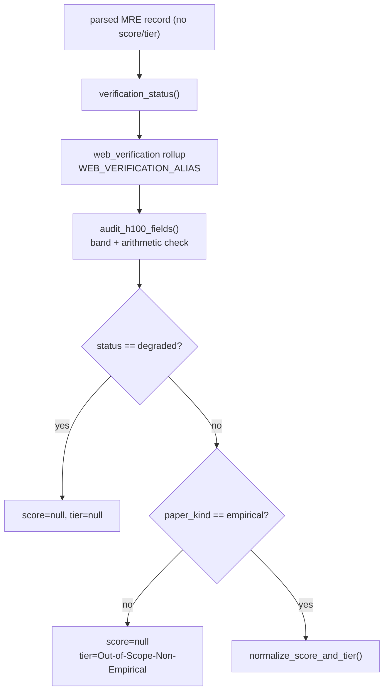

# Classifier mode (`--mode classification`) ✅

The classifier is **stage S1** of the benchmark: it reads one paper, *verifies* its
released artifacts against the open web, and emits **one MRE record per paper**. It
is a mode of the single agent core (`runtime/tool_loop.py`) — same loop, guardrails,
and structured-output finalization as the [auditor](auditor.md); only the prompt,
toolset, and output schema differ. The model reports evidence; **deterministic
post-processing computes every consequential label** (web rollup, H100 band, score,
tier).

!!! info "Where it sits"
    `CLASSIFIER ──► LOCKFILE ──► REPRODUCTION ──► AUDITOR`. The classifier's
    extracted rows are exactly what [`audit/select_pool.py`](../selection/select-pool.md)
    band-stratifies into [the lockfile](../selection/lockfile.md). See the
    [architecture overview](../architecture.md) for the whole system.

---

## Input: `{PAPER_TEXT}`

The default dataset is the NeurIPS-2025 paper-bundle Hub dataset
(`config/config.py` → `PAPER_BUNDLE_DATASET = "Mithilss/neurips-2025-paper-bundles"`,
overridable with `--dataset`). `load_bundle_papers` (`papers/bundles.py`) loads the
`train` split, validates the required columns, deduplicates by `arxiv_id`, and
returns `Paper` objects (`papers/papers.py`). The runner then keeps only papers that
actually carry LaTeX (`papers = [paper for paper in papers if paper.tex_files]` in
`run_arxiv_prompt_vllm.py`).

Each prompt is built by `template.replace(PLACEHOLDER, paper.text())`, where
`PLACEHOLDER = "{PAPER_TEXT}"`. `Paper.text()` concatenates, in order:

| Section | Source |
|---|---|
| Header | `arxiv_id`, `title`, `source_url` |
| `OPENREVIEW_SUPPLEMENT` | `supplement_text(...)` — status, source URL, a file manifest, and excerpt sections for text files (`papers/supplements.py`) |
| `PAPER_LATEX:` | `paper_tex_text`, or `joined_tex_sections(tex_files)` if the flat text is empty |

!!! note "Supplement code is first-party evidence"
    The supplement block flags MRE-relevant code, configs, scripts, and notebooks
    from the OpenReview supplement as first-party code evidence, and the system
    message tells the model to treat them as such. Code-evidence files are sorted
    ahead of others in the excerpt section (`is_code_evidence_file`,
    `papers/supplements.py`).

---

## Tools

The classifier toolset is `WEB_TOOLS` (`config/config.py`), driven by
`WEB_SYSTEM_MESSAGE`. All tools are **read-only evidence-gathering** — the model may
not invent local-filesystem tools. See [web tools](../tools/web-tools.md) for the
full contract.

| Tool | Backed by | Use |
|---|---|---|
| `paper_bundle_file_contents` | the current paper's bundle | read one supplement file by manifest path |
| `github_search_repositories`, `github_search_code` | GitHub MCP | GitHub-scoped search (code search ≤ 256 chars) |
| `github_repo`, `github_file_contents`, `github_repository_tree` | GitHub MCP | inspect a candidate repo, read files, walk the tree |
| `huggingface_search`, `huggingface_repo`, `huggingface_repository_tree` | Hugging Face MCP + Hub API | HF-scoped semantic search and repo/tree inspection |
| `fetch_url` | direct HTTP(S) | fetch a known public URL |

!!! tip "Search is `tool_choice="auto"`"
    The loop never scripts a tool sequence. The system message coaches the model to
    try title/acronym/arXiv-ID/method-name variants, prefer direct `github_repo` /
    `huggingface_repo` checks once a URL exists, and — crucially — to record
    `tool_searched_not_found` when a real search turns up nothing. **Finding nothing
    after a genuine search is successful verification of absence, not a tool
    failure.**

---

## Output: one MRE record (`FINAL_JSON_SCHEMA`)

After the tool-exploration phase, exactly one forced structured-output pass produces
JSON matching `FINAL_RESPONSE_FORMAT` (`schema/output.py`, schema name
`repro_artifact_classification`). All top-level fields are required; the model emits
**no score and no tier** — those are computed downstream. See
[schemas](../tools/schemas.md) for the full field reference.

| Field | Meaning |
|---|---|
| `central_claim`, `claim_evidence` | the one claim the MRE must test, plus its anchor in the paper |
| `paper_kind` | `empirical` · `theoretical` · `position` · `survey` |
| `mre_config` | the smallest experiment that tests the claim |
| `match_bar` | the pinned, machine-readable success bar (see below) |
| `verified_links` | clean URLs grouped into `paper_or_project` / `code` / `dataset` / `weights` |
| `signals` | four booleans, each `{value, verification, evidence}` |
| `agent_task` | what the reproduction agent will be told to do |
| `h100_estimate` | the compute-cost estimate (see below) |

### The four signals

`signals` (`SIGNAL_NAMES`) carry the verification verdict that drives the score:

`code_available` · `dataset_available` · `weights_available` · `dataset_is_standard`

Each is a `signal_schema()` object whose `verification` is one of
`tool_verified` · `tool_searched_not_found` · `tool_failed` · `paper_text_only` ·
`not_applicable` (`VERIFICATION_STATES`). The `verification` field — not just the
boolean — is what the run-health rollup reads.

### `match_bar` — pinned once, reused everywhere

`match_bar` (`match_bar_schema()`) fixes "how close counts as a match" at
classification time so every later agent is judged against the same ruler.

| `kind` | what counts | `op` / `reference_value` / `tolerance` |
|---|---|---|
| `point_estimate` | land near `reference_value` | `op="abs_rel_within"`, `tolerance` set |
| `threshold` | clear a floor/ceiling | `op=">=" / "<="`, `tolerance=null` |
| `direction` | beat a baseline | `op` names the inequality, `reference`/`tolerance` null |
| `magnitude` | the *size* of a delta is the target | `tolerance` applies to the delta |
| `none` | no checkable scalar (theory/position) | all null |

The [auditor](auditor.md) adopts this `match_bar` verbatim from the lockfile rather
than re-inferring the bar from prose each run.

---

## Deterministic post-processing

The schema deliberately omits `score` and `tier`. `finalize_extracted_row`
(`runtime/run_health.py`) runs after the model returns and computes the labels. The
LLM proposes; code decides.



### 1. Run-health → `web_verification` rollup

`verification_status` (`runtime/run_health.py`) folds the loop telemetry and the
per-signal `verification` states into one of `verified` · `incomplete` · `degraded`:

- **`degraded`** if input overflowed the context or the signals are malformed.
- **`incomplete`** if the loop hit `round_limit` / `repeated_call_cutoff` /
  `context_budget`, if any applicable signal is `tool_failed` or `paper_text_only`,
  or if there were applicable signals but **zero** tool calls.
- **`verified`** otherwise.

`finalize_extracted_row` writes `verification_status`, then maps it to the
public-facing `web_verification` via `WEB_VERIFICATION_ALIAS`
(`verified→available`, `incomplete→partial`, `degraded→unavailable`). Any
model-emitted `web_verification` is preserved as `reported_web_verification`.

### 2. H100 audit

`audit_h100_fields` (`audit/h100.py`) re-checks the model's `h100_estimate` rather
than trusting it. It recomputes `gpu_count × wallclock_hours ×
h100_equivalent_multiplier`, compares against the reported `hours` (mismatch >
`MISMATCH_TOLERANCE = 0.2` relative), and assigns a compute band
(`0-8` · `8-32` · `32-96` · `96-192` · `>192`). It emits `h100_hours_estimate`,
`h100_estimate_basis`, `h100_band`, `h100_recomputed_hours`,
`h100_arithmetic_mismatch`, and `h100_needs_human_review` (true when the basis is
`compute_unspecified`, the arithmetic can't be recomputed, or it mismatches). The
band is what the
[H100 budget](../selection/h100-budget.md) selection later filters on.

### 3. Score and tier

For empirical, non-degraded rows, `normalize_score_and_tier`
(`schema/output.py`) calls `deterministic_score_and_tier`, which reads only the four
signal booleans:

```text
score = 0
if not code_available:                              score += 2
if not dataset_is_standard and not dataset_available: score += 3
if not weights_available:                            score += 1
```

`tier_for_score` then maps the score to a difficulty tier:

| score | tier |
|---|---|
| 0 | `Easy` |
| 1 | `Medium` |
| 2 | `Hard` |
| 3 (and dataset available or standard) | `Hard` |
| otherwise | `Artifact-Blocked` |

!!! warning "The model never grades itself"
    If the model *did* emit a `score`/`tier` that disagrees with the computed value,
    the originals are preserved as `reported_score` / `reported_tier` and the code's
    values overwrite `score` / `tier`. Degraded rows get `score=null, tier=null`;
    non-empirical papers get `tier="Out-of-Scope-Non-Empirical"` (`NON_EMPIRICAL_TIER`)
    and `score=null`.

---

## Running it

`--mode classification` is the default. A minimal run over the bundle dataset:

```bash
python src/run_arxiv_prompt_vllm.py \
  --mode classification \
  --prompt-file prompts/prompt.txt \
  --dataset Mithilss/neurips-2025-paper-bundles \
  --num-prompts 10
```

The prompt file **must** contain the `{PAPER_TEXT}` placeholder or the runner exits
(`run_arxiv_prompt_vllm.py`). Raw model output lands in `--output`; the finalized MRE
records land in `--extracted-output`. See [run-arxiv](../cli/run-arxiv.md) for the
full flag set and [the lockfile](../selection/lockfile.md) for what happens to the
extracted rows next.

!!! note "Downstream consumers reuse the same schema"
    `reprocli_openai/recheck.py` re-runs the same `FINAL_JSON_SCHEMA` +
    `normalize_score_and_tier` to recheck individual rows, so a rechecked row is
    label-compatible with a freshly classified one.
