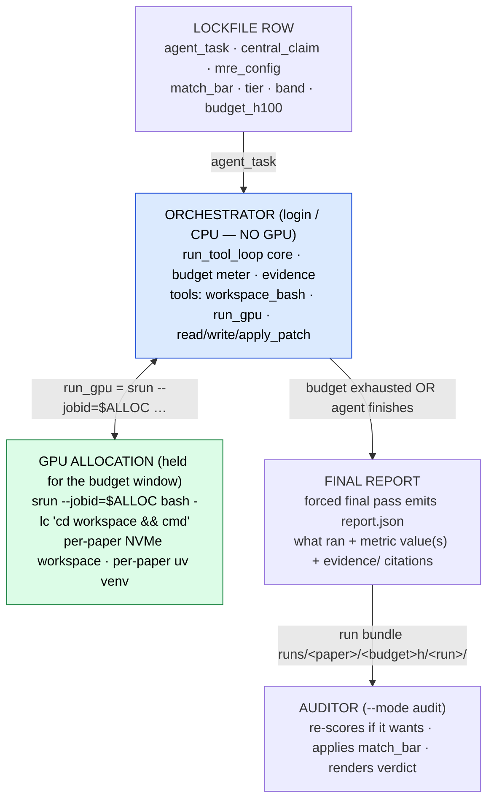

# Reproduction agent (`--mode reproduce`) 🚧

The reproduction agent is the **missing consumer** of the lockfile: given one
lockfile row it *actually runs the experiment* on the cluster under a metered
H100-hour budget, then emits the run bundle the auditor grades. It is the same
`run_tool_loop` skeleton as the [classifier](classifier.md) and
[auditor](auditor.md), with an execution toolset bolted on. This page summarizes
**Part III** of the [system architecture](../architecture.md) — read that for the
full spec.

!!! warning "Status: 🚧 designed, not yet wired"
    Nothing below is built. There is no `src/reprocli_repro/` package and no
    `--mode reproduce` yet. This is the single open edge (S6) that turns
    classifier-plus-auditor into an end-to-end benchmark. See
    [Part V of the architecture](../architecture.md#part-v-status-the-one-remaining-handoff).

## Where it sits in the pipeline

The reproduction agent is **S6**, fed by the lockfile and feeding the auditor:

```text
CLASSIFIER ──► LOCKFILE ──► REPRODUCTION agent (srun) ──► run bundle ──► AUDITOR
   (S1)        (the data)          (S6 🚧)                 (evidence)      (S7)
```

Its input is **one lockfile row** (`audit_pool_extracted.jsonl`) carrying
`agent_task`, `central_claim`, `mre_config`, `match_bar`, `tier`, `band`, and
`budget_h100_hours`. See [the lockfile](../selection/lockfile.md) for the row
schema and [select-pool](../selection/select-pool.md) for how rows are chosen.

## The core decision: decouple orchestration from GPU

The agent's *thinking* — LLM calls, file edits, dependency installs, reading
results — is cheap CPU work; only the experiment itself needs a GPU. Renting a GPU
for the whole episode while the LLM reasons would burn the H100 budget on idle
time. So the design physically splits the two:

| layer | runs on | holds |
|---|---|---|
| **Orchestrator** | login or CPU allocation (long-lived, cheap, no GPU) | the agent loop, the budget meter, evidence capture, the bundle writer |
| **GPU work** | a GPU allocation held open for the budget window | nothing but `srun` steps that do real experiment work |

**The allocation is the budget container; each `run_gpu` tool call is one `srun`
step inside it.** This reuses the repo's existing split — `salloc` holds the
nodes, `srun --jobid=$SLURM_JOB_ID --nodes=1 --ntasks=1 … bash -lc '…'` runs each
step — documented on the [SLURM clusters](../slurm/clusters.md) and
[sbatch](../slurm/sbatch.md) pages.

This works because the vLLM server is a **pure completion endpoint** — all
conversation memory lives in the orchestrator's `conversations` dict, not the
server (Part II.4). The agent's *brain* can be any served model while its *hands*
(`srun`) live in a different allocation.



## Tools the reproduction agent gets

The toolset swaps in through the same `resolve_mode_settings` seam used by the
other modes (a new `--mode reproduce`); the loop body, guardrails, structured-output
finalization, and trace capture are unchanged from Part II.

| tool | runs where | role |
|---|---|---|
| `workspace_bash` | orchestrator / CPU `srun` step | clone the repo at a pinned commit, create the per-paper `uv` venv, install deps, edit files, inspect data — anything that does not need a GPU |
| `run_gpu` | `srun --jobid=$ALLOC` into the GPU allocation | the experiment: training/eval/scoring. Wraps the command, captures out/err/exit, **meters** `gpus × wallclock × hw_multiplier`, enforces a per-step timeout and the **remaining** budget |
| `read_file` / `write_file` / `apply_patch` | orchestrator (workspace-confined) | structured edits; `apply_patch` feeds `patches/author_code.diff` (R11 integrity) |

The episode ends the same way the other modes do — a round/budget guard or a natural
stop triggers a **forced final pass** (tools off) that emits the agent's `report.json`.
There is no `submit` tool and no `repro.yaml` submission contract.

!!! note "The brain is provider-agnostic"
    The agent's reasoning runs on **any OpenAI-compatible `/v1/chat/completions`
    server, chosen purely by base URL**. The existing `--vllm-server-url` +
    `build_chat_completion_request` → `post_chat_completion_row` path already speaks
    that protocol, so the brain is swapped by changing the URL — a cluster vLLM
    server or any other gateway — with no provider-specific code in the harness. If
    that endpoint is itself a cluster vLLM server, it is its own allocation, never
    the one metered against the paper's H100 budget.

## The budget meter (the new guardrail)

Where the classifier/auditor [guardrails](../agent-core/guardrails.md) bound
*tokens and rounds*, the reproduction agent's hard guardrail bounds *compute*.
`run_gpu` is wrapped so it refuses once the budget is spent, forcing the agent
toward submission:

```text
remaining = budget_h100_hours − Σ(step.gpus × step.wallclock_h × hw_multiplier)
if remaining ≤ 0:  run_gpu refuses → forces the agent to finish and write its report
```

`hw_multiplier` comes from the H100-equivalence table (report-format R9), so a
GH200 step and an H200 step are both charged in **H100-equivalent hours** — see
[the H100 budget model](../selection/h100-budget.md). Every step appends a
`trajectory.jsonl` row (`{t, h100_hours_consumed, measured, note}`) so
`budget_at_first_pass` is reconstructable.

## The agent reports; the auditor renders the verdict

The agent's last act is its **report** — a structured account of what it ran, the
metric value(s) it observed, and citations into `evidence/`. It writes **no
verdict**: there is no `repro.yaml` submission contract and **no post-loop harness
re-execution**. Everything after the report is the [auditor](auditor.md)'s job — the
separate LLM-as-a-judge that already reads the run bundle:

- it **re-scores if it wants** — recompute a metric from a saved artifact by
  `write_run_file`-ing a script and running it under `bash` (`run_dir_tools.py`);
- it adopts the lockfile's `match_bar` **verbatim** (`match_target`, §I.2 of the
  architecture);
- it renders the verdict — the 0–5 score → `reproduced` / `partial` /
  `not_reproduced` / `unverifiable`, with the deterministic anti-cheat cap.

"No agent grades itself" still holds: the report's author and its grader are
different roles, and a report claim that contradicts the evidence the auditor
recomputes becomes a `cheat_flag` — the same trust-but-verify posture as the other
modes, applied to execution. The bundle lands at `runs/<paper_id>/<budget>h/<run_id>/`
for the auditor to grade.

!!! example "The run bundle the auditor reads"
    ```text
    runs/<paper_id>/<budget>h/<run_id>/
      report.json     # the agent's cited account of the run (what ran + measured)
      evidence/       # commands.log · trajectory.jsonl · env.lock · patches/
      workspace/      # the editable clone + per-paper uv venv
      reference/      # ro paper LaTeX + supplement (the agent's reference copy)
    ```
    The verdict is **not** in the bundle — it is the auditor's output.

## Proposed module layout 🚧

Part III.6 proposes splitting execution out of `reprocli_vllm` (classifier +
auditor) into a new `reprocli_repro` package, which also closes the standing TODO
to separate classification/audit from the harness and keeps every module under the
[300-line rule](../contributing/layout.md):

```text
src/reprocli_repro/                 # the S6 execution agent (mode = reproduce)
  __init__.py
  cli_args.py        # --mode reproduce wiring; reuses resolve_mode_settings seam
  slurm.py           # salloc/srun wrappers, allocation lifecycle, node discovery
  budget.py          # H100-equiv meter + hw_multiplier table (R9)
  workspace.py       # per-paper workspace + uv venv + pinned-commit clone
  evidence.py        # commands.log / trajectory.jsonl / env.lock / patches capture
  tools/
    workspace_bash.py
    run_gpu.py       # the srun-dispatching tool
src/reprocli/report/                # the bundle layer (feeds the auditor)
  schema.py · validate.py · render.py   # report.json schema + report.md (the agent's account)
```

!!! warning "Sandboxing is a prerequisite at scale"
    The reproduction agent's `run_gpu` / `workspace_bash` run real shell commands.
    Like the auditor's `bash`, they are fine for running our own agents locally, but
    container/seccomp isolation is the prerequisite before running **untrusted paper
    code** at scale. A per-paper `uv` venv already isolates dependency installs so
    one paper's install cannot poison another's.

## See also

- [System architecture, Part III](../architecture.md#part-iii-the-reproduction-agent-s6-designed-not-yet-wired) — the full design this page summarizes
- [The shared agent core](../agent-core/index.md) and [tool loop](../agent-core/tool-loop.md) — the `run_tool_loop` skeleton all three modes reuse
- [SLURM clusters](../slurm/clusters.md) and [sbatch jobs](../slurm/sbatch.md) — the allocation → `srun` step substrate `run_gpu` builds on
- [The lockfile](../selection/lockfile.md) and [H100 budget model](../selection/h100-budget.md) — the input row and the unit the budget meter charges in
