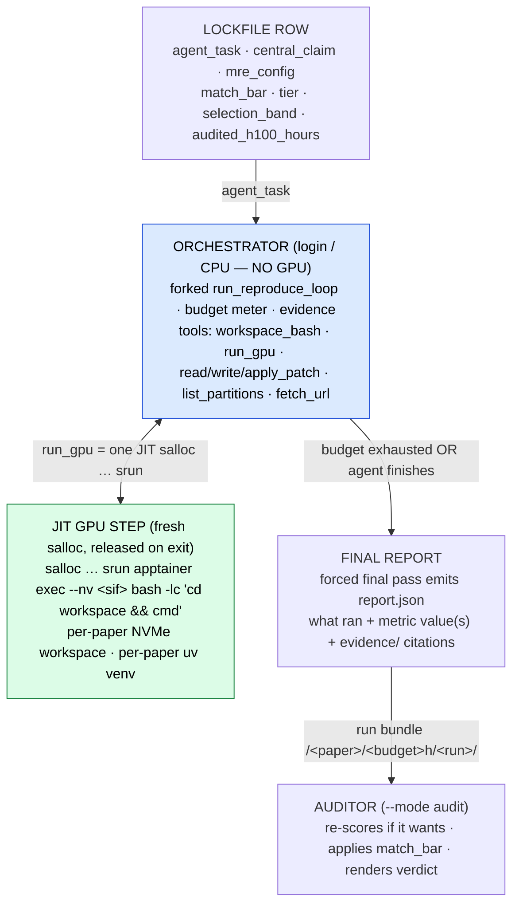

# Reproduction agent (`python -m reprocli_repro`) ✅

The reproduction agent is the **S6 consumer** of the lockfile: given one lockfile
row it *actually runs the experiment* on the cluster under a metered H100-hour
budget, then emits the run bundle the [auditor](auditor.md) grades. It lives in its
**own package** (`src/reprocli_repro/`) and *forks* the `run_tool_loop` skeleton —
same two-thread-pool structure, its own driver, guardrails, and tool dispatch. This
page summarizes **Part III** of the [system architecture](../architecture.md) — read
that for the full spec.

!!! info "Entry point"
    Run it with `python -m reprocli_repro` (its own argparse in `cli_args.py`, **not**
    `resolve_mode_settings`). It attaches its brain to an already-served endpoint by
    URL and never self-hosts a model.

## Where it sits in the pipeline

The reproduction agent is **S6**, fed by the lockfile and feeding the auditor:

```text
LOCKFILE ──► REPRODUCTION agent (JIT srun) ──► run bundle ──► AUDITOR
(the data)          (S6 ✅)                     (evidence)      (S7)
```

Its input is **one lockfile row** carrying `agent_task`, `central_claim`,
`mre_config`, `match_bar`, `tier`, `selection_band`, and `audited_h100_hours`. The
row is loaded from the audited lockfile (`--lockfile`, default the published HF
dataset; `--split test`/`validation`; `--paper-id` for a single paper). See
[the lockfile](../selection/lockfile.md) for the row schema and
[select-pool](../selection/select-pool.md) for how rows are chosen.

## The core decision: decouple orchestration from GPU — via JIT allocation

The agent's *thinking* — LLM calls, file edits, dependency installs, reading
results — is cheap CPU work; only the experiment itself needs a GPU. Renting a GPU
for the whole episode while the LLM reasons would burn the H100 budget on idle
time. So the design physically splits the two, and provisions GPUs
**just-in-time (JIT), one step at a time**:

| layer | runs on | holds |
|---|---|---|
| **Orchestrator** | login or CPU allocation (long-lived, cheap, no GPU) | the agent loop, the budget meter, evidence capture, the bundle writer, and **all** CPU work (clone, `uv venv`, install, edit, inspect) |
| **GPU work** | a **fresh `salloc` per `run_gpu` step**, released the instant the command exits | nothing but the one metered step that does real experiment work |

**Nothing is pre-held.** Each `run_gpu` tool call opens one fresh `salloc` sized
for that step and releases it the moment the command returns, so idle GPU time is
never charged — the budget is spent only on real compute. There is no
`--allocation-jobid` and no pre-held-allocation mode.

This works because the vLLM server is a **pure completion endpoint** — all
conversation memory lives in the orchestrator's `conversations` dict, not the
server. The agent's *brain* can be any served model while its *hands*
(`run_gpu`/`srun`) live in a throwaway allocation.



## The mandatory Apptainer sandbox

Every GPU step runs **inside a read-only Apptainer image** (`sandbox.py`), the
substrate's single hard requirement. CUDA and a GPU-ready `torch` come from that
`.sif` (no host `module load`), and the agent layers a **per-paper `uv` venv**
(`--system-site-packages`, to reuse the image's torch) on top — never the shared
`.venv` — so one paper's dependency install can never poison another's. The base
image defaults to the `deltaai` profile's pinned `.sif` and is overridable with
`--apptainer-image` / `$REPRO_APPTAINER_SIF`.

`deltaai` is the **only** cluster profile (`cluster.py`); it pins the account,
default partition (`ghx4`), node size, and `hw`. The two per-run overrides are
`--partition` (pick a different queue for one allocation, e.g. the
faster-scheduling `ghx4-interactive`, also discoverable via the `list_partitions`
tool) and `--apptainer-image`.

## Tools the reproduction agent gets

The toolset is assembled by `build_repro_tools()` (`tools/__init__.py`) and wired
onto the forked loop via `dispatch.execute_repro_tool_call`. The loop body,
guardrails, structured-output finalization, and trace capture mirror the shared
core.

| tool | runs where | role |
|---|---|---|
| `workspace_bash` | orchestrator CPU subprocess, cwd = `workspace/` | clone the repo at a pinned commit, create the per-paper `uv` venv, install deps, edit files, inspect data — anything that does not need a GPU |
| `read_file` / `write_file` / `apply_patch` | orchestrator (path-confined) | reads span `workspace`/`reference`/`evidence`; writes only `workspace`/`evidence`; `apply_patch` runs `git apply` and saves the diff under `evidence/patches/` |
| `list_partitions` | orchestrator (`sinfo`, read-only) | enumerate the cluster's partitions so the model can pick a `partition` for `run_gpu` |
| `fetch_url` | orchestrator (read-only http[s]) | fetch a public docs page / wheel index / raw file (`tools/fetch.py`) |
| `run_gpu` | one JIT `salloc … srun` per call, inside the Apptainer sandbox | the experiment: training/eval/scoring. Wraps the command, captures out/err/exit, **meters** `gpus × elapsed × hw_multiplier`, enforces a per-step timeout and the **remaining** budget |

The episode ends the same way the audit mode does — a round/budget guard or a
natural stop triggers a **forced final pass** (tools off) that emits the agent's
`report.json`. There is no `submit` tool and no `repro.yaml` submission contract.

!!! note "The brain is provider-agnostic and URL-only"
    The agent's reasoning runs on **any OpenAI-compatible `/v1/chat/completions`
    server, chosen purely by base URL**. The runner resolves it from
    `--vllm-server-url`, else `$REPROCLI_SERVER_URL`, else the endpoint file
    [`reprocli_serve`](../slurm/serve.md) publishes (`$REPROCLI_ENDPOINT_FILE`); with
    no endpoint it exits with an error. The brain is swapped by changing the URL — no
    provider-specific code in the harness, and the agent never self-hosts a model. If
    that endpoint is itself a cluster vLLM server, it is its own allocation, never the
    one metered against the paper's H100 budget.

## The budget meter (the new guardrail)

Where the audit [guardrails](../agent-core/guardrails.md) bound *tokens and rounds*,
the reproduction agent's hard guardrail bounds *compute* (`budget.py` +
`loop.apply_guardrails`). `run_gpu` is refused when the step's pre-authorized worst
case would overspend, forcing the agent toward its report:

```text
cost(step)  = gpus × elapsed_h × hw_multiplier[hw]        # charged on ACTUAL elapsed
worst(step) = gpus × (minutes / 60) × hw_multiplier[hw]   # pre-authorization (the --time cap)
if worst > remaining OR budget exhausted:  run_gpu refuses BEFORE launching
```

`--time=<minutes>` is the wall limit SLURM hard-kills at, so the maximum charge is
bounded *before* launch and a step can be refused up front. `hw_multiplier`
(`budget.HW_MULTIPLIER`) reduces every GPU-hour to H100-equivalent hours — see
[the H100 budget model](../selection/h100-budget.md). SLURM bills only the run, not
the queue wait, so the meter is fed elapsed *run* time. Every step appends a
`trajectory.jsonl` row so the spend is reconstructable; budget exhaustion sets
`exit_reason="budget_exhausted"` and force-finals. The per-episode ceiling is
`--budget-h100-hours`, or, by default, derived from the row's `selection_band`
upper edge.

## The agent reports; the auditor renders the verdict

The agent's last act is its **report** — a structured account of what it ran, the
metric value(s) it observed, and citations into `evidence/`. It writes **no
verdict**: there is no `repro.yaml` submission contract and **no post-loop harness
re-execution**. Everything after the report is the [auditor](auditor.md)'s job — the
separate LLM-as-a-judge that already reads the run bundle:

- it **re-scores if it wants** — recompute a metric from a saved artifact by
  `write_run_file`-ing a script and running it under `bash` (`run_dir_tools.py`);
- it adopts the lockfile's `match_bar` **verbatim** (§I.2 of the architecture);
- it renders the verdict — the 0–5 score → `reproduced` / `partial` /
  `not_reproduced` / `unverifiable`, with the deterministic anti-cheat cap.

"No agent grades itself" still holds: the report's author and its grader are
different roles, and a report claim that contradicts the evidence the auditor
recomputes becomes a `cheat_flag` — the same trust-but-verify posture as the audit
mode, applied to execution.

!!! example "The run bundle the auditor reads"
    ```text
    <runs-dir>/<paper_id>/<budget>h/<run_id>/
      report.json     # the agent's cited account of the run (what ran + measured)
      evidence/       # commands.log · trajectory.jsonl · env.lock · patches/
      workspace/      # the editable clone + per-paper uv venv
      reference/      # ro paper LaTeX + supplement (the agent's reference copy)
    ```
    (`<runs-dir>` defaults under `$REPRO_WORK_ROOT`; `<run_id>` is a fresh
    time+random id so re-runs of one paper never collide.) The verdict is **not** in
    the bundle — it is the auditor's output.

## Module layout

The package is self-contained (every module under the [300-line rule](../contributing/layout.md)),
borrowing only import-level primitives from `reprocli_vllm`. The load-bearing modules:

```text
src/reprocli_repro/
  __main__.py · cli_args.py · cli_resolve.py   # entry point + its own argparse/validation
  loop.py                                       # run_reproduce_loop — forked run_tool_loop skeleton
  context.py · compaction.py                    # per-episode state + microcompact context tier
  inputs.py · dataset.py · prompt_render.py     # lockfile row → rendered prompt + run paths
  workspace.py · reference.py · evidence.py     # per-paper workspace / ro reference / durable evidence
  budget.py · cluster.py · slurm.py · sandbox.py # H100 meter · deltaai profile · JIT salloc · Apptainer wrap
  postgrest.py · supabase_sink.py               # optional Supabase run telemetry
  dispatch.py · tools/                          # execute_repro_tool_call + workspace_bash/run_gpu/files/…
  report/schema.py · report/validate.py         # report.json schema + validator (the agent's account)
```

See [the repo layout](../contributing/layout.md) for the full tree.

!!! warning "Sandboxing untrusted code at scale"
    The mandatory Apptainer image and per-paper `uv` venv give **environment
    isolation** (one paper's install can't poison another's). Hardened **security
    isolation** for untrusted paper code — a credential split so the GPU step runs
    with no keys, and resolve-then-run-offline for gated data/weights — is the
    remaining hardening before running beyond hand-checked papers.

## See also

- [System architecture, Part III](../architecture.md) — the full design this page summarizes
- [The shared agent core](../agent-core/index.md) and [tool loop](../agent-core/tool-loop.md) — the `run_tool_loop` skeleton this loop forks
- [SLURM clusters](../slurm/clusters.md) — the JIT `salloc` → `srun` step substrate `run_gpu` builds on
- [The lockfile](../selection/lockfile.md) and [H100 budget model](../selection/h100-budget.md) — the input row and the unit the budget meter charges in
