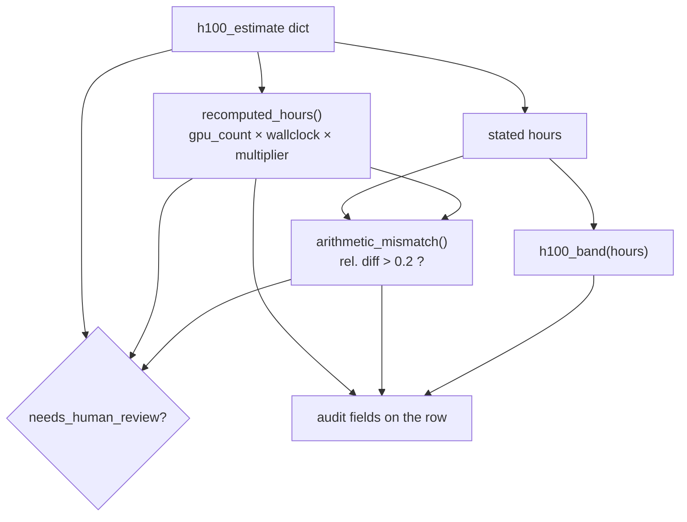
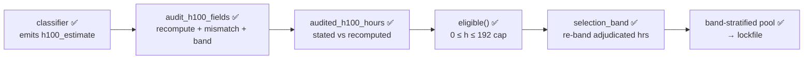

# H100 budget — cost model & band assignment

Every classified paper carries an `h100_estimate` — the smallest compute needed to test its central claim, expressed in H100-equivalent hours. Two deterministic stages turn that model-reported estimate into a trustworthy number: a per-row **audit** that re-derives and sanity-checks the arithmetic (`audit/h100.py`), and a selection-time **adjudication** that decides whether the model's stated hours or the recomputed hours win, then buckets the row into a compute band (`audit/select_pool.py`). The band and the audited hours are what the [lockfile](lockfile.md) and [pool selection](select-pool.md) ultimately stratify on.

!!! note "Through-line: the model reports, the code decides"
    The classifier emits `h100_estimate` as free evidence. It never assigns a band or a budget. Bands, the 192-hr cap, and the stated-vs-recomputed adjudication are all computed by deterministic code — the same trust-but-verify posture as the rest of the [architecture](../architecture.md).

## The `h100_estimate` record ✅

The classifier's final schema (`schema/output.py`, `h100_estimate_schema`) requires these fields per paper:

| field | type | meaning |
|---|---|---|
| `hours` | number | the model's **stated** H100-equivalent hours |
| `basis_kind` | enum | `paper_reported` · `derived_from_config` · `comparable_experiment` · `compute_unspecified` |
| `gpu_count` | number \| null | GPUs used for the MRE |
| `gpu_type` | string \| null | the hardware named in the paper (e.g. `A100`, `H200`, `GH200`) |
| `wallclock_hours` | number \| null | wall-clock duration of the run |
| `h100_equivalent_multiplier` | number \| null | per-GPU H100-equivalence factor for `gpu_type` |
| `basis` | string | prose justification |

The multiplier is the equivalence handle: it converts one GPU-hour of `gpu_type` into H100-equivalent GPU-hours, so a slower-than-H100 card carries a multiplier `< 1`. There is **no built-in lookup table** in `audit/h100.py` — the multiplier is reported per-row by the model inside `h100_estimate`, and the audit only checks that `hours` is consistent with it.

## Per-row audit — `audit/h100.py` ✅

`audit_h100_fields(row)` runs inside `finalize_extracted_row` (`runtime/run_health.py`) on every classified row, right after `verification_status` is set. It recomputes the hours from the structured fields and flags arithmetic mismatches.

### What each function does

| function | behavior |
|---|---|
| `recomputed_hours(estimate)` | returns `gpu_count × wallclock_hours × h100_equivalent_multiplier`; `None` if any factor is missing/non-numeric, `gpu_count ≤ 0`, `wallclock < 0`, or `multiplier ≤ 0` |
| `arithmetic_mismatch(hours, recomputed)` | `True` when the relative difference exceeds `MISMATCH_TOLERANCE = 0.2` (20 %), normalized by the larger magnitude; `None` if either input is missing; `False` when both are 0 |
| `h100_band(hours)` | maps stated hours to a band label (below); `None` for missing/negative |
| `as_number(value)` | strict numeric coercion — **`bool` is rejected** (so `True` is not read as `1.0`) |

### Fields written back onto the row

`audit_h100_fields` returns:

| field | source |
|---|---|
| `h100_hours_estimate` | the stated `hours` |
| `h100_estimate_basis` | `basis` prose, prefixed with `basis_kind` if not already present (`basis_text`) |
| `h100_band` | `h100_band(hours)` |
| `h100_recomputed_hours` | `recomputed_hours(estimate)` |
| `h100_arithmetic_mismatch` | the mismatch flag |
| `h100_needs_human_review` | `True` if `basis_kind == "compute_unspecified"`, **or** recompute failed (`None`), **or** a mismatch was flagged |

!!! warning "Legacy rows"
    If `row["h100_estimate"]` is missing or not a dict, `legacy_audit_fields` runs instead: it bands the flat `h100_hours_estimate`, sets the recomputed/mismatch fields to `None`, and forces `h100_needs_human_review = True`. Pre-schema rows are always queued for a human.

## Bands and the 192-hr cap ✅

`H100_BANDS` defines four inclusive-bounded bands; anything above 192 H100-hr falls into the `OVER_CAP_BAND` sentinel `">192"`. Band edges overlap by construction — `h100_band` returns the **first** band whose `low ≤ value ≤ high`, so a value exactly on a boundary lands in the cheaper band.

| band label | range (H100-hr) | role |
|---|---|---|
| `0-8` | `0 ≤ h ≤ 8` | cheapest tier-of-cost |
| `8-32` | `8 ≤ h ≤ 32` | |
| `32-96` | `32 ≤ h ≤ 96` | |
| `96-192` | `96 ≤ h ≤ 192` | most expensive selectable band |
| `>192` | `h > 192` | over the cap — **excluded from selection** |

!!! example "Boundary behavior"
    `h100_band(8.0)` returns `"0-8"`, not `"8-32"` — boundaries belong to the lower band. `h100_band(192.0)` returns `"96-192"`; `h100_band(192.01)` returns `">192"`. Negative or non-numeric input returns `None`.

The cap itself is enforced in `audit/select_pool.py` as `H100_CAP = 192.0`: `eligible()` keeps a row only when its **audited** hours satisfy `0 ≤ hours ≤ 192`. The `">192"` band can never reach the pool.

## Selection-time adjudication — `audit/select_pool.py` ✅

At selection, the per-row mismatch flag is *adjudicated* into a single trusted number by `audited_h100_hours(row)`, which returns `(hours, replaced_stated)`. The recomputed `gpu_count × wallclock × multiplier` value replaces the model's stated `hours` only when **all** of these hold:

1. the audit flagged `h100_arithmetic_mismatch` (the stated number is inconsistent);
2. the row's `custom_id` is **not** in `MANUAL_KEEP_STATED` (a hand-curated allow-list — currently `{"2511.08214"}` — where the stated number was verified correct by hand despite the flag);
3. the `h100_equivalent_multiplier` is sane: `≤ MULTIPLIER_SANE_MAX = 1.1`. Above this the structured fields are treated as garbage (the degraded-row pattern), so the recompute is *not* trusted; and
4. `h100_recomputed_hours` is actually present (not `None`).

When all four hold, the recomputed value wins and `h100_hours_adjudicated = True` is recorded on the row; otherwise the stated `hours` stand.

!!! tip "Why the multiplier ceiling, not a floor"
    A mismatch with a believable multiplier (`≤ 1.1`) usually means the model *inflated* its stated hours — the recompute corrects it downward. A wild multiplier means the fields themselves are unreliable, so the recompute would only launder bad inputs; in that case the row keeps its stated hours and stays flagged for review.

The adjudicated hours then drive everything downstream in `select_pool`:

- `eligible()` applies the `verified` + tier + `0 ≤ hours ≤ 192` gate using the **adjudicated** hours, not the stated ones.
- each surviving row gets `audited_h100_hours`, `h100_hours_adjudicated`, and a fresh `selection_band = h100_band(audited_hours)` written onto it (re-banded from the adjudicated value).
- band quotas are filled cheapest-first by `audited_h100_hours`, with expensive-band deficits cascading down to the next cheapest band.

See [pool selection](select-pool.md) for the band weights (`5/7/8/5` per 25), the largest-remainder apportionment, and the deficit-refill cascade. The resulting per-tier band counts and `total_audited_h100_hours` land in `<out>_summary.json` (and `adjudicated_hours` counts how many rows had the recompute swapped in).

## End to end

The same H100-equivalence idea reappears 🚧 in the (designed, not-yet-built) reproduction agent's **budget meter**, where `Σ gpus × wallclock × hw_multiplier` is metered live against `budget_h100_hours` to halt a run — see [the architecture overview](../architecture.md) Part III.4. The cost model here is what assigns each lockfile row the budget that meter enforces.

## Related pages

- [Pool selection](select-pool.md) — band weights, quotas, and the deficit cascade
- [The lockfile](lockfile.md) — the band-selected audit pool these hours feed
- [Architecture overview](../architecture.md) — where the H100 audit sits in the full pipeline
- [Dataset stages](../dataset/stages.md) · [Bundle schema](../dataset/bundle-schema.md)
