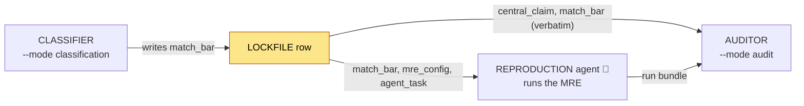

# The lockfile

ReproBench turns on **one artifact**: `audit_pool_extracted.jsonl` (~200 rows), the band-selected audit pool emitted by `audit/select_pool.py`. It is the single hand-off both downstream agents read — the reproduction agent consumes it to know *what to run and how close counts*, and the auditor consumes it to grade against the *same* pinned bar. This section covers what one row holds, why the success bar is pinned exactly once, and the `match_bar` through-line; child pages cover [how the pool is selected](select-pool.md) and [the H100 budget bands](h100-budget.md).

!!! note "Where it sits in the system"
    `CLASSIFIER ──► LOCKFILE ──► REPRODUCTION agent ──► run bundle ──► AUDITOR`. See the [architecture overview](../architecture.md) for the full picture. The lockfile is stage **S5** (`✅` live).

## Why a lockfile exists

The success bar — "how close to the paper's number counts as a reproduction" — is decided **once**, by the classifier, and then frozen into the row. Every downstream consumer reuses it **verbatim** instead of re-inferring it per run.

```text
Stage 1 classifier PINS it  →  lockfile CARRIES it  →  Auditor APPLIES it verbatim
```

This is the core trust-but-verify posture of the whole benchmark applied to the *ruler*: no agent grades itself, and no two runs of the same paper are judged against a different target the auditor happened to re-read out of the prose that run.

## What one row contains

Each row is one paper (`custom_id` = arXiv id) carried through from the classifier's MRE record (`schema/output.py`, `FINAL_RESPONSE_FORMAT`) plus the selection fields `audit/select_pool.py` adds. The fields a downstream agent cares about:

| field | source | role |
|---|---|---|
| `custom_id` | classifier | arXiv id; the row key, the run-dir name (`<runs-dir>/<arxiv_id>`) |
| `central_claim` | classifier | the one claim the reproduction must test |
| `claim_evidence` | classifier | where in the paper the claim is stated |
| `mre_config` | classifier | smallest experiment that tests the claim (the MRE) |
| `match_bar` | classifier | the pinned success bar — see below |
| `agent_task` | classifier | what the reproduction agent is told to do |
| `paper_kind` | classifier | `empirical` / `theoretical` / `position` / `survey` |
| `signals` | classifier | code / dataset / weights / dataset-is-standard availability + verification |
| `verified_links` | classifier | `paper_or_project` / `code` / `dataset` / `weights` URLs |
| `tier` | code-decided | `Easy` / `Medium` / `Hard` (artifact difficulty) |
| `selection_band` | `select_pool.py` | compute band `0-8` / `8-32` / `32-96` / `96-192` (H100 hours) |
| `audited_h100_hours` | `select_pool.py` | the adjudicated H100-hour budget for this cell |
| `h100_hours_adjudicated` | `select_pool.py` | `true` if the recompute overrode the model's stated hours |
| `h100_estimate` | classifier | full estimate object (`hours`, `basis_kind`, `gpu_count`, `gpu_type`, `wallclock_hours`, `h100_equivalent_multiplier`, `basis`); selection reads `hours` to derive `audited_h100_hours` |
| `verification_status` | classifier loop | `verified` / `incomplete` / `degraded` (only `verified` is eligible) |

!!! info "`tier` and `score` are computed, not trusted"
    The classifier *proposes* signals; `normalize_score_and_tier` in `schema/output.py` recomputes the rubric score and tier from those signals deterministically and overwrites the model's values (keeping the model's as `reported_score` / `reported_tier` when they differ). The lockfile carries the **code-decided** tier.

!!! tip "`band` vs `budget`"
    The architecture diagram labels these `band` and `budget`. In the actual row they are the literal keys **`selection_band`** (the bucket label) and **`audited_h100_hours`** (the numeric budget). The proposed S6 reproduction agent reads the same value under the name `budget_h100_hours`.

## The `match_bar` through-line

`match_bar` is the machine-readable shape of the success bar, defined in `schema/output.py` (`match_bar_schema`, `MATCH_BAR_KINDS`) and pinned once by the classifier (`rubric_audit.md` C1). Its object has five fields:

```json
{
  "kind": "point_estimate",
  "op": "abs_rel_within",
  "reference_value": 25.76,
  "tolerance": 0.05,
  "note": "Table 2, BLEU on WMT14 en-de, same eval protocol"
}
```

`op` carries the relation in the auditor's own vocabulary; `reference_value` and `tolerance` are `null` whenever the kind has no single scalar to be near.

### The five kinds

| `kind` | what counts as a match | representative fields |
|---|---|---|
| `point_estimate` | land near a value | `op=abs_rel_within`, `reference_value=25.76`, `tolerance=0.05` |
| `threshold` | clear a floor/ceiling | `op=">="`, `reference_value=85`, `tolerance=null` |
| `direction` | beat a baseline (no tolerance band) | `op="measured_method > measured_baseline, same protocol"`, `reference_value=null`, `tolerance=null` |
| `magnitude` | the *size* of a delta is the target | `op="delta within tol"`, `reference_value=+5`, `tolerance=0.05` (tolerance applies to the delta) |
| `none` | no checkable scalar/relation (theory/position) | all null |

!!! warning "Fallback for rows that predate the field"
    Rows produced before `match_bar` existed (e.g. the v5 trial run) or with `kind = none` fall back to the rubric defaults in `rubric_audit.md` C1: **±5 %** for a point estimate, **direction-only** for a comparative. The auditor applies this fallback; it never re-invents a *paper-specific* number.

### Who pins it and who applies it



- **Classifier (`✅`)** sets `match_bar` while emitting the MRE record. It is the only writer.
- **Reproduction agent (`🚧` designed, not built)** reads it to know the target the experiment must hit, and the harness applies it to the fresh re-execution's metric to write `result.json`.
- **Auditor (`✅`)** adopts it verbatim when grading, so the score reflects the pinned bar, not one the auditor re-derived.

## How a row gets into the pool

`audit/select_pool.py` filters every classified row and stratifies what survives. A row is **eligible** only if `verification_status == "verified"`, its `tier` is one of `Easy`/`Medium`/`Hard`, and its adjudicated H100 hours fall in `0 … 192`. Survivors are bucketed by compute band and filled cheapest-first against per-tier band weights.

```text
keep if  verified  AND  tier ∈ {Easy, Medium, Hard}  AND  0 ≤ audited_h100_hours ≤ 192
   ├ bucket by selection_band  (0-8 / 8-32 / 32-96 / 96-192)
   ├ band weights 5/7/8/5 per 25, scaled to --total (default 200)
   ├ cheapest-first inside each band; expensive-band deficits cascade to cheaper bands
   ▼
audit_pool_extracted.jsonl   ◄══ THE LOCKFILE
```

A representative run (`--total 200`) lands at 67 / 67 / 66 rows across Easy / Medium / Hard, each tier band-stratified per the weights. The selection algorithm, the H100 adjudication, and the band weights are documented on the child pages:

- [Pool selection](select-pool.md) — eligibility, `largest_remainder` apportionment, cheapest-first fill, deficit cascade, and the three output files.
- [H100 budget](h100-budget.md) — how `audited_h100_hours` is computed, the arithmetic-mismatch audit, the 192-hour cap, and the four bands.

!!! example "Regenerating the lockfile"
    ```bash
    python -m reprocli_vllm.audit.select_pool \
        --run outputs/v5/neurips_2025_minimax_m2_trial \
        --out outputs/v5/audit_pool --total 200
    ```
    Writes `audit_pool_extracted.jsonl` (the lockfile), `audit_pool_trace.jsonl` (matching tool-call traces), and `audit_pool_summary.json` (per-tier band counts).

## Related

- [Dataset stages](../dataset/stages.md) and the [bundle schema](../dataset/bundle-schema.md) — how the classifier produces the rows that feed selection.
- [Auditor mode](../modes/auditor.md) — the consumer that applies `match_bar` verbatim.
- [Reproduction mode](../modes/reproduction.md) — the `🚧` consumer that runs the MRE under `audited_h100_hours`.
