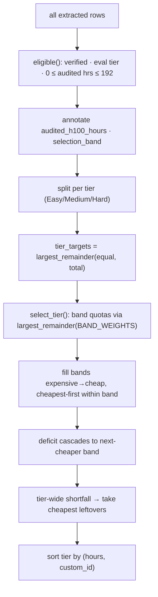

# Pool selection

`audit/select_pool.py` ✅ turns the classifier's `<run>_extracted.jsonl` (one MRE
record per paper) into the band-stratified human-audit pool — the rows that become
[the lockfile](lockfile.md). It keeps only **verified** papers whose **audited H100
hours fit under the 192-hour cap**, stratifies them across the three evaluated tiers
and four compute bands, and fills each band **cheapest-first**. This page documents
the actual selection functions, the CLI entry, the knobs, and the two helper tools
for inspecting what came out.

!!! note "Where this sits in the pipeline"
    Stage 2 (pool selection) runs after Stage 1 (classification). The classifier and
    the H100 audit have already written every paper's `verification_status`, `tier`,
    `h100_estimate`, and the recompute/mismatch fields; selection only *reads* those
    and chooses a subset. See [Dataset stages](../dataset/stages.md) and the
    [H100 budget model](h100-budget.md) for upstream detail.

## CLI entry

```bash
python -m reprocli_vllm.audit.select_pool \
    --run outputs/v5/neurips_2025_minimax_m2_trial \
    --out outputs/v5/audit_pool \
    --total 200
```

| Flag | Type | Default | Meaning |
| --- | --- | --- | --- |
| `--run` | path | *required* | Input **basename** with no suffix; the script reads `<run>_extracted.jsonl` and (if present) `<run>_trace.jsonl`. |
| `--out` | path | *required* | Output **basename** with no suffix; writes `<out>_extracted.jsonl`, `<out>_trace.jsonl`, `<out>_summary.json`. |
| `--total` | int | `200` | Pool size summed across all three tiers. |

`main()` loads the extracted rows, calls `select_pool(rows, total)`, then
`write_outputs()` streams the three artifacts.

## Eligibility

A row survives `eligible(row)` only if **all** hold (`audit/select_pool.py`):

| Check | Source field | Rule |
| --- | --- | --- |
| Verified | `verification_status` | must equal `"verified"` |
| Evaluated tier | `tier` | must be one of `Easy`, `Medium`, `Hard` (`EVAL_TIERS`) — `Artifact-Blocked` and out-of-scope rows are logged-only and excluded here |
| Within cap | audited H100 hours | `0 <= hours <= 192.0` (`H100_CAP`) |

### Audited hours — which number wins

The "audited" hours are not blindly the model's stated number.
`audited_h100_hours(row)` adjudicates the H100 arithmetic audit and returns
`(hours, replaced)`:

- It starts from the model's **stated** `h100_estimate.hours`.
- If the row was flagged `h100_arithmetic_mismatch` **and** the row is not on the
  manual allow-list **and** the estimate's `h100_equivalent_multiplier` is sane
  (`<= 1.1`, `MULTIPLIER_SANE_MAX`), it substitutes `h100_recomputed_hours`
  (`gpu_count x wallclock x multiplier`, computed upstream in `audit/h100.py`) and
  marks the row `h100_hours_adjudicated = True`.
- Otherwise the stated value is kept.

!!! warning "Two guard constants"
    `MANUAL_KEEP_STATED = {"2511.08214"}` — a paper whose stated hours were verified
    by hand despite an arithmetic-mismatch flag; the recompute is *not* substituted.

    `MULTIPLIER_SANE_MAX = 1.1` — above this multiplier the structured fields are
    treated as garbage (degraded-row pattern), so the recompute is distrusted and the
    stated value is kept. The row may still be dropped later if its hours exceed the
    cap.

Each kept row is annotated in-place before stratification:

| Added field | Value |
| --- | --- |
| `audited_h100_hours` | the adjudicated hours |
| `h100_hours_adjudicated` | whether the recompute replaced the stated value |
| `selection_band` | `h100_band(hours)` → one of the four band labels |

## Bands and weights

Bands come from `h100_band()` in `audit/h100.py`; selection uses the four under-cap
bands in `BAND_ORDER`:

| Band (H100-hr) | Weight per 25 selected (`BAND_WEIGHTS`) |
| --- | --- |
| `0-8` | 5 |
| `8-32` | 7 |
| `32-96` | 8 |
| `96-192` | 5 |

Weights derive from the per-tier band weights in the dataset-construction methodology
(5 / 7 / 8 / 5 per 25) and are scaled to the requested pool size at runtime — they are
**not** a fixed count.

## Selection algorithm



### Tier apportionment

`select_pool()` splits `--total` **evenly** across the three tiers using
`largest_remainder({t: 1 for t in EVAL_TIERS}, total)` — equal weights, so e.g.
`--total 200` → 67 / 67 / 66 (the remainder is handed to the tiers with the largest
fractional part).

### Band quotas and cheapest-first fill (`select_tier`)

Within a tier, `select_tier(rows, target)`:

1. Buckets the tier's eligible rows by `selection_band`, then sorts each bucket
   ascending by `(audited_h100_hours, custom_id)` — **cheapest first**, ties broken
   deterministically by id.
2. Computes per-band quotas with `largest_remainder(BAND_WEIGHTS, target)`.
3. Walks the bands **most-expensive first** (`reversed(BAND_ORDER)`) so any
   **deficit cascades down** into the next cheaper band. For each band it takes
   `quota + carried_deficit` rows; whatever it cannot fill becomes the deficit for the
   next (cheaper) band.
4. If a deficit remains after all bands (the whole tier is short), it takes the
   cheapest still-unselected rows in the tier to top up.
5. Returns the tier's selection sorted by `(audited_h100_hours, custom_id)`.

!!! tip "Why expensive-first"
    Cheap rows are abundant, expensive rows are scarce. Filling from the top down lets
    an empty expensive band's quota fall to cheaper bands that *can* satisfy it, rather
    than stranding the budget. The reverse never happens — a cheap-band deficit cannot
    be served by emptier expensive bands.

`largest_remainder(weights, total)` (used for both tier and band apportionment) scales
the weights so they sum to `total`, floors each, then hands the leftover units to the
keys with the largest fractional remainders.

## Outputs

`write_outputs(base, run, selection)` emits three files:

| File | Contents |
| --- | --- |
| `<out>_extracted.jsonl` | the selected rows (with `audited_h100_hours`, `h100_hours_adjudicated`, `selection_band` added) — **this is the lockfile body** |
| `<out>_trace.jsonl` | tool-call traces filtered from `<run>_trace.jsonl` to the selected `custom_id`s (skipped with a warning if the source trace file is absent) |
| `<out>_summary.json` | per-tier counts: rows selected, band histogram, adjudicated-hours count, `h100_needs_human_review` count, and total audited H100-hours; plus `h100_cap` and `band_weights_per_25` |

A per-tier line is also printed to the console, e.g.
`Easy   67 selected   0-8:13  8-32:19  32-96:21  96-192:14   flagged:4  adjudicated:2`.

!!! example "Summary shape"
    ```json
    {
      "source_run": "outputs/v5/neurips_2025_minimax_m2_trial",
      "total_selected": 200,
      "h100_cap": 192.0,
      "band_weights_per_25": {"0-8": 5, "8-32": 7, "32-96": 8, "96-192": 5},
      "tiers": {
        "Easy": {"selected": 67, "bands": {"0-8": 13, "...": "..."},
                 "adjudicated_hours": 2, "h100_flagged": 4,
                 "total_audited_h100_hours": 612.3}
      }
    }
    ```

## Inspecting the pool

A helper tool reads the same artifacts to check composition before the pool is
frozen into the lockfile:

| Tool | What it does |
| --- | --- |
| `tools/plot_audit_pool.py` ✅ | Reads `<out>_extracted.jsonl` and renders two panels: **(a)** pool composition — papers per `selection_band` grouped by tier; **(b)** a compute-feasibility ECDF — the share of MREs per tier whose audited compute fits under each agent budget, with the `4 / 16 / 64 / 192` H100-hour budgets marked. Run `python3 tools/plot_audit_pool.py [--pool ... --out ...]`. |

!!! note "Feasibility framing is analysis-only"
    The helper doesn't change the selection; it consumes its output (or the upstream
    verified rows) to sanity-check budget feasibility. The
    `4 / 16 / 64 / 192` budgets in `plot_audit_pool.py` are the reproduction agent's
    [H100 budgets](h100-budget.md), not the four selection bands.

## See also

- [The lockfile](lockfile.md) — the frozen `audit_pool_extracted.jsonl` and the
  fields each row carries downstream.
- [H100 budget model](h100-budget.md) — how `h100_estimate`, recompute, and bands are
  produced upstream.
- [Auditor mode](../modes/auditor.md) and [Reproduction mode](../modes/reproduction.md)
  — the two consumers of the selected pool.
- [Architecture overview](../architecture.md) — where Stage 2 sits end-to-end.
