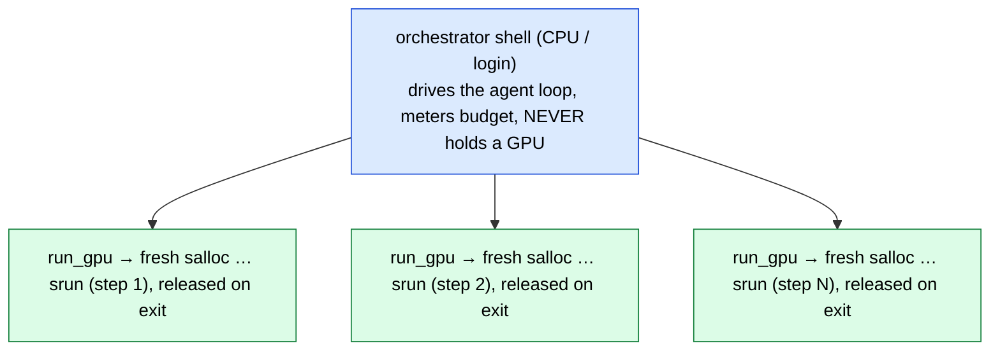

# Clusters & the allocation→step pattern

How GPU work is actually managed in this repo — the SLURM substrate the
reproduction agent builds on. Two NCSA clusters are in play (DeltaAI and Delta).
The reproduction agent provisions GPUs **just-in-time**: it holds nothing while
it reasons, then opens a fresh allocation per GPU step and releases it the moment
the step exits. This page is the standalone form of Part IV of the
[architecture overview](../architecture.md).

---

## Clusters & accounts

| cluster | account / partition | hardware | used for |
|---|---|---|---|
| **DeltaAI** (NCSA) | `-A betw-dtai-gh -p ghx4` | GH200, 4 GPU/node | the reproduction agent's `deltaai` profile (the only profile); model serving |
| **Delta** (NCSA) | `-A bfvr-delta-cpu -p cpu-interactive` | CPU | model downloads, CPU orchestration |
| **Delta** (NCSA) | `-A bfvr-delta-gpu -p gpuH200x8-interactive` | H200 ×8/node | interactive + multi-node model serving |

`deltaai` is the single built-in reproduction-agent profile
(`src/reprocli_repro/cluster.py`): it pins the account, the default partition
(`ghx4`), the node hardware (`gh200`), and the per-node GPU count. Two per-run
overrides exist — `--partition` (pick a different queue, e.g. the
faster-turnaround `ghx4-interactive`) and `--apptainer-image` (swap the base
`.sif`). There is no account / hardware / gpus-per-node override, and no second
cluster profile.

!!! note "Interactive partitions"
    For interactive allocations on DeltaAI, use `-p ghx4-interactive` instead of
    `ghx4`. Pass `--partition ghx4-interactive` (or let the agent pick it per
    `run_gpu` step via the `list_partitions` tool) when your allocation policy
    requires it.

---

## The JIT allocation → step pattern (the load-bearing idea)

The reproduction agent's split is **orchestrator = cheap CPU, GPU step =
just-in-time allocation.** The agent loop, budget meter, evidence capture, and
**all** CPU work (clone, `uv venv`, install, edit, inspect) run on a long-lived
CPU/login process that **never holds a GPU**. Each GPU step opens **one fresh
`salloc`** sized for that step and **releases it the instant the command exits** —
nothing is pre-held, so idle GPU time is never charged.

```bash
# Orchestrator (CPU, this shell) drives the agent loop; each run_gpu step opens
# and releases its own allocation, running inside the mandatory Apptainer sandbox:
salloc -A betw-dtai-gh -p ghx4 --nodes=1 --gpus=<k> --time=<minutes> \
  srun --ntasks=1 apptainer exec --nv --cleanenv --no-home <sif> \
       bash -lc 'cd <per-paper-workspace> && <experiment command>'
```



Each `run_gpu` step is metered as `gpus × elapsed_h × hw_multiplier` (actual
elapsed; queue wait is not charged) against the row's `budget_h100_hours`; when
the remaining budget hits zero, `run_gpu` refuses and the agent is forced to
finish and write its report. The model sets `gpus`/`minutes` per call; the
account/partition/node come from the `deltaai` profile. See
[the reproduction mode](../modes/reproduction.md) for the budget meter and how the
agent reports while the auditor renders the verdict.

!!! tip "Why this maps onto the agent core"
    The vLLM server is a stateless chat-completions endpoint (all conversation
    memory lives in the orchestrator's `conversations` dict — see
    [the architecture](../architecture.md#part-ii-the-single-agent-core)). The
    reproduction agent attaches its *brain* to any already-running
    OpenAI-compatible endpoint by base URL and spends **zero** GPU budget on
    reasoning; the metered GPU allocation is touched only by `run_gpu`→`srun`
    steps that do real experiment work. Orchestration and GPU are therefore
    physically different allocations.

The same `salloc … srun … bash -lc '…'` shape is what a **multi-node serve** uses
for every in-allocation command — interface discovery, head-IP probing, and the
`vllm serve` launch (see the [serving page](serve.md)). There the allocation is
long-lived because a served model must stay up; the reproduction agent's GPU
allocations, by contrast, live only for one step.

---

## The standardized env block

Every `srun` step inherits the environment the sbatch scripts already
standardize. The block below is shared across the `serve_*.sbatch` servers and
the interactive runbook's §2
(`scripts/kimi_k2_6/kimi_k2_6_multinode_interactive.md`). The one divergence: the single-node
sbatch scripts additionally pin loopback rendezvous
(`export MASTER_ADDR=127.0.0.1` / `export VLLM_HOST_IP=127.0.0.1`), which the
**multi-node** runbook deliberately omits — there the head address is discovered
as `HEAD_IP` (see the multi-node warning below).

### Caches (project-scoped, not `$HOME`)

Compile/runtime caches are pinned under `/work/nvme/bfvr/msalunkhe/.cache/…` so
they survive and are shared across jobs rather than filling a home quota:

```bash
export TORCHINDUCTOR_CACHE_DIR=/work/nvme/bfvr/msalunkhe/.cache/torchinductor
export TRITON_CACHE_DIR=/work/nvme/bfvr/msalunkhe/.cache/triton
export VLLM_CACHE_ROOT=/work/nvme/bfvr/msalunkhe/.cache/vllm
```

### NCCL / Torch-NCCL tuning

Collectives tuning for the GH200/H200 fabric — CUMEM off, plugin defaulted off,
async error handling and monitoring on, a long heartbeat timeout. Most are
`${VAR:-default}` so they can be overridden from the launching shell:

```bash
export NCCL_CUMEM_ENABLE=0
export NCCL_CUMEM_HOST_ENABLE=0
export NCCL_DEBUG="${NCCL_DEBUG:-INFO}"
export NCCL_DEBUG_SUBSYS="${NCCL_DEBUG_SUBSYS:-INIT,ENV,NET}"
export NCCL_NET_PLUGIN="${NCCL_NET_PLUGIN_OVERRIDE:-none}"
export TORCH_NCCL_ASYNC_ERROR_HANDLING="${TORCH_NCCL_ASYNC_ERROR_HANDLING:-1}"
export TORCH_NCCL_ENABLE_MONITORING="${TORCH_NCCL_ENABLE_MONITORING:-1}"
export TORCH_NCCL_HEARTBEAT_TIMEOUT_SEC="${TORCH_NCCL_HEARTBEAT_TIMEOUT_SEC:-1200}"
```

### CUDA / runtime hygiene

```bash
export SAFETENSORS_FAST_GPU=1
export CUDA_MODULE_LOADING=LAZY
export CUDA_DEVICE_ORDER=PCI_BUS_ID
export PYTHONFAULTHANDLER=1
export OMP_NUM_THREADS=1
ulimit -l unlimited || true
ulimit -s unlimited || true
```

### Module + interpreter + path

```bash
module load python/3.11.9
source /u/msalunkhe/reprocli/.venv/bin/activate   # the shared repo venv (serve + auditor)
cd /u/msalunkhe/reprocli
export PYTHONPATH=/u/msalunkhe/reprocli/src:${PYTHONPATH:-}
```

!!! warning "Multi-node adds fabric-interface discovery"
    For a **multi-node** serve, the env block alone is not enough: the runbook
    also discovers the high-speed fabric interface (`hsn0` on DeltaAI) and the
    head IP, then exports `GLOO_SOCKET_IFNAME` / `NCCL_SOCKET_IFNAME`
    (`scripts/kimi_k2_6/kimi_k2_6_multinode_interactive.md` §3–§4). If `IFACE_NAME` is unset
    when probing, `ip -o -4 addr show` lists every interface and the first match
    is loopback — silently making `HEAD_IP=127.0.0.1`, which breaks the
    rendezvous (the worker node times out with `4/8 clients joined`). The runbook
    now fails fast on an empty or loopback `HEAD_IP`.

### Per-paper `uv` venv (the reproduction agent's isolation)

The shared `.venv` above is the repo's serving/auditor environment. The
reproduction agent intentionally does **not** reuse it: each paper gets its own
**per-paper `uv` venv** (`--system-site-packages` over the Apptainer image's
torch) built from the paper's pinned commit, so one paper's dependency install
can never poison another's. This is the decouple-and-isolate intent from the
architecture (Part IV `workspace.py`).

!!! example "Shape of a per-paper workspace step"
    ```bash
    srun --jobid=$SLURM_JOB_ID --nodes=1 --ntasks=1 bash -lc '
      cd <per-paper-workspace>           # on NVMe, e.g. /work/nvme/...
      module load python/3.11.9
      uv venv .venv && source .venv/bin/activate
      uv pip install -r requirements.txt # the paper'\''s own deps
      <experiment command>               # this is what run_gpu wraps
    '
    ```
    The exact `uv`/clone wrappers live in the `src/reprocli_repro/` modules
    (`workspace.py`, `slurm.py`); the shape above mirrors the JIT
    `salloc … srun … bash -lc '…'` step the agent's `run_gpu` tool builds.

---

## Worked example: attach a consumer to a live multi-node server

Once `salloc` holds 2× GH200 nodes and `srun` launches `vllm serve` across them,
a consumer attaches by URL with **no** vLLM launch flags (the server is already
up). The auditor:

```bash
python3 src/run_arxiv_prompt_vllm.py \
  --mode audit \
  --vllm-server-url "http://${HEAD_IP}:8000" \
  --model moonshotai/Kimi-K2.6 \
  --tool-rounds 12 \
  --request-workers 2 \
  --claims hf://datasets/Mithilss/neurips-2025-audit-pool/audit_pool_extracted.jsonl \
  --runs-dir <runs-dir> \
  --output outputs/audit_smoke.jsonl \
  --extracted-output outputs/audit_smoke_extracted.jsonl
```

This is the same `--vllm-server-url` seam the reproduction agent's
provider-agnostic brain uses: swap the endpoint by changing the URL, with no
provider-specific code in the harness.

---

## Where to go next

- [Serving (reprocli_serve)](serve.md) — the standalone central vLLM server other
  nodes attach to by URL, and the endpoint contract that decouples it from consumers.
- [Sbatch jobs](sbatch.md) — the batch (`#SBATCH`) form of a serve-then-attach run
  that pins this env block.
- [Reproduction mode](../modes/reproduction.md) — the `salloc` +
  `run_gpu`→`srun` execution agent and its H100-hour budget meter.
- [Architecture overview](../architecture.md) — Part IV in context with the full
  lockfile → reproduction → auditor pipeline.
