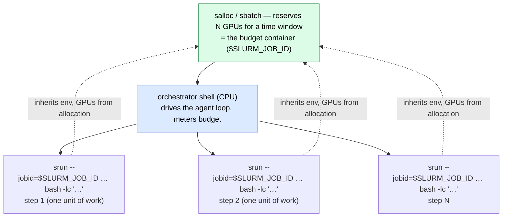

# Clusters & the allocation→step pattern

How GPU work is actually managed in this repo today — the SLURM substrate the
reproduction agent builds on. Two NCSA clusters are in play (DeltaAI and Delta),
and every GPU run follows one shape: an **allocation holds the GPUs** (the budget
container) and **`srun` steps run each unit of work inside it**. This page is the
standalone form of Part IV of the [architecture overview](../architecture.md).

!!! info "Status legend"
    ✅ live · 🚧 designed, not yet wired — consistent with the architecture doc.
    The classifier/auditor sbatch jobs are ✅ live; the reproduction agent's
    `salloc`/`run_gpu`→`srun` loop is 🚧 designed (see
    [the reproduction mode](../modes/reproduction.md)).

---

## Clusters & accounts ✅

| cluster | account / partition | hardware | used for |
|---|---|---|---|
| **DeltaAI** (NCSA) | `-A betw-dtai-gh -p ghx4` | GH200, 4 GPU/node | the classifier/auditor sbatch jobs (`scripts/**/*.sbatch`) |
| **Delta** (NCSA) | `-A bfvr-delta-cpu -p cpu-interactive` | CPU | model downloads, CPU orchestration |
| **Delta** (NCSA) | `-A bfvr-delta-gpu -p gpuH200x8-interactive` | H200 ×8/node | interactive + multi-node model serving |

!!! note "Interactive partitions"
    For interactive allocations on DeltaAI, the runbook uses
    `-p ghx4-interactive` instead of `ghx4`
    (`scripts/kimi_k2_6/kimi_k2_6_multinode_interactive.md` §1). Pick the interactive
    variant when your allocation policy requires it.

These three account/partition triples are not hypothetical — they are the exact
strings the live scripts pass:

- `scripts/kimi_k2_6/paper_classification_kimi_k2_6.sbatch` → `#SBATCH -A betw-dtai-gh`,
  `#SBATCH -p ghx4` (single node, `--gpus-per-node=8`, `--gpu-bind=none`).
- `scripts/cluster/delta_scripts.sh` line 1 → `srun -A bfvr-delta-cpu -p cpu-interactive
  …` to grab a CPU shell for an `hf download`.
- `scripts/cluster/delta_scripts.sh` line 4 → `srun -A bfvr-delta-gpu -p
  gpuH200x8-interactive --gpus-per-node=6 …` for an interactive H200 shell.

---

## The allocation → step pattern ✅ (the load-bearing idea)

The repo's split is **allocation = budget container, `srun` step = one unit of
work.** `salloc` (or `sbatch`) reserves the nodes for a time window; every
discrete piece of GPU work runs as an `srun` step *inside* that allocation,
pinned to it with `--jobid=$SLURM_JOB_ID`.

```bash
# 1. Hold GPUs for the budget window (the budget container)
salloc -A betw-dtai-gh -p ghx4 --nodes=1 --gpus-per-node=1 \
       --cpus-per-task=16 --mem=64G --time=<budget-derived>

# 2. Orchestrator (CPU, this shell) drives the agent loop and fires steps:
srun --jobid=$SLURM_JOB_ID --nodes=1 --ntasks=1 \
     bash -lc 'cd <workspace> && <agent command>'
```

This is the same shape the multi-node runbook uses for *every* in-allocation
command — interface discovery, head-IP probing, and the `vllm serve` launch all
go through `srun --jobid=$SLURM_JOB_ID … bash -lc '…'`
(`scripts/kimi_k2_6/kimi_k2_6_multinode_interactive.md` §3–§5).



!!! tip "Why this maps onto the agent core"
    The vLLM server is a stateless chat-completions endpoint (all conversation
    memory lives in the orchestrator's `conversations` dict — see
    [the architecture](../architecture.md#part-ii-the-single-agent-core)). The
    reproduction agent attaches its *brain* to any already-running
    OpenAI-compatible endpoint by base URL and spends **zero** GPU budget on
    reasoning; the metered GPU allocation is touched only by `run_gpu`→`srun`
    steps that do real experiment work. Orchestration and GPU are therefore
    physically different allocations, exactly as the design requires.

### Designed extension: orchestrator vs. GPU steps 🚧

The reproduction agent (Part III, [reproduction mode](../modes/reproduction.md))
keeps the same allocation→step *shape* but flips *who holds the allocation and
when*. The classifier/auditor pre-hold one sbatch allocation for a whole job; the
reproduction agent instead provisions GPUs **just-in-time** — it holds nothing
until a GPU command runs, then `salloc`s a fresh allocation for that one step and
releases it:

| concern | where it lives | why |
|---|---|---|
| agent loop, budget meter, evidence, bundle writer, **and all CPU work** (clone / venv / install / edit) | **login / CPU allocation** — long-lived, cheap, **never holds a GPU** | LLM reasoning + file edits + installs are cheap CPU work; holding a GPU across the whole episode would burn the H100 budget on idle time |
| the experiment (train / eval / score) | **agent-owned, just-in-time `salloc` per `run_gpu` call** — provisioned only while the command runs, then released | only the experiment itself needs a GPU; the agent allocates GPUs *only when it needs them*, so idle GPU time is never charged |

Each `run_gpu` step is metered as `gpus × elapsed_h × hw_multiplier` (actual
elapsed; queue wait is not charged) against the row's `budget_h100_hours`; when
the remaining budget hits zero, `run_gpu` refuses and the agent is forced to finish
and write its report. The model sets `gpus`/`minutes` per call; the
account/partition/node come from the cluster profile it's entitled to. See
[the reproduction mode](../modes/reproduction.md) for the budget meter and how the
agent reports while the auditor renders the verdict.

---

## The standardized env block ✅

Every `srun` step inherits the environment the sbatch scripts already
standardize. The block below is shared across
`scripts/minimax_m2/paper_classification.sbatch`,
`scripts/kimi_k2_6/paper_classification_kimi_k2_6.sbatch`, the `serve_*.sbatch` servers, and
the interactive runbook's §2
(`scripts/kimi_k2_6/kimi_k2_6_multinode_interactive.md`). The one divergence: the single-node
sbatch scripts additionally pin loopback rendezvous
(`export MASTER_ADDR=127.0.0.1` / `export VLLM_HOST_IP=127.0.0.1`), which the
**multi-node** runbook deliberately omits — there the head address is discovered
as `HEAD_IP` (see the multi-node warning below).

### Caches (project-scoped, not `$HOME`)

Compile/runtime caches are pinned under `/work/nvme/bfvr/msalunkhe/.cache/…` so
they survive and are shared across jobs rather than filling a home quota:

```bash
export TORCHINDUCTOR_CACHE_DIR=/work/nvme/bfvr/msalunkhe/.cache/torchinductor
export TRITON_CACHE_DIR=/work/nvme/bfvr/msalunkhe/.cache/triton
export VLLM_CACHE_ROOT=/work/nvme/bfvr/msalunkhe/.cache/vllm
```

### NCCL / Torch-NCCL tuning

Collectives tuning for the GH200/H200 fabric — CUMEM off, plugin defaulted off,
async error handling and monitoring on, a long heartbeat timeout. Most are
`${VAR:-default}` so they can be overridden from the launching shell:

```bash
export NCCL_CUMEM_ENABLE=0
export NCCL_CUMEM_HOST_ENABLE=0
export NCCL_DEBUG="${NCCL_DEBUG:-INFO}"
export NCCL_DEBUG_SUBSYS="${NCCL_DEBUG_SUBSYS:-INIT,ENV,NET}"
export NCCL_NET_PLUGIN="${NCCL_NET_PLUGIN_OVERRIDE:-none}"
export TORCH_NCCL_ASYNC_ERROR_HANDLING="${TORCH_NCCL_ASYNC_ERROR_HANDLING:-1}"
export TORCH_NCCL_ENABLE_MONITORING="${TORCH_NCCL_ENABLE_MONITORING:-1}"
export TORCH_NCCL_HEARTBEAT_TIMEOUT_SEC="${TORCH_NCCL_HEARTBEAT_TIMEOUT_SEC:-1200}"
```

### CUDA / runtime hygiene

```bash
export SAFETENSORS_FAST_GPU=1
export CUDA_MODULE_LOADING=LAZY
export CUDA_DEVICE_ORDER=PCI_BUS_ID
export PYTHONFAULTHANDLER=1
export OMP_NUM_THREADS=1
ulimit -l unlimited || true
ulimit -s unlimited || true
```

### Module + interpreter + path

```bash
module load python/3.11.9
source /u/msalunkhe/reprocli/.venv/bin/activate   # the shared classifier/auditor venv
cd /u/msalunkhe/reprocli
export PYTHONPATH=/u/msalunkhe/reprocli/src:${PYTHONPATH:-}
```

!!! warning "Multi-node adds fabric-interface discovery"
    For a **multi-node** serve, the env block alone is not enough: the runbook
    also discovers the high-speed fabric interface (`hsn0` on DeltaAI) and the
    head IP, then exports `GLOO_SOCKET_IFNAME` / `NCCL_SOCKET_IFNAME`
    (`scripts/kimi_k2_6/kimi_k2_6_multinode_interactive.md` §3–§4). If `IFACE_NAME` is unset
    when probing, `ip -o -4 addr show` lists every interface and the first match
    is loopback — silently making `HEAD_IP=127.0.0.1`, which breaks the
    rendezvous (the worker node times out with `4/8 clients joined`). The runbook
    now fails fast on an empty or loopback `HEAD_IP`.

### Per-paper `uv` venv (the reproduction agent's isolation) 🚧

The shared `.venv` above is the **classifier/auditor** environment. The
reproduction agent intentionally does **not** reuse it: each paper gets its own
**per-paper `uv` venv** built from the paper's pinned commit, so one paper's
dependency install can never poison another's. This is the decouple-and-isolate
intent from the architecture (Part IV.2 / III.6 `workspace.py`).

!!! example "Shape of a per-paper workspace step"
    ```bash
    srun --jobid=$SLURM_JOB_ID --nodes=1 --ntasks=1 bash -lc '
      cd <per-paper-workspace>           # on NVMe, e.g. /work/nvme/...
      module load python/3.11.9
      uv venv .venv && source .venv/bin/activate
      uv pip install -r requirements.txt # the paper'\''s own deps
      <experiment command>               # this is what run_gpu wraps
    '
    ```
    The exact `uv`/clone wrappers are the 🚧 designed `src/reprocli_repro/`
    modules (`workspace.py`, `slurm.py`); the shape above mirrors the live
    `srun … bash -lc '…'` steps in the runbook.

---

## Worked example: attach a classifier to a live multi-node server ✅

The runbook's §7 shows the end-to-end pattern — `salloc` holds 2× GH200 nodes,
`srun` launches `vllm serve` across them, and the classifier attaches by URL with
**no** vLLM launch flags (the server is already up):

```bash
python3 src/run_arxiv_prompt_vllm.py \
  --vllm-server-url "http://${HEAD_IP}:8000" \
  --model moonshotai/Kimi-K2.6 \
  --num-prompts 2 \
  --tool-rounds 12 \
  --request-workers 2 \
  --dataset Mithilss/neurips-2025-paper-bundles \
  --output outputs/neurips_2025_kimi_k2_6_multinode_smoke.jsonl \
  --extracted-output outputs/neurips_2025_kimi_k2_6_multinode_smoke_extracted.jsonl
```

This is the same `--vllm-server-url` seam the reproduction agent's
provider-agnostic brain uses: swap the endpoint by changing the URL, with no
provider-specific code in the harness.

---

## Where to go next

- [Serving (reprocli_serve)](serve.md) — the standalone central vLLM server other
  nodes attach to by URL, and the endpoint contract that decouples it from the runner.
- [Sbatch jobs](sbatch.md) — the batch (`#SBATCH`) form of the classifier/auditor
  runs that pin this env block.
- [Reproduction mode](../modes/reproduction.md) — the 🚧 `salloc` +
  `run_gpu`→`srun` execution agent and its H100-hour budget meter.
- [Architecture overview](../architecture.md) — Part IV in context with the full
  classifier → lockfile → reproduction → auditor pipeline.
