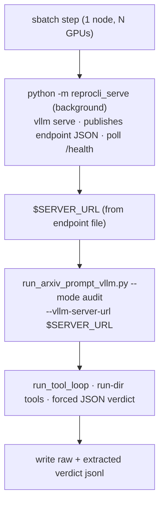

# Batch jobs (`scripts/**/*.sbatch`)

Running a consumer on DeltaAI in batch follows the **serve paradigm**: a single
sbatch job sets the shared DeltaAI environment block, stands up a
[`reprocli_serve`](serve.md) server in the background, waits for it to publish its
endpoint JSON, then attaches a consumer — the [auditor](../modes/auditor.md) runner
(`src/run_arxiv_prompt_vllm.py`) or the [reproduction agent](../modes/reproduction.md)
brain — by that URL. The consumers are **URL-only**: the runner never embeds its
own vLLM server, so a job that does not point it at a served endpoint exits with an
error.

!!! note "One server, many consumers"
    The model is a swappable service reached by base URL, not a process bolted
    into the consumer. Changing providers is a server-step / URL change with no
    consumer edits (see [architecture](../architecture.md), Part II).

## The shared header

Every DeltaAI batch script opens with the same environment block — the one the
[clusters page](clusters.md#the-standardized-env-block) documents in full. The
SLURM directives differ per job (name, CPU/GPU/mem/time, output prefix); the env
block is byte-for-byte the same.

| concern | what the header does |
|---|---|
| `set -euo pipefail` | fail fast on any error or unset var |
| caches | `TORCHINDUCTOR_CACHE_DIR`, `TRITON_CACHE_DIR`, `VLLM_CACHE_ROOT` → `/work/nvme/bfvr/msalunkhe/.cache/{torchinductor,triton,vllm}` |
| single-host vLLM | `MASTER_ADDR=127.0.0.1`, `VLLM_HOST_IP=127.0.0.1` |
| NCCL / Torch tuning | `NCCL_CUMEM_ENABLE=0`, `NCCL_NET_PLUGIN` (default `none`), `OMP_NUM_THREADS=1`, `TORCH_NCCL_*` async-error / heartbeat (`1200s`) |
| `PYTHONPATH` | prepends `/u/msalunkhe/reprocli/src` |
| toolchain | `module load python/3.11.9`; `source /u/msalunkhe/reprocli/.venv/bin/activate`; `cd /u/msalunkhe/reprocli/` |
| compiler probe | sets `CXX`/`TORCHINDUCTOR_CXX` to `g++`/`c++` when SLURM leaves `CXX=CC` |
| diagnostics | echoes host + GPU vars, dumps the `CUDA|NCCL|VLLM|SLURM|…` env, runs `nvidia-smi topo -m` |

!!! tip "These paths are operator-specific"
    The header hard-codes one operator's NCSA paths (`/u/msalunkhe/…`, `/work/nvme/bfvr/msalunkhe/…`). Treat the scripts as a template: the env tuning is reusable, the absolute paths are not.

## SLURM directives at a glance

A DeltaAI batch job targets account `betw-dtai-gh`, partition `ghx4`, one node,
`--gpu-bind=none`, `--export=ALL`. Size the allocation to the served model: a 4-GPU
node fits the TP-4 MiniMax profile; an 8-GPU / two-node layout is needed for the
heavier Kimi / M3 profiles (`reprocli_serve/profiles.py`). The GPUs are held for
the life of the **server**; the attached consumer is cheap and can even run on a
separate CPU allocation pointed at the published URL.

## The serve paradigm (step 1 server, step 2 consumer)

Step 1 — the server (background), e.g. TP 4 with the MiniMax fusion pass:

```bash
python -m reprocli_serve \
  --model "$MODEL" --served-model-name MiniMaxAI/MiniMax-M2.7 \
  --port 8000 --tensor-parallel-size 4 --max-model-len 196608 \
  --distributed-executor-backend mp \
  --compilation-config '{"mode":3,"pass_config":{"fuse_minimax_qk_norm":true}}' \
  --endpoint-file "$ENDPOINT_FILE" &
```

`reprocli_serve` binds `0.0.0.0`, discovers the routable fabric IP, and writes the
endpoint JSON to `$ENDPOINT_FILE` once `/health` is green (removing it on exit).
See the [serving page](serve.md) for the full flag surface and the endpoint contract.

Step 2 — a consumer attaches by the published URL. The auditor:

```bash
python3 src/run_arxiv_prompt_vllm.py \
  --mode audit \
  --vllm-server-url "$SERVER_URL" --model MiniMaxAI/MiniMax-M2.7 \
  --tool-rounds 12 --max-input-tokens 128000 --max-tokens 8192 \
  --request-workers 16 \
  --claims hf://datasets/Mithilss/neurips-2025-audit-pool/audit_pool_extracted.jsonl \
  --runs-dir <runs-dir> \
  --output outputs/v5/audit.jsonl \
  --extracted-output outputs/v5/audit_extracted.jsonl \
  --save-round-jsonl --max-model-len 196608
```

`$SERVER_URL` is read from the endpoint file (or `$REPROCLI_SERVER_URL` /
`$REPROCLI_ENDPOINT_FILE`). The auditor reads each paper's `central_claim` from the
audit pool plus that paper's run directory at `<runs-dir>/<arxiv_id>` with the
run-dir tools, and grades 0–5 against `rubric_audit.md`. See [run-dir tools](../tools/run-dir-tools.md)
and [the auditor](../modes/auditor.md).



!!! note "`--trust-remote-code` is set server-side"
    The runner takes no `--trust-remote-code` flag. `reprocli_serve` sets
    `trust_remote_code=True` per profile (`reprocli_serve/profiles.py`), so the
    served model loads with remote code enabled; the attached consumer only
    speaks chat-completions to it.

## See also

- [Serving (`reprocli_serve`)](serve.md) — the server the consumers attach to, and the endpoint contract.
- [Clusters & accounts](clusters.md) — the account/partition table, the env block, and the JIT allocation pattern.
- [Auditor mode](../modes/auditor.md) — what the audit pass computes.
- [The tool loop](../agent-core/tool-loop.md) — the shared agent core the auditor invokes.
- [Run a paper](../cli/run-arxiv.md) — the `run_arxiv_prompt_vllm.py` CLI in full.
