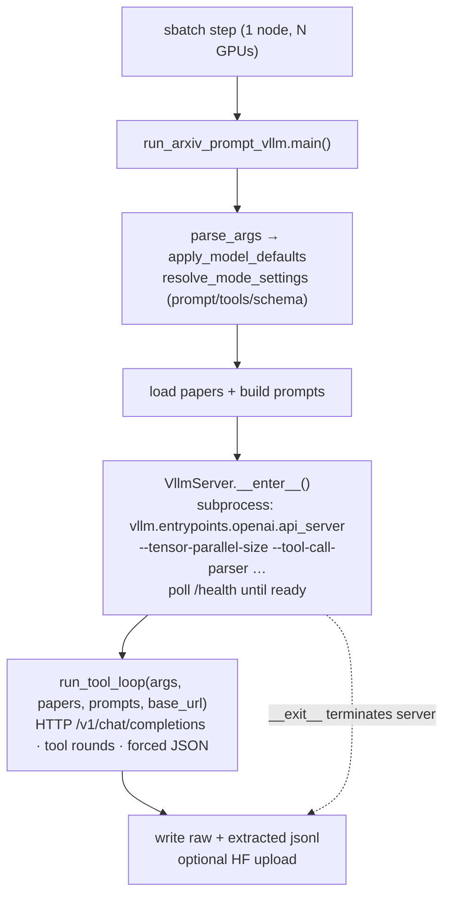

# Batch jobs (`scripts/**/*.sbatch`)

The two classifier batch scripts in `scripts/` are thin launchers: each sets the same DeltaAI environment block, activates the project venv, and drives the [tool loop](../agent-core/tool-loop.md) over the [paper bundles](../dataset/index.md) via `src/run_arxiv_prompt_vllm.py`. They differ in how the model is served: `paper_classification.sbatch` uses the **serve paradigm** (a background `reprocli_serve` server, then the runner attached by URL — see [serving](serve.md)), while `paper_classification_kimi_k2_6.sbatch` lets the runner **embed** its own vLLM server (`vllm/server.py`). The standalone `serve_*.sbatch` servers are documented on the [serving page](serve.md). See [Clusters & accounts](clusters.md) for the account/partition table and the `salloc`→`srun` pattern the (designed) reproduction agent uses.

!!! note "One runner, two invocations"
    Both scripts drive `python3 src/run_arxiv_prompt_vllm.py …`; what differs is the model and how it is served. The loop body, guardrails, and structured-output finalization are shared (see [architecture](../architecture.md), Part II).

## The shared header

Every script opens with an identical block. The SLURM directives differ only in job name, CPU/GPU/mem/time, and output-file prefix (next section); the env block below is byte-for-byte the same in both.

| concern | what the header does |
|---|---|
| `set -euo pipefail` | fail fast on any error or unset var |
| caches | `TORCHINDUCTOR_CACHE_DIR`, `TRITON_CACHE_DIR`, `VLLM_CACHE_ROOT` → `/projects/bgnp/msalunkhe/.cache/{torchinductor,triton,vllm}` |
| single-host vLLM | `MASTER_ADDR=127.0.0.1`, `VLLM_HOST_IP=127.0.0.1` |
| NCCL / Torch tuning | `NCCL_CUMEM_ENABLE=0`, `NCCL_NET_PLUGIN` (default `none`), `OMP_NUM_THREADS=1`, `TORCH_NCCL_*` async-error / heartbeat (`1200s`) |
| `PYTHONPATH` | prepends `/u/msalunkhe/reprocli/src` |
| toolchain | `module load python/3.11.9`; `source /u/msalunkhe/reprocli/.venv/bin/activate`; `cd /u/msalunkhe/reprocli/` |
| compiler probe | sets `CXX`/`TORCHINDUCTOR_CXX` to `g++`/`c++` when SLURM leaves `CXX=CC` |
| diagnostics | echoes host + GPU vars, dumps the `CUDA|NCCL|VLLM|SLURM|…` env, runs `nvidia-smi topo -m` |

!!! tip "These paths are operator-specific"
    The header hard-codes one operator's NCSA paths (`/u/msalunkhe/…`, `/projects/bgnp/msalunkhe/…`). Treat the scripts as a template: the env tuning is reusable, the absolute paths are not.

## SLURM directives at a glance

Both target DeltaAI: account `betw-dtai-gh`, partition `ghx4`, one node, `--gpu-bind=none`, `--export=ALL`, and email to `mithils3@illinois.edu` on `BEGIN,END,FAIL`. They diverge on size and walltime:

| script | job name | `--cpus-per-task` | `--gpus-per-node` | `--mem` | `--time` | log prefix |
|---|---|---|---|---|---|---|
| `paper_classification.sbatch` | `reprocli_paper_classification` | 16 | 4 | 256G | 48:00:00 | `slurm-%j` |
| `paper_classification_kimi_k2_6.sbatch` | `reprocli_kimi_k2_6` | 32 | 8 | 512G | 12:00:00 | `slurm-kimi-k2-6-%j` |

The Kimi job is the heavy one — 8 GPUs and 512G — because the model runs at tensor-parallel 8 (below). The MiniMax classifier fits on 4 GPUs.

## ✅ `paper_classification.sbatch` — the MiniMax classifier

The stage-1 dataset-construction pass: read each NeurIPS bundle, verify its artifacts via the web/MCP toolset, and emit one MRE record per paper. It runs the **serve paradigm** on one node — step 1 stands the model up with `reprocli_serve`, step 2 attaches the model-agnostic runner by the published URL. The model is the default `MINIMAX_M2_MODEL`, whose serve flags come from `reprocli_serve/profiles.py` (TP 4, `minimax_m2` parsers, `trust_remote_code`); sampling (`temperature=1.0/top_p=0.95/top_k=40`) is applied client-side by the runner.

Step 1 — the server (background), TP 4 with the MiniMax fusion pass:

```bash
python -m reprocli_serve \
  --model "$MODEL" --served-model-name MiniMaxAI/MiniMax-M2.7 \
  --port 8000 --tensor-parallel-size 4 --max-model-len 196608 \
  --distributed-executor-backend mp \
  --compilation-config '{"mode":3,"pass_config":{"fuse_minimax_qk_norm":true}}' \
  --endpoint-file "$ENDPOINT_FILE" &
```

Step 2 — the runner attaches by `$SERVER_URL` (read from the endpoint file) and writes the dataset:

```bash
python3 src/run_arxiv_prompt_vllm.py \
  --vllm-server-url "$SERVER_URL" --model MiniMaxAI/MiniMax-M2.7 \
  --tool-rounds 12 --max-input-tokens 128000 --max-tokens 8192 \
  --request-workers 32 --stream-first-response \
  --dataset Mithilss/neurips-2025-paper-bundles \
  --output outputs/neurips_2025_minimax_m2_trial.jsonl \
  --extracted-output outputs/neurips_2025_minimax_m2_trial_extracted.jsonl \
  --save-round-jsonl --max-model-len 196608 \
  --hf-repo Mithilss/neurips-2025-results
```

| flag | effect |
|---|---|
| (no `--mode`) | defaults to `classification` (`config/cli_args.py`); loads bundle papers with `tex_files`, prompt template `prompts/prompt.txt`, `{PAPER_TEXT}` placeholder |
| (no `--num-prompts`) | runs the **full** dataset (`select_papers` returns all papers) |
| `--request-workers 32` | up to 32 episodes in flight against the served model |
| `--compilation-config` (server) | explicit override of the per-model default (`{"cudagraph_mode":"PIECEWISE"}`); enables the `fuse_minimax_qk_norm` pass |
| `--hf-repo` | incremental + final upload of run outputs to the Hub (`hf_run_uploader`) |

To run **embedded** instead (no separate server), omit `--vllm-server-url` / `$REPROCLI_SERVER_URL` / `$REPROCLI_ENDPOINT_FILE` and the runner launches its own local vLLM (see [serving](serve.md)). The classifier's tools, schema, and post-processing are on [the classifier page](../modes/classifier.md).

## ✅ `paper_classification_kimi_k2_6.sbatch` — Kimi K2.6 classifier

Same classification job, swapped onto Moonshot **Kimi K2.6** on 8 GPUs. Passing `--model` to a local Kimi checkpoint makes `apply_model_defaults` route through `apply_kimi_defaults` (`config/minimax_defaults.py`): TP 8, the `kimi_k2` tool-call + reasoning parsers, `mm_encoder_tp_mode="data"`, and `trust_remote_code=True`. The script also sets several of these explicitly so the intent is legible:

```bash
python3 src/run_arxiv_prompt_vllm.py \
  --model /work/hdd/bfvr/msalunkhe/models/ \
  --num-prompts 500 \
  --tool-rounds 12 \
  --max-input-tokens 128000 --max-tokens 8192 \
  --request-workers 16 \
  --stream-first-response \
  --dataset Mithilss/neurips-2025-paper-bundles \
  --vllm-cache-dir /projects/bgnp/msalunkhe/Kimi-K2.6/vllm_cache \
  --distributed-executor-backend mp \
  --output outputs/neurips_2025_kimi_k2_6_trial.jsonl \
  --extracted-output outputs/neurips_2025_kimi_k2_6_trial_extracted.jsonl \
  --save-round-jsonl \
  --max-model-len 196608 \
  --tensor-parallel-size 8 \
  --tool-call-parser kimi_k2 --reasoning-parser kimi_k2 \
  --mm-encoder-tp-mode data
```

| difference vs. MiniMax | why |
|---|---|
| `--model /work/hdd/bfvr/msalunkhe/models/` | local Kimi K2.6 checkpoint; `is_kimi_k2_6` detects it via path suffix or `config.json` `architectures` (`KimiK25…`) |
| `--tensor-parallel-size 8` | the model is sharded across all 8 GPUs (`--gpus-per-node=8`) |
| `--tool-call-parser kimi_k2` / `--reasoning-parser kimi_k2` | Kimi's native tool-call and reasoning grammars |
| `--mm-encoder-tp-mode data` | multimodal-encoder TP placement Kimi expects (forwarded to vLLM verbatim) |
| `--num-prompts 500` | random subset of 500 papers (`random.sample`), not the full set |
| `--request-workers 16` | half the MiniMax concurrency — the 8-way model is heavier per request |
| no `--compilation-config` | Kimi runs without the MiniMax fusion pass |

!!! note "`trust-remote-code` is a default, not a flag here"
    Neither classifier script passes `--trust-remote-code` on the command line. `apply_minimax_profile` / `apply_kimi_defaults` set `args.trust_remote_code = True`, and `VllmServer.__enter__` appends `--trust-remote-code` to the vLLM command when that attribute is truthy. Both model families load with remote code enabled.

## Audit pass (`--mode audit`)

There is no batch script for the auditor; run it directly (verify exact paths against `config/cli_args.py` defaults first):

```bash
python3 src/run_arxiv_prompt_vllm.py \
  --mode audit \
  --claims hf://datasets/Mithilss/neurips-2025-audit-pool/audit_pool_extracted.jsonl \
  --runs-dir <runs-dir> \
  --output outputs/v5/audit.jsonl \
  --extracted-output outputs/v5/audit_extracted.jsonl
```

`--mode audit` reads each paper's `central_claim` from the audit pool plus the agent's run directory at `<runs-dir>/<arxiv_id>` with read-only run-dir tools, and grades 0–5 against `rubric_audit.md` ([run-dir tools](../tools/run-dir-tools.md), [auditor](../modes/auditor.md)). A ~4h / 4-GPU / 256G allocation is a reasonable shape for an audit pass.

## How the embedded path launches vLLM and drives the loop

The **embedded** path — the Kimi script, and any run without `--vllm-server-url` / `$REPROCLI_SERVER_URL` / `$REPROCLI_ENDPOINT_FILE` — starts no `srun` server step. The Python entry point launches vLLM **inside the same job step** as a subprocess and then loops in-process (the serve paradigm instead points the runner at a separately launched `reprocli_serve`):



Concretely (`run_arxiv_prompt_vllm.py`):

1. `parse_args()` applies the per-model profile and `resolve_mode_settings` (mode picks prompt, tools, output schema).
2. Papers/prompts are loaded — bundle LaTeX for classification, claim + run dir for audit.
3. Unless `--vllm-server-url` is given, `with VllmServer(args) as server_url:` spawns `python -m vllm.entrypoints.openai.api_server` on `127.0.0.1:<free-port>` with `--enable-auto-tool-choice` and the resolved TP / parser / `--max-model-len` / `--mm-encoder-tp-mode` / `--trust-remote-code` flags, then polls `/health` until ready (`vllm/server.py`).
4. `run_tool_loop(...)` drives episodes over the OpenAI-compatible endpoint (`runtime/tool_loop.py`); the server is stateless, so all conversation memory lives in the orchestrator.
5. On exit, `VllmServer.__exit__` terminates the subprocess; rows are flushed and, if `--hf-repo` is set, uploaded.

!!! note "Attaching to an external server"
    These scripts always use the embedded server. The same runner can attach to an already-running multi-node vLLM via `--vllm-server-url` (e.g. the interactive Kimi serving in `scripts/kimi_k2_6/kimi_k2_6_multinode_interactive.md`); see [architecture](../architecture.md) II.4 and [Clusters & accounts](clusters.md).

## See also

- [Clusters & accounts](clusters.md) — account/partition table, `salloc`→`srun` allocation pattern.
- [Classifier mode](../modes/classifier.md) · [Auditor mode](../modes/auditor.md) — what each pass actually computes.
- [The tool loop](../agent-core/tool-loop.md) — the shared agent core these jobs invoke.
- [Run a paper](../cli/run-arxiv.md) — the `run_arxiv_prompt_vllm.py` CLI in full.
