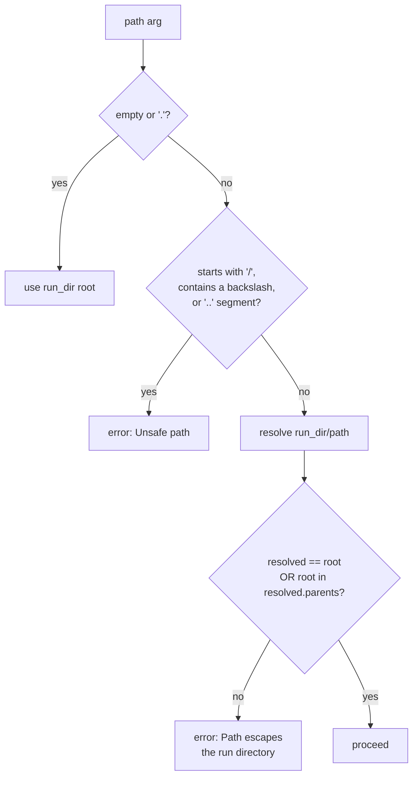

# Run-directory tools (the auditor's hands)

The [auditor](../modes/auditor.md) is handed exactly **one** agent reproduction run directory — a pile of `*.log` files, output artifacts, and whatever code the agent wrote — and explores it to trace how every graded number was actually produced. Its entire toolset (`tools/run_dir_tools.py`) is **read-mostly and path-confined to `<runs-dir>/<arxiv_id>`**: it can list, read, write *new* files, and run shell commands, but only inside that one directory. This page documents each tool exactly as defined, the confinement guarantee, and the sandboxing caveat carried forward from [the architecture overview](../architecture.md).

!!! note "One toolset, one mode"
    These four tools are the auditor mode's toolset; they swap in via the same `resolve_mode_settings` seam as every other mode (`config/cli_args.py` sets `args.tools = AUDIT_TOOLS`). They share the loop body, guardrails, and structured-output finalization described in [the tool loop](../agent-core/tool-loop.md). The handlers receive the bound `run_dir` from `paper.run_dir`; if `--runs-dir` was never set, every audit tool returns an `ok: false` error instead of touching the filesystem (`tools/web_tools.py`).

## The toolset ✅

`AUDIT_TOOLS` declares four function tools; `AUDIT_TOOL_HANDLERS` maps each name to its handler (`tools/run_dir_tools.py`).

| Tool | Handler | What it does |
|---|---|---|
| `list_run_files` ✅ | `list_run_files` | Enumerate files/dirs in the run dir (optionally recursive) |
| `read_run_file` ✅ | `read_run_file` | Read one text file by relative path |
| `bash` ✅ | `run_bash` | Run a shell command with the run dir as cwd |
| `write_run_file` ✅ | `write_run_file` | Write one **new** text file into the run dir |

!!! warning "No dedicated Python interpreter tool"
    There is **deliberately no separate `python` tool**. Re-scoring an artifact (recompute a metric from a saved output) goes through `bash` running `python3 -c …`, or — for anything multi-line — `write_run_file` a script and then `bash` it. The point is to keep every consequential computation **on disk and citable** rather than hidden inside an interpreter call.

### `list_run_files`

Discover the `*.log`, output, and code files the agent produced.

| Arg | Type | Required | Default | Notes |
|---|---|---|---|---|
| `path` | string | no | run-dir root | subdirectory within the run dir; omit for the root |
| `recursive` | boolean | no | `false` | `rglob("*")` vs a single-level `iterdir()` |

Returns `{ ok, run_dir, path, count, entries, truncated }`. Each entry is `{ path, type: "dir"|"file", size }` (sizes in bytes; `0` for dirs). The listing skips `SKIP_DIRS` (`.git`, `__pycache__`, `.venv`, `node_modules`) and is capped at `RUN_MANIFEST_MAX_ENTRIES` (200) entries, with `truncated` flagging when more existed.

### `read_run_file`

Read a log, an output JSON, or a script the agent wrote, by path relative to the run directory.

| Arg | Type | Required | Default | Bounds |
|---|---|---|---|---|
| `path` | string | **yes** | — | relative to the run dir |
| `max_chars` | integer | no | `RUN_FILE_DEFAULT_CHARS` (40 000) | clamped to `[1, RUN_FILE_MAX_CHARS]` = 200 000 |

Files are decoded UTF-8 with `errors="replace"`. Returns `{ ok, path, size, text, truncated }`, where `text` is the first `max_chars` characters and `truncated` is true when the file was longer.

### `bash`

Run a bash command with the run directory as the working directory — grep logs, inspect outputs, or run a script you wrote.

| Arg | Type | Required | Default | Bounds |
|---|---|---|---|---|
| `command` | string | **yes** | — | empty string → error |
| `timeout` | integer | no | `BASH_TIMEOUT` (60 s) | clamped to `[1, BASH_TIMEOUT]` — i.e. **60 s is both default and ceiling** |

Runs `bash -lc <command>` via `subprocess.run` with `cwd=run_dir`. Returns `{ ok, command, returncode, stdout, stderr }`, where `ok` is `returncode == 0`. A timeout returns `ok: false` with `bash timed out after <timeout>s`.

### `write_run_file`

Write a **new** text file (typically a re-scoring Python script) into the run dir so you can run it with `bash` and cite it as evidence. Use this for multi-line scripts instead of fighting `python3 -c` quoting.

| Arg | Type | Required | Notes |
|---|---|---|---|
| `path` | string | **yes** | new path relative to the run dir; **must not already exist** |
| `content` | string | **yes** | text to write; capped at `RUN_FILE_WRITE_MAX_CHARS` (200 000) |

Returns `{ ok, path, bytes_written }`. Three guards protect the evidence: it refuses the run-dir root or an existing directory, **refuses to overwrite any existing file** (`Refusing to overwrite <rel>; write to a new path.`) so an agent artifact under audit can never be clobbered, and rejects non-string or oversize `content`. Parent directories are created as needed.

## Path-confinement guarantee ✅

Every path argument flows through `_resolve_within(run_dir, rel)` before any filesystem access, so the auditor cannot read or write outside the bound run directory:

Concretely (`_resolve_within`):

- **Lexical rejection** — any absolute path (`/…`), backslash, or `..` path segment is refused as `Unsafe path` before resolution.
- **Realpath containment** — the candidate is `resolve()`d and must equal the resolved run-dir root or have it among its `parents`; otherwise `Path escapes the run directory`. This catches symlink escapes that survive the lexical check.

!!! tip "The `bash` exception to symbolic confinement"
    `list_run_files`, `read_run_file`, and `write_run_file` enforce confinement on their **path arguments**. The `bash` tool is confined only by **cwd** (`cwd=run_dir`) — it is a full login shell, so a command can still reference absolute paths. See the sandboxing caveat below.

## Result-budget layer ✅

Every audit tool result passes through the shared chokepoint `execute_tool_call → truncate_tool_result` (`tools/result_limits.py`) before re-entering the conversation, capping the serialized result at `TOOL_RESULT_MAX_CHARS` (40 000). When a result is too large, `truncate_tool_result` repeatedly halves the **longest string leaf** (keeping at least `MIN_KEPT_CHARS` = 200) until it fits, then sets `truncated: true` and a `truncation_note` advising a narrower request. `is_transient_error` lets the dispatcher retry once on transient failures (timeouts, connection resets, rate limits), but those markers rarely fire for purely local run-dir tools.

This is why per-tool limits (`read_run_file`'s `max_chars`, `list_run_files`'s 200-entry cap) and this outer budget coexist: the tool truncates first to its own bound, and the chokepoint guarantees nothing exceeds the context budget regardless.

## Prompt seeding: `run_dir_manifest` ✅

The audit prompt is seeded with a text listing of the run directory by `run_dir_manifest(run_dir)` (consumed via `audit/inputs.py:load_run_bundle`). It walks the dir recursively, lists up to 200 files with byte sizes, and tells the model to open them with `list_run_files` / `read_run_file` / `bash` and to `write_run_file` a script when re-scoring. Two degenerate cases short-circuit grading with a defensible floor:

| Condition | Manifest text → verdict |
|---|---|
| Run dir does not exist | "No agent reproduction run is available … verdict `unverifiable` with score 0." |
| Run dir exists but is empty | "Run directory is empty; verdict `unverifiable`, score 0." |

## Sandboxing caveat 🚧

Carried forward from [the architecture overview](../architecture.md) (Known caveats):

!!! warning "`bash` is a full shell — fine for our own runs, not yet for untrusted ones"
    The audit `bash` is a **full login shell scoped (by cwd) to the run dir** — fine for grading **our own** agents' runs locally. Container/seccomp isolation is the **prerequisite before grading untrusted runs**. The same sandboxing treatment is required for the [reproduction agent](../modes/reproduction.md)'s `run_gpu` / `workspace_bash` before it runs untrusted paper code at scale.

## Related pages

- [Auditor mode](../modes/auditor.md) — how these tools are used to grade 0–5 and apply the anti-cheat cap.
- [The tool loop](../agent-core/tool-loop.md) — the shared agent core these tools plug into.
- [Schemas](schemas.md) — the audit output schema (`AUDIT_RESPONSE_FORMAT`).
- [Architecture overview](../architecture.md) — where the auditor sits in the end-to-end flow.
