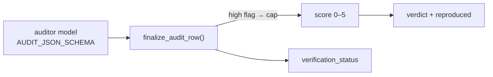

# Structured-output schemas

The two JSON Schemas the LLM agents are constrained to emit. Both are
`response_format` objects of `type: "json_schema"` with
`additionalProperties: false` and **all** properties `required`, so the model
cannot omit a field or smuggle in an extra one. The **classifier** emits one MRE
record per paper (`schema/output.py`); the **auditor** emits one verdict per run
bundle (`schema/audit.py`). This page is the canonical field reference — other
pages link here rather than re-listing the fields.

!!! note "Through-line"
    The model reports **evidence**; the code computes every consequential
    label. `score`, `tier`, and `verdict` are derived from these fields by
    deterministic post-processing — never adopted verbatim from the model. See
    [the architecture overview](../architecture.md).

---

## 1. Classifier — `FINAL_RESPONSE_FORMAT` ✅

`schema/output.py` builds `FINAL_RESPONSE_FORMAT` (a `response_format` wrapper,
`json_schema.name = "repro_artifact_classification"`) and exposes the bare schema
as `FINAL_JSON_SCHEMA`. The classifier ([classifier mode](../modes/classifier.md))
sends it as `response_format` in `vllm/io.py`; OpenAI re-checks reuse
`FINAL_JSON_SCHEMA` in `reprocli_openai/recheck.py`.

### Top-level fields

| Field | Type | Notes |
|---|---|---|
| `central_claim` | string | The single headline result the paper stands on. |
| `claim_evidence` | string | Where in the paper that claim is stated (quote / table / figure). |
| `paper_kind` | enum string | One of `empirical`, `theoretical`, `position`, `survey`. |
| `mre_config` | string | The minimal reproducible experiment: the smallest config that exercises `central_claim`. |
| `match_bar` | object | Pinned, machine-readable success bar — see [below](#the-match_bar-object). |
| `verified_links` | object | Tool-confirmed URLs, grouped by artifact — see [below](#the-verified_links-object). |
| `signals` | object | Four artifact-availability signals — see [below](#the-signals-object). |
| `agent_task` | string | The instruction handed to the reproduction agent. |
| `h100_estimate` | object | Compute-cost estimate in H100-hours — see [below](#the-h100_estimate-object). |

!!! info "Field order"
    `properties` and `required` list the same nine keys in the **same** order:
    `central_claim, claim_evidence, paper_kind, mre_config, match_bar,
    verified_links, signals, agent_task, h100_estimate`. The table above follows
    that order.

### The `match_bar` object

Built by `match_bar_schema()`. Pinned once into the lockfile so every agent is
judged against the **same** target (rubric C1); the auditor adopts it verbatim
rather than re-inferring the bar from prose each run. All five fields are
required.

| Field | Type | Notes |
|---|---|---|
| `kind` | enum string | `point_estimate`, `threshold`, `direction`, `magnitude`, or `none`. |
| `op` | string | The relation in the auditor's vocabulary (e.g. `abs_rel_within`, `>=`, `measured_method > measured_baseline, same protocol`). |
| `reference_value` | number \| null | The scalar to compare against; `null` when the kind has no single scalar (`direction`/`none`). |
| `tolerance` | number \| null | Allowed deviation; `null` for `threshold`/`direction`/`none`. |
| `note` | string | Free-text qualifier on how to read the bar. |

| `kind` | Meaning | `op` / `reference_value` / `tolerance` |
|---|---|---|
| `point_estimate` | Land near a target | `abs_rel_within`; reference set; tolerance set |
| `threshold` | A floor or ceiling | `>=` or `<=`; reference set; tolerance `null` |
| `direction` | Beat a baseline | `op` names the inequality; reference/tolerance `null` |
| `magnitude` | The size of a delta is the target | tolerance applies to the delta |
| `none` | No checkable scalar/relation (theoretical/position) | all `null` |

### The `verified_links` object

Four arrays of strings, all required, each holding URLs a tool actually
confirmed (see [web tools](web-tools.md)):

| Field | Type | Holds |
|---|---|---|
| `paper_or_project` | array<string> | Paper / project landing pages. |
| `code` | array<string> | Source repositories. |
| `dataset` | array<string> | Dataset locations. |
| `weights` | array<string> | Pretrained-weight locations. |

### The `signals` object

Four artifact-availability signals, each an identical sub-object from
`signal_schema()`:

| Signal | What it asserts |
|---|---|
| `code_available` | Source code is reachable. |
| `dataset_available` | The dataset is reachable. |
| `weights_available` | Pretrained weights are reachable. |
| `dataset_is_standard` | The dataset is a standard/public benchmark. |

Each signal carries three required fields:

| Field | Type | Notes |
|---|---|---|
| `value` | boolean | The asserted yes/no. |
| `verification` | enum string | How it was checked — see states below. |
| `evidence` | string | The supporting citation/quote. |

`verification` ∈ `tool_verified`, `tool_searched_not_found`, `tool_failed`,
`paper_text_only`, `not_applicable`.

!!! tip "Signals drive tier, not the model"
    `deterministic_score_and_tier()` in `schema/output.py` reads only the four
    boolean `value`s and computes `score`/`tier` in code. The mapping:
    `+2` if no code, `+3` if neither standard nor available dataset, `+1` if no
    weights; the score then maps to `Easy / Medium / Hard / Artifact-Blocked`.
    `normalize_score_and_tier()` overwrites any model-supplied `score`/`tier`
    and preserves the originals under `reported_score`/`reported_tier`. See
    [the lockfile](../selection/lockfile.md).

### The `h100_estimate` object

Built by `h100_estimate_schema()`; all seven fields required.

| Field | Type | Notes |
|---|---|---|
| `hours` | number | Estimated H100-equivalent hours for the MRE. |
| `basis_kind` | enum string | `paper_reported`, `derived_from_config`, `comparable_experiment`, or `compute_unspecified`. |
| `gpu_count` | number \| null | GPUs used in the basis run. |
| `gpu_type` | string \| null | GPU model named in the basis. |
| `wallclock_hours` | number \| null | Wall-clock hours of the basis run. |
| `h100_equivalent_multiplier` | number \| null | Conversion factor from the basis GPU to an H100. |
| `basis` | string | Free-text explanation of how `hours` was derived. |

See [the H100 budget](../selection/h100-budget.md) for how this estimate feeds
band selection.

---

## 2. Auditor — `AUDIT_RESPONSE_FORMAT` ✅

`schema/audit.py` builds `AUDIT_RESPONSE_FORMAT`
(`json_schema.name = "audit_verdict"`) and exposes the bare schema as
`AUDIT_JSON_SCHEMA`. The [auditor mode](../modes/auditor.md) wires it in via
`config/cli_args.py`. The auditor reads a paper's central claim plus one agent
run bundle and grades it against the rubric; every graded quantity must be
traceable to a citation inside the bundle.

### Fields

The comment anchors (`C1`–`C6`) map fields to rubric criteria. All fifteen
fields are required.

| Field | Type | Rubric | Notes |
|---|---|---|---|
| `paper_id` | string | — | Identifier of the paper under audit. |
| `central_claim` | string | C1 | The auditor's restatement of the claim as a checkable target. |
| `target_metric` | string | C1 | The metric the claim is measured in. |
| `reference_value` | number \| null | C1 | The pinned target value (`null` if none). |
| `op` | string | C1 | The comparison relation (mirrors `match_bar.op`). |
| `tolerance` | number \| null | C1 | Allowed deviation (`null` if none). |
| `execution_verified` | boolean | C2 | Proof the metric was actually computed by a run. |
| `execution_evidence` | string | C2 | Citation backing `execution_verified`. |
| `measured_value` | number \| null | C3 | The agent's reproduced value (`null` if not found). |
| `measured_citation` | string | C3 | Where in the bundle `measured_value` came from. |
| `cheat_flags` | array<object> | C4 | Anti-cheat flags — see [below](#the-cheat_flags-array). |
| `value_comparison` | string | C5 | How `measured_value` compares to the bar. |
| `methodology_notes` | string | C6 | Notes on experiment fidelity. |
| `score` | integer 0–5 | — | Granular reproduction score; `minimum: 0`, `maximum: 5`. |
| `rationale` | string | — | Justification for the score. |

### The `cheat_flags` array

Each item, from `_flag_item()`, has three required fields:

| Field | Type | Notes |
|---|---|---|
| `kind` | enum string | The provenance failure observed (see kinds below). |
| `evidence` | string | The cited proof from the bundle. |
| `severity` | enum string | `low`, `med`, or `high`. |

`kind` ∈ `hardcoded_constant`, `echoed_prose_number`,
`self_scored_or_fabricated`, `wrong_split_scale_dataset`,
`cherry_picked_metric`, `stale_artifact`.

!!! warning "A high-severity flag caps the score at 0"
    `finalize_audit_row()` in `audit/audit.py` enforces this in code, not the
    prompt: any `severity: "high"` flag forces `score` to `0` and stashes the
    model's original under `reported_score`. The coarse `verdict` and the
    `reproduced` boolean are then derived from the (possibly capped) score —
    the model never sets them directly.

### Derived fields (post-processing, not in the schema)

`finalize_audit_row()` adds these to the row after parsing — they are **not**
part of `AUDIT_JSON_SCHEMA`:

| Field | Source |
|---|---|
| `has_high_cheat_flag` | True if any flag is `severity: "high"`. |
| `verdict` | `reproduced` (score ≥ 4) · `partial` (3) · `unverifiable` (0 and not `execution_verified`) · `not_reproduced` (otherwise, or any high flag). |
| `reproduced` | `score >= 4` (`REPRODUCED_MIN_SCORE`). |
| `exit_reason` | From the tool-loop run-health (`runtime/run_health.py`). |
| `verification_status` | `verified` · `incomplete` (loop ended early) · `degraded` (malformed auditor output). |

---

## See also

- [Structured output](../agent-core/structured-output.md) — how these schemas are enforced at decode time.
- [Classifier mode](../modes/classifier.md) and [auditor mode](../modes/auditor.md) — the agents that emit them.
- [Bundle schema](../dataset/bundle-schema.md) — the lockfile row built from `FINAL_JSON_SCHEMA`.
