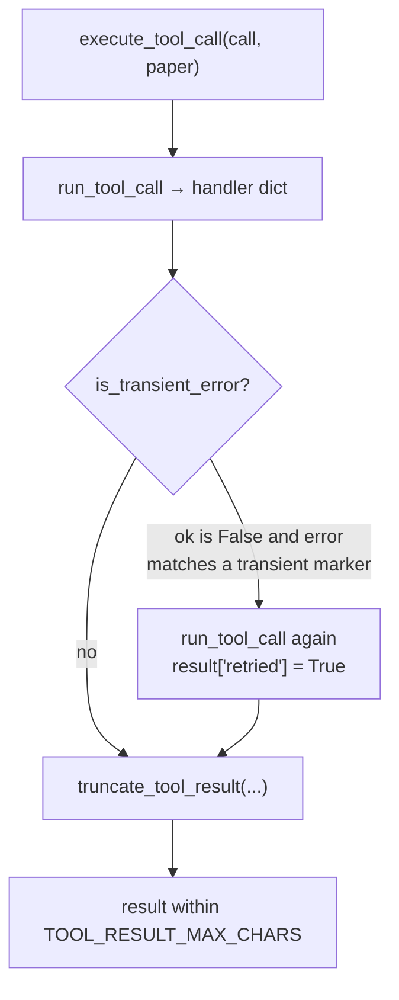
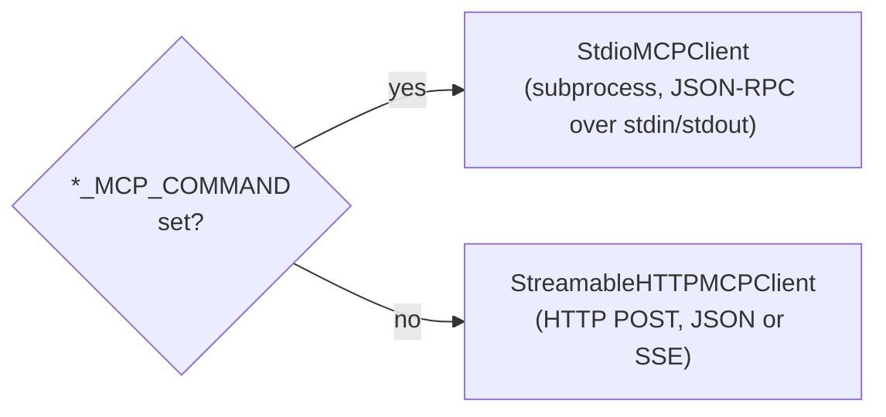

# Web tools — the classifier's read-only evidence toolset

The **classifier agent** (mode ① in [the architecture overview](../architecture.md)) verifies a paper's reproduction artifacts by gathering read-only evidence: GitHub repos and files, Hugging Face repos and trees, the paper's own OpenReview supplement bundle, and arbitrary public URLs. Every tool here returns a JSON-serializable dict, never writes anything, and is funneled through one truncation chokepoint so no single result can blow the context budget. This page documents the exposed tool schemas, what each returns, the MCP transport behind the GitHub/HF tools, and the retry-once-then-truncate wrapper.

> Verified against: `tools/web_tools.py`, `tools/github_mcp.py`, `tools/huggingface_mcp.py`, `tools/huggingface_tree.py`, `tools/mcp_client.py`, `tools/mcp_results.py`, `tools/paper_bundle.py`, `tools/result_limits.py`, `tools/http_utils.py`, `config/config.py`.
> Status legend: ✅ live · 🚧 designed, not yet wired.

!!! note "Scope of this page"
    These are the tools the classifier sees. The auditor's run-directory tools live in [run-dir tools](run-dir-tools.md); the raw JSON-Schema for all tool roles is collected in [tool schemas](schemas.md). For where this toolset plugs into the agent, see [the tool loop](../agent-core/tool-loop.md) and [the classifier mode](../modes/classifier.md).

## The tool table

The schemas advertised to the model are built in `config/config.py` as `WEB_TOOLS`; dispatch happens in `tools/web_tools.py` via the `TOOL_HANDLERS` map (plus the two specially-routed handlers). All tools are read-only.

| Tool | Purpose | Scope / backing service | Status |
| --- | --- | --- | --- |
| `github_search_repositories` | Search repos like a GitHub-scoped web search | GitHub MCP `search_repositories` | ✅ |
| `github_search_code` | Code search with GitHub qualifiers (quotes, OR, NOT) | GitHub MCP `search_code` | ✅ |
| `github_repo` | One-shot repo overview: root files, README, latest release, tree | GitHub MCP (4 calls) | ✅ |
| `github_file_contents` | Read a file or directory listing | GitHub MCP `get_file_contents` | ✅ |
| `github_repository_tree` | List a repo tree, optionally filtered/recursive | GitHub MCP `get_repository_tree` | ✅ |
| `huggingface_search` | Search repos / papers / Spaces / docs / Hub | Hugging Face MCP (tool chosen at runtime) | ✅ |
| `huggingface_repo` | Repo details + README/card + compact root tree | HF MCP + `huggingface_hub` | ✅ |
| `huggingface_repository_tree` | List HF repo files/folders | `huggingface_hub` `HfApi.list_repo_tree` | ✅ |
| `fetch_url` | Fetch a public http(s) URL, return status + text | Direct `urllib` request | ✅ |
| `paper_bundle_file_contents` | Read a text file from the paper's OpenReview supplement | Local paper bundle manifest | ✅ |

!!! warning "Routing is not all `TOOL_HANDLERS`"
    `TOOL_HANDLERS` only holds the GitHub/HF/`fetch_url` handlers. `paper_bundle_file_contents` is dispatched separately because it needs the current `Paper` object, and any name found in `AUDIT_TOOL_HANDLERS` (the run-dir tools) is dispatched ahead of everything else when a `run_dir` is bound. Unknown names return `{"ok": false, "error": "Unknown tool: …"}` with the full available-tool list.

## Dispatch and the retry-once-then-truncate wrapper

Every classifier tool call enters through `execute_tool_call(call, paper)` in `tools/web_tools.py`. The flow:

- **`run_tool_call`** parses the function arguments (a dict, or a JSON string via `parse_tool_arguments`), picks the handler, and wraps any exception as `{"ok": false, "tool": name, "error": "<ExcType>: <msg>"}`.
- **Retry once on transient errors.** `is_transient_error` (in `tools/result_limits.py`) only fires when `ok` is `False` *and* the lowercased `error` contains one of: `timeouterror`, `timed out`, `urlerror`, `connectionerror`, `connectionreseterror`, `remotedisconnected`, `rate limit`, `429`. On a hit the call runs exactly once more and the result is stamped `"retried": true`. There is no backoff and no second retry.
- **Truncate last.** Whatever comes back is passed through `truncate_tool_result(result, TOOL_RESULT_MAX_CHARS)`.

### How truncation works

`truncate_tool_result` (`tools/result_limits.py`) keeps the *whole result dict shape* but shrinks oversized strings:

1. If `len(json.dumps(result))` is already ≤ `TOOL_RESULT_MAX_CHARS` (**40 000**, from `config/config.py`), return unchanged.
2. Otherwise, up to 64 times: find the single longest string leaf anywhere in the nested dict/list (`longest_string_leaf`) and halve it (never below `MIN_KEPT_CHARS` = 200), appending `…[truncated]`.
3. Stamp `"truncated": true` and a `"truncation_note"` telling the model to request a specific file path, `path_filter`, or smaller range.

!!! tip "Two different budgets"
    `TOOL_MAX_CHARS` (**24 000**) is the *per-fetch* cap passed into `fetch_url` and HTTP reads. `TOOL_RESULT_MAX_CHARS` (**40 000**) is the *final serialized-dict* cap applied to every tool result by the wrapper. The bundle-file tool has its own pair (`BUNDLE_FILE_DEFAULT_CHARS` = 60 000, `BUNDLE_FILE_MAX_CHARS` = 200 000) applied to the file body *before* the 40 000 result cap clamps it again.

## MCP transport (GitHub + Hugging Face)

The GitHub and Hugging Face tools talk to remote MCP servers through one tiny client in `tools/mcp_client.py`. The clients are constructed lazily and `@cache`-d (one per process) by `github_mcp_client()` and `hf_mcp_client()`.

### Two transports, chosen by environment

| Transport | When | Behavior |
| --- | --- | --- |
| `StdioMCPClient` | `GITHUB_MCP_COMMAND` / `HF_MCP_COMMAND` is set | Spawns the command with `subprocess.Popen`, exchanges newline-delimited JSON-RPC; reads with `select` until the deadline; `atexit`-registers `close()`. |
| `StreamableHTTPMCPClient` | default | POSTs JSON-RPC to the server URL with `Accept: application/json, text/event-stream`; tracks `Mcp-Session-Id` and `MCP-Protocol-Version`; decodes either a JSON body or an SSE `data:` stream. |

Both share `BaseMCPClient`, which performs the MCP handshake once (`initialize` → `notifications/initialized`, protocol version `2025-06-18`) behind a lock before the first `tools/call` or `tools/list`, then reuses the session.

### Endpoints, tokens, and toolsets

| Server | Default URL | Token env (first match wins) | Notes |
| --- | --- | --- | --- |
| GitHub | `https://api.githubcopilot.com/mcp/` (`GITHUB_MCP_URL` overrides) | `GITHUB_MCP_TOKEN`, `GITHUB_TOKEN`, `GH_TOKEN` | Token sent as `Authorization: Bearer …`. Toolsets via `X-MCP-Toolsets` (default `repos,git,issues,pull_requests`, override with `GITHUB_MCP_TOOLSETS`). |
| Hugging Face | `https://huggingface.co/mcp` (`HF_MCP_URL` overrides) | `HF_MCP_TOKEN`, `HF_TOKEN`, `HUGGINGFACE_TOKEN` | Token sent as `Authorization: Bearer …`. |

!!! warning "No silent anonymous mode"
    If no token is found **and** the URL env var is unset, client construction raises `MCPError` (e.g. *"Set GITHUB_MCP_TOKEN, GITHUB_TOKEN, GH_TOKEN, or GITHUB_MCP_COMMAND"*). Setting `*_MCP_URL` explicitly lets you point at an unauthenticated/local server without a token.

### MCP result compaction

Raw MCP `tools/call` responses are normalized by `mcp_tool_result` (`tools/mcp_results.py`) into `{"ok": not isError, "tool": name, "result": {...}}`. The `result` is compacted: all `content[].text` (and embedded resource text) is concatenated into `"text"`, and if that text parses as JSON it is *also* attached as `"json"`. Tool wrappers (`github_result`, `hf_result`) then add `provider`, `name`, `arguments`, and often a `hint`.

## GitHub MCP tools (`tools/github_mcp.py`)

Repo arguments accept either `owner/name` or a `github.com` URL, parsed by `parse_github_repo` (URL `.git` suffix stripped). `github_owner_repo` also accepts separate `owner`/`name` keys.

- **`github_search_repositories` / `github_search_code`** — require a non-empty `query`; `max_results` is clamped to `[1, 20]` (default 5) and passed as `perPage`. Repo search adds `minimal_output: true`. Optional `sort`/`order` are forwarded. Each returns the compacted MCP `result` plus a `hint` nudging the model to inspect candidate repos/files before counting code as available, and to try alternate title/acronym/arXiv-ID queries before concluding nothing exists.
- **`github_file_contents`** — reads a single `path` (file or directory listing) at optional `ref`/`sha`. Long results are truncated, so the schema description tells the model to request specific paths.
- **`github_repository_tree`** — lists the tree; forwards optional `tree_sha`, `path_filter`, and a boolean `recursive`. The schema steers callers toward `path_filter` over recursive listings.
- **`github_repo`** — a convenience aggregate that fires **four** MCP calls via `safe_call_github_mcp` (which never raises, capturing per-call errors): root listing (`get_file_contents` at path `""`), the first README found among `README.md`, `readme.md`, `README.rst`, `README.txt`, `get_latest_release`, and `get_repository_tree`. Returns `root`, `readme`, `latest_release`, `tree`, an `errors` list for whichever calls failed, and `ok = true` if **any** of the four succeeded.

## Hugging Face MCP tools (`tools/huggingface_mcp.py`)

The HF MCP server's tool names vary, so the wrapper **discovers** the right tool at call time: `choose_hf_tool(search_type)` calls `list_tools()`, prefers a known name (`hub_repo_search`, `paper_search`, `space_search`, `hf_hub_query`, `hub_repo_details`), and otherwise scores tools by keyword (`tool_score`). `params_for_schema` then maps the wrapper's arguments onto whatever parameter names the chosen tool's `inputSchema` actually declares (e.g. `query`/`message`/`q`/`text`; `results_limit`/`limit`/`perPage`/…).

- **`huggingface_search`** — needs a `query` (accepts `query`/`message`/`q`/`text`); `search_type` is one of `repositories` (default), `papers`, `spaces`, `docs`, `hub`. Returns the compacted MCP result plus a `hint` listing alternate query strategies.
- **`huggingface_repo`** — parses one or more repo ids from `repo`/`repo_ids` (`namespace/repo` or a `huggingface.co` URL), resolves `repo_type` (`model`/`dataset`/`space`/`auto`), requests details with `include_readme: true`, and **augments** the response with a `root_tree`: a compact first-40-entry tree fetched directly from the Hub via `safe_repository_tree_summary` (errors captured, never raised).

!!! note "huggingface_repo combines two backends"
    Details/README come from the **MCP server**, while `root_tree` comes from the **`huggingface_hub` Hub API** — so a repo can return useful tree data even when the MCP details call is weak.

## `huggingface_repository_tree` (`tools/huggingface_tree.py`)

This tool does **not** go through MCP — it calls `huggingface_hub`'s `HfApi.list_repo_tree` directly. It accepts `repo` (or `repo_id`), `repo_type` (aliases like `datasets`→`dataset`, `repo`→`auto` are normalized), optional `path`, `revision`, and a boolean `recursive`. `max_entries` defaults to **80** and is clamped to `[1, 500]` (`MAX_ALLOWED_ENTRIES`).

It returns `entries` (each `{path, type, size?, lfs?, lfs_size?}`, type derived from the entry class name), plus `entry_count`, and a `truncated` flag set when more than `max_entries` entries were observed. The schema description tells the model to use this for deeper structure *after* `huggingface_repo` finds a candidate.

## `fetch_url` (`tools/web_tools.py` + `tools/http_utils.py`)

Fetches a single public URL and returns its text — used for project pages, raw files, docs, etc.

- Only `http`/`https` URLs are allowed (`is_http_url`); anything else returns `{"ok": false, "error": "Only http(s) URLs are supported: …"}`.
- `max_chars` defaults to `TOOL_MAX_CHARS` (**24 000**) and is capped at that value via `min(...)`.
- The body is decoded with the response charset; if the `Content-Type` looks like HTML it is run through `html_to_text` (strips `<script>`/`<style>`, converts block tags to newlines, unescapes entities). Non-text content types yield an empty `text`.
- Returns `{ok, url, status, final_url, content_type, text}` where `ok` is `200 ≤ status < 400`. `text` is sliced to `max_chars` before the result-level truncation runs.

!!! note "Not a search engine"
    `fetch_url` is a direct GET of a known URL — there is no web-search tool in this toolset. Discovery happens through GitHub/HF search; `fetch_url` is for following a specific link.

## `paper_bundle_file_contents` (`tools/paper_bundle.py`)

Reads a text file from the **current paper's** OpenReview supplement bundle. It is routed specially: if no `Paper` is bound, it returns `{"ok": false, "error": "paper_bundle_file_contents requires current Paper context"}`.

- The `path` argument is sanitized by `normalize_manifest_path`: backslashes, absolute paths (`/…`), and `..` traversal are rejected; a leading `supplement/` segment is stripped; the path is `posixpath.normpath`-ed.
- Resolved against the paper's manifest (`supplement_files`, keyed by `relative_path`/`filename`). An unknown path returns `available_paths` (sorted, capped at 40 with an "… and N more" tail).
- `max_chars` defaults to `BUNDLE_FILE_DEFAULT_CHARS` (**60 000**) and is clamped to `[1, BUNDLE_FILE_MAX_CHARS]` (**200 000**).
- Returns file metadata (`path`, `filename`, `extension`, `file_size`, `sha256`, `is_text`). For text files it adds `text` (sliced to `max_chars`), `truncated`, and `max_chars`; non-text files return metadata only.

See [the bundle schema](../dataset/bundle-schema.md) for how `supplement_files` is built and what the manifest contains.

## Cross-references

- [Classifier mode](../modes/classifier.md) — how this toolset is wired into artifact verification.
- [Tool loop](../agent-core/tool-loop.md) — the agent core that issues these calls.
- [Tool schemas](schemas.md) — full JSON-Schema for every tool role.
- [Run-dir tools](run-dir-tools.md) — the auditor's read-only counterpart.
- [Architecture overview](../architecture.md) — where the classifier sits end-to-end.
